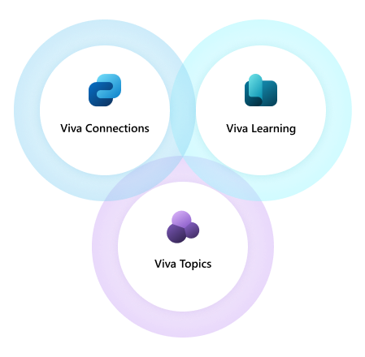
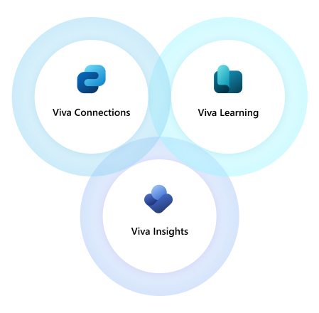
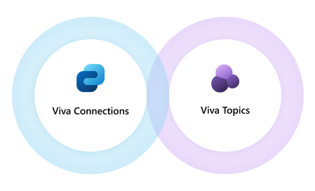

# Combine Microsoft Viva apps to support popular business scenarios

Microsoft Viva apps can be combined to create powerful employee experiences for common business scenarios. Use this guidance for inspiration about how your organization can use combinations of Viva apps to meet specific needs. Each scenario can be supported by two Viva apps. Optionally, you can combine three or more Viva apps to create an even more effective experience. Then, get specific guidance on how to get started planning and deploying your solution.

**Scenarios in this article**:

- Training and onboarding
- Wellness and work-life balance
- Knowledge sharing and management

## Training and onboarding

Onboard new employees or volunteers and encourage them to learn new skills with the combination of Viva Learning and Viva Connections. Create a training experience that people can access on desktop and mobile devices and that you can target to specific audiences. Consider also adding Viva Topics to help your organization manage internal projects, subject matter experts, and terminology. Viva Insights can add even more features for onboarding. [Learn more about onboarding new employees with Viva.](solutions/viva-onboard-change-roles.md)

### App 1: Viva Learning

Create and store custom training and onboarding content that your employees can access in Microsoft Teams.

1. Get Viva Learning.
2. Create custom onboarding content such as videos, Word documents, PowerPoint presentations, and more, and store them in a SharePoint site.
3. [Configure SharePoint as a content source](learning/configure-sharepoint-content-source.md) for Viva Learning to allow users in your organization to access and share your custom content from Viva Learning in Teams.
4. Managers can [recommend](https://support.microsoft.com/office/recommend-and-manage-content-in-viva-learning-77f9dcbf-41a8-4b19-b4d1-b99c406f37b8) this content to users in your organization.

### App 2: Viva Connections

Make it easy for your employees to access content in Viva Learning through their dashboard.

1. Get Viva Connections.
2. [Create a dashboard](connections/create-dashboard.md) so your users can quickly and easily access information and tasks.
3. Add a Viva Learning [teams app card](connections/create-dashboard.md) to the dashboard.
4. If you only want your Viva Learning card to show up to users going through the training and onboarding process, you can use [audience targeting](connections/create-dashboard.md).

### App 3: Viva Topics

Enhance your training and onboarding process by helping your employees learn more about important topics in your organization.

1. Get Viva Topics.
2. [Create topics](topics/create-a-topic.md) for important concepts and projects in your organization that you want your trainees to learn about.
3. Mention these topics in the custom training and onboarding content that you’ve created and stored in SharePoint.
4. These topics will appear highlighted in SharePoint pages. Users can select them to view topic cards that include relevant information and related resources. Viva Topics will also automatically generate topics, which [users can edit](topics/edit-a-topic.md).

### App 4: Viva Insights

Help new team members understand how to spend time productively and help managers provide better guidance on time management. [Learn more about Viva Insights](insights/introduction) and how it helps protect and organize time in [supporting work/life balance.](solutions/viva-work-life-balance)

1. Get Viva Insights.
2. Make Viva Insights easily discoverable from the Viva Connections Dashboard by adding the Insights app card.
3. Create useful recommendations such as protecting time in the day for regular breaks, focused work, and learning that can help improve wellbeing and boost productivity. Viva insights includes personal insights like this that only employees can see.

## Wellness and work-life balance

Help your employees manage their time effectively and create a healthy workplace culture with Viva Insights, Viva Learning, and Viva Connections. First, use Viva Insights to gain an understanding of your team’s work habits. Then, create or source learning content to encourage healthy workplace practices. Finally, add Viva Connections to share communications and resources about wellness and workplace practices.

### App 1: Viva Insights

Understand your organization’s workplace habits and how your team spends their time.

1. Set up [Viva Insights](insights/introduction.md).
2. Enable [organization insights](insights/org-team-insights/org-insights.md) to help business leaders understand the work habits of their organization as a whole.
3. Enable [team insights](insights/org-team-insights/team-insights.md) for employees to learn more about their teams’ unique habits and understand how their habits can set a good example.
4. Enable [personal insights](insights/personal/introduction.md) for employees to learn how to make the most of their time at work. Viva Insights helps employees be more proactive in protecting their schedule by setting up a [focus plan](insights/personal/teams/focus-plan.md) and a [virtual commute](insights/personal/teams/virtual-commute.md). Employees can also access mindfulness content from [Headspace](insights/personal/teams/headspace.md) to help them reduce stress and burnout.

### App 2: Viva Connections

Share resources and communications about wellbeing, work-life balance, and workplace culture.

1. Get Viva Connections.
2. [Create a dashboard](connections/create-dashboard.md)  and add cards so your users can quickly and easily access communications and resources. Use what you learned from Viva Insights to determine what content can help your workforce.
3. [Tailor content to specific teams and people](connections/viva-connections-overview.md). For example, if you learn from Viva Insights that one team is often working very late, you can target a presentation about work-life balance to appear on the dashboards and feeds of team members.

### App 3: Viva Learning

Create, source, and share content to educate your organization about healthy work habits.

1. Get Viva Learning.
2. Use what you learned from Viva Insights to determine where your workforce has opportunities for learning. For example, your employees might benefit from training, on time management, effective communication, or stress management.
3. Choose whether you want to [create your own content to host on SharePoint](learning/configure-sharepoint-content-source.md), use a [third-party provider](learning/configure-other-content-sources.md) or [learning management system](learning/configure-lms.md), or use content that’s available by default from Microsoft and LinkedIn Learning.
4. Managers and leaders can [recommend](https://support.microsoft.com/office/recommend-and-manage-content-in-viva-learning-77f9dcbf-41a8-4b19-b4d1-b99c406f37b8) content to specific users, and users can search for content to empower themselves.
5. If you’re using Viva Connections, add a Viva Learning [teams app card](connections/create-dashboard.md) to the dashboard.

## Knowledge sharing and management

### App 1: Viva Topics

Empower employees to find the information and contacts that they need to do their best work.

1. Get Viva Topics.
2. [Assign roles](topics/topic-experiences-roles.md) to members of your organization. These roles determine who can view, edit, create, and manage specific topics for your organization.
3. [Get started driving Viva Topics adoption](topics/topics-adoption-getstarted.md) in your organization.
4. Once you’ve set up Viva Topics and assigned roles, your employees will be able to easily find resources and experts related to a topic. Viva Topics is available in SharePoint, Word, Excel, and PowerPoint, and integrates with Microsoft Search. When an employee sees a term that they want to know more about, they can highlight a word or phrase within the tool, right-click and choose the option to search the highlighted word. If there’s a topic associated, a topic card surfaces as the first result. In addition, anyone can edit topics, so employees can easily share their expertise and knowledge.

### App 2: Viva Connections

1. Get Viva Connections.
2. [Create a dashboard](connections/create-dashboard.md) and add cards so your users can quickly and easily access communications and resources. You can [share news](/sharepoint/distribute-corporate-news-to-your-organization), [add web link dashboard cards](connections/create-dashboard.md), and [share videos](connections/video-news-links.md) to your users’ feeds.
3. When employees use Viva Connections to view content in SharePoint, they’ll be able to view highlighted topics and view topics cards with Viva Topics.

### App 3: Viva Engage

1. Get Viva Engage.
2. Use Viva Engage storylines to connect people across the company, strengthen professional relationships, and build social capital. [Set up storylines](engage/eac-storyline)
3. Build communities in Viva Engage where employees can share knowledge, and discuss shared interests and business initiatives. [Join and create a community in Viva Engage](https://support.microsoft.com/en-us/topic/join-and-create-a-community-in-viva-engage-1ee29da1-5250-4c1e-b773-e7a78cfaf5d4)
4. Connect employees across different working groups and business silos to help them exchange knowledge, find answers, and crowdsource ideas. [Manage Viva Engage community members](https://support.microsoft.com/en-us/topic/manage-viva-engage-community-members-3e75fbe9-1b3e-48b5-8e4b-af2716b7873a)

## Learn more

[Get all Microsoft Viva apps](plan-for-all-viva-modules.md)

[Introduction to Viva Connections](connections/viva-connections-overview.md)

[Introduction to Viva Insights](insights/introduction.md)

[Introduction to Microsoft Viva Learning](learning/index.md)

[Introduction to Microsoft Viva Topics](topics/index.md)

