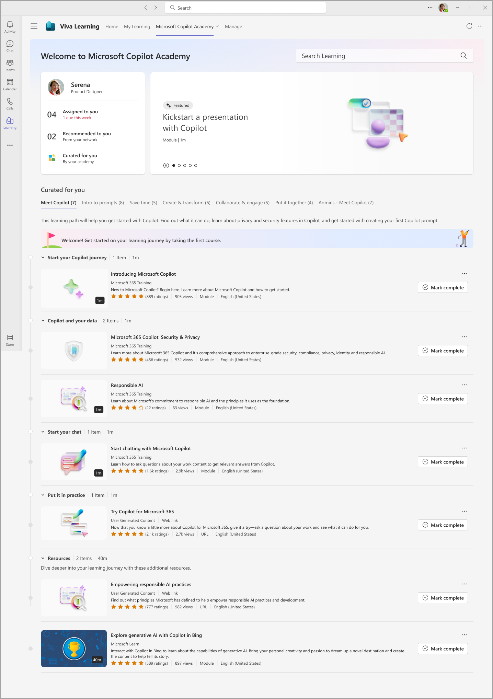
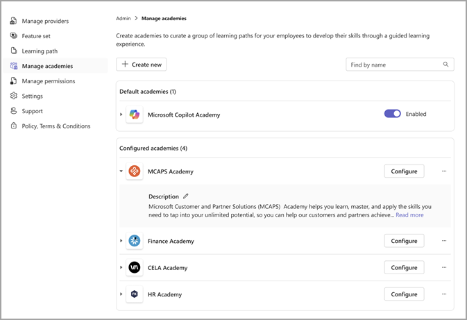

# Microsoft Copilot Academy 

Microsoft Copilot Academy is built in to develop user skills associated with Copilot usage. This experience provides structured educational content within Viva Learning to help users learn about, discover, and use Copilot effectively.  

## Prerequisites for Microsoft Copilot Academy

Users need to meet the following criteria to access Microsoft Copilot Academy:

1. A user profile provisioned within a tenant that has Copilot for Microsoft 365 licenses.  

2. Assigned a paid license of  Microsoft Viva Suite or Viva Learning.  

## Configure Microsoft Copilot Academy

Microsoft Copilot Academy is enabled by default and discoverable for users who meet the criteria within their Viva Learning app under the **Academies** dropdown navigation menu.  

Admins can disable Microsoft Copilot Academy from the **Admin** tab in Viva Learning under the **Manage academies** section. 

## Language support 

Microsoft Copilot Academy is currently only supported in English with a planned expansion to other languages. 

## Create your own custom academy

You can create a new Academy tailored to your needs by utilizing learning objects from the Copilot Academy. This approach allows you to maintain the essence of the Copilot Academy while also incorporating your organization's unique requirements. Here’s how: 

- **Create learning paths**: Start by creating learning paths that mirror learning paths available in the Copilot Academy. This step forms the foundation of your custom academy. 

- **Add to your new academy**: Once your learning paths are set, you can seamlessly integrate them into your new academy for a personalized learning experience. 
