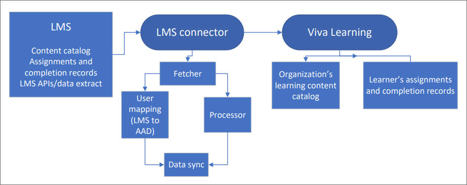

# Add learning management systems for Microsoft Viva Learning

A growing set of learning management systems are available through Viva Learning. This set may change at any time as more providers join or change their status with the program.

Learning management systems aren't enabled by default. To enable these sources, you'll need to [add them in the Microsoft 365 admin center](content-sources-365-admin-center.md#configure-settings-for-the-learning-content-sources) and follow the specific instructions shown in the following table.

>[!NOTE]
>You'll need a Viva Learning or Viva Suite license to access this feature. [Learn more about licensing](https://www.microsoft.com/microsoft-viva/learning).

>[!NOTE]
>It can take 24 to 48 hours for Viva Learning users to see content for the sources you enabled in the admin portal.

## Learning management systems

|Learning management system  |Configuration instructions  |
|---------|---------|
|Cornerstone OnDemand |[Configure Cornerstone OnDemand as a content source](configure-cornerstone-content-source.md)         |
|Saba    |[Configure Saba as a content source](configure-saba-content-source.md)         |
|SAP SuccessFactors   |[Configure SAP SuccessFactors as a content source](configure-successfactors-content-source.md)         |

>[!NOTE]
>Available learning management systems are subject to change. Depending on your organization, you may have access to different learning management systems than are listed here.

## Dataflow architecture

The dataflow diagram illustrates how Viva Learning uses the LMS connector to ingest the learning content catalog and learner records (assignments and completion status). The learning management system (LMS) is the ultimate source of content and learner records for their customers. Viva Learning extracts the content and learner records from the LMS by the LMS Connector as depicted in the diagram below.

The step-by-step content ingestion process is explained below.

1. **LMS**   Viva Learning requires two types of data from every LMS.
    1. **Content catalog**: Fields that are extracted as part of the Content Catalog package or API from the LMS. [View the table](#content-catalog)
    2. **Assignment and completion records (learner records sync)**: Fields that are extracted as part of the Assignment & Completion package or API from the LMS. [View the assignment table](#assignment-records). [View the completion table](#completion-status).

2. **LMS Connector**   The LMS Connector pulls content from the LMS using both API and SFTP mechanisms. The first time you sync, the LMS extractor pulls the full data. Afterwards, a scheduler triggers once every 24 hours to refresh the data and pull any changes. Then the extract is validated and processed. If you encounter any error in processing, the error code displays on the admin portal. User records received from the extract are mapped with Azure Active Directory (AAD) records to ensure the correct assignment and completion status for every user. Once all the records are processed, the data is synchronized to Viva Learning and displayed in Viva Learning.

3. **Viva Learning**   Content details (content provider logo, thumbnail, title, description, etc.) display on the **Home** and **Learning** tabs in Viva Learning.   The **My learning** tab shows the user's assigned and completed courses, which are fetched from the LMS.

### Content catalog

These are the data extracted from the LMS as part of the Content Catalog package.

|Metadata field name |Field details |Priority |
|:-------------------|:-------------|:--------|
|Content provider (LMS) name | LMS's name. This can be provided separately and appended. |Required |
|Content provider (LMS) logo URL | URL to the LMS's logo for display purposes. |Required |
|Title of learning content |Title of learning content |Required |
|Content module's thumbnail URL |URL to the learning content thumbnail image for display purposes |Required |
|Content module's URL (deep link to consume content) |URL to learning content. This is the link that the user selects to consume content. |Required |
|Content module description/summary |Description or summary of learning content |Required |
|Content language/locale |Language in which content is available. Metadata should be provided in all available languages. |Required |
|Content module duration |Time duration of learning content |Required |
|Last modified date of content module/content creation date |Date the learning content was last modified |Required |
|Content format |Content format, such as article or video |Required |
|Assigned user role |Role(s) or group(s) that have permissions to the content  |Required for role-based access |
|Content source name |Name of the course content provider |Recommended |
|Content source logo URL |Logo of the course content provider |Recommended |
|Content ID |Unique identifier for learning content |Recommended |
|Content module author/creator/contributor |Author/creator/contributor of learning content |Recommended |
|Content module length/size |Size of content, not based on time. For example, this could be the number of pages. |Recommended |
|Tags and keywords |Keywords, topics, and other tags associated with the learning content |Recommended |
|Difficulty level |Difficulty level of the course (such as beginner, intermediate, or advanced) |Recommended |
|Content module thumbnail alt text |Alternative text to support accessible design for images. Text describes images and can be invoked by screen readers for users with assistive technology. |Recommended |
|Popularity score |Rating or popularity score for learning content |Recommended |
|Skills associated |Skills tags associated with the learning content |Recommended |

### Assignment records

These are the data extracted from the LMS for assignment records.

|Metadata field name |Field details |Priority |
|:-------------------|:-------------|:--------|
|Tenant ID | Tenant ID |Required |
|Configuration ID |LMS configuration ID. This is the equivalent to the learning source ID of the LAS |Required |
|ID |Object unique key (configid+externalAssignmentId) |Required |
|Learning object ID |Unique identifier for the assigned learning object |Required |
|Learner ID |ID of the learner/user to whom the learning object was assigned |Required |
|External assignment ID |Unique assignment ID on each LMS side |Required |
|Assignment due date |Date the assigned course is due for completion |Required |
|Assignment completion status |Current completion status of the assigned learning object. This can be Not started, In progress, or Completed. |Required |
|Assignment date |Date the learning object was assigned |Required |
|Assigner ID |ID of the user who assigned the learning object |Recommended |
|Assignment completion date |Date the assignee completed the learning object |Recommended |
|Assignment title |Title that an assigner can maintain |Recommended |
|Notes |Notes or comments on the assignment |Recommended |

### Completion status

These are the data extracted from the LMS for completion status.

|Metadata field name |Field details |Priority |
|:-------------------|:-------------|:--------|
|Tenant ID | Tenant ID |Required |
|Configuration ID |LMS configuration ID. This is the equivalent to the learning source ID of the LAS |Required |
|ID |Object unique key (configid+externalAssignmentId) |Required |
|User ID |Unique identifier for the user or employee |Required |
|Learning object ID |Unique identifier for the assigned learning object |Required |
|Completion status of learning object |The current completion status of the learning object. This can be either In progress or Completed. |Required |
|Date of completion |Date the user completed the learning object |Recommended |
|Start date |Date the user started the learning object |Recommended |
|Course completion ID |Unique identifier for the course completion record |Recommended |
|Current time |How far the user has progressed in the course (time)  |Recommended |
|Current page number |How far the user has progressed in the course (page number) |Recommended |

## Content ingestion errors

If you experience any errors in your Microsoft 365 admin center during content ingestion, refer to the table below for next steps. This is an exhaustive list and may contain more error codes in the future.

>[!NOTE]
>The maximum number of active learning items supported in a tenant is 500,000 records.
The maximum number of total learning items supported in a tenant is 1 million records.

|Learning management system |Error code |Error code description |
|:-------------------|:-------------|:--------|
|All LMSs | USR_ERROR_INVALID_RESOURCE_CREDENTIALS |The authentication credentials you provided are Invalid. Make sure you enter the correct credentials. You can contact Microsoft customer support for more details. |
|All LMSs |USR_ERROR_ACCESS_DENIED |Access denied by partner. Confirm that the credentials you entered are correct or contact the content provider's support team. |
|All LMSs |Changes not saved |Confirm that you've entered the correct configuration details. |
|SuccessFactors |USR_ERROR_SF_INITIAL_PACKAGE_NOT_FOUND |No new content ingested as the required package was not found in the SuccessFactors SFTP server. Make sure that the [SuccessFactors package](configure-successfactors-content-source.md#configure-in-your-successfactors-portal) is available. It may take up to 7 working days to generate this package the first time you sync. If you can't find the package, contact your SuccessFactors support team. |
|SuccessFactors |USR_ERROR_SF_DELTA_PACKAGE_NOT_FOUND |No new content was ingested as the required package was not found in the SuccessFactors SFTP server. Please ensure that SF package is available in the configured folder path on your SF portal. If you can't find the package, contact your SuccessFactors support team. |
|SuccessFactors |USR_ERROR_SFTP_NO_FILES_FOUND |No new content ingested because there were no files present in the SuccessFactors SFTP server.  Make sure that you can find the files in the [SuccessFactors package](configure-successfactors-content-source.md#configure-in-your-successfactors-portal). If you can't find the files, contact your SuccessFactors support team. |
|SuccessFactors |USR_ERROR_SF_COMPRESSED_PACKAGE_SIZE_EXCEEDED |No new content was ingested because the compressed package size exceeded 2GB. [Contact Microsoft customer support](help-support.md) for more details. |
|SuccessFactors |USR_ERROR_SF_UNCOMPRESSED_PACKAGE_SIZE_EXCEEDED |No new content was ingested because the uncompressed package size exceeded 25GB. [Contact Microsoft customer support](help-support.md) |
|Cornerstone OnDemand |USR_ERROR_INVALID_RESOURCE_CREDENTIALS |The authentication credentials you provided are Invalid. Make sure the credentials are being copied from Microsoft Viva Learning in Cornerstone OnDemand portal. |

Your changes won't be saved if you've entered any fields incorrectly. You can close and reopen the flyout to view and correct any invalid fields.

|Learning management system |Error message |
|:----------------|:----------------------|
|All LMSs |Your changes couldn’t be saved. Make sure you’ve entered the correct (field name). |

## Content consumption for end users

Once you've added a learning management system as a content source from the Microsoft 365 admin center, content from the LMS will flow to Viva Learning and will be visible to end users.

Once a user chooses to play a course in Viva Learning, they will be directed to the LMS webpage and will need to enter the login credentials on the LMS sign-in page. [Learn more about how to consume content with Viva Learning](https://support.microsoft.com/office/01bfed12-c327-41e0-a68f-7fa527dcc98a).
