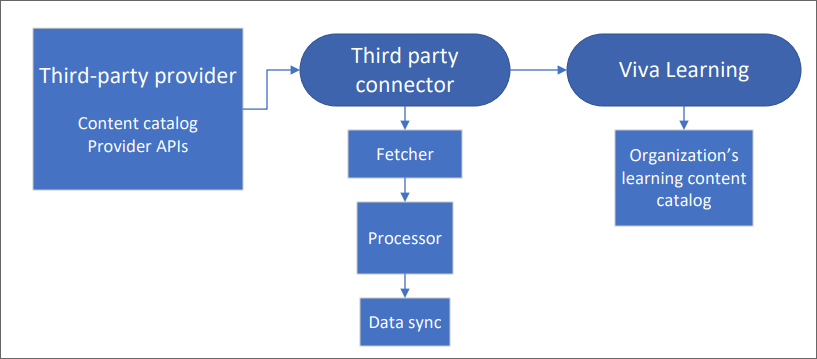

# Add other content providers for Microsoft Viva Learning

A growing set of learning content providers are available through Viva Learning. This set may change at any time as more providers join or change their status with the program.

Some learning sources will be enabled by default and will be available without a premium Viva Learning license. These learning sources include:

- LinkedIn Learning select 125 courses
- Microsoft Learn
- Microsoft 365 Training

Third-party content sources are not enabled by default. To enable these sources, you will need to [add them in the Microsoft 365 admin center](content-sources-365-admin-center.md#configure-settings-for-the-learning-content-sources) and follow the specific instructions shown in the following table.

>[!NOTE]
>You'll need a Viva Learning or Viva Suite license to access this feature. [Learn more about licensing](https://www.microsoft.com/microsoft-viva/learning).

>[!NOTE]
>It can take 24 to 48 hours for Viva Learning users to see content for the sources you enabled in the admin portal. It can also take 24 to 48 hours to hide content from LinkedIn Learning, Microsoft Learn and Microsoft 365 trainings from Viva Learning after you have disabled them in the admin portal.

|Content provider  |Configuration instructions  |
|---------|---------|
|EdCast    |[Configure EdCast as a content source](configure-edcast-content-source.md)    |
|Go1     |[Configure Go1 as a content source](configure-go1-content-source.md)         |
|OpenSesame    |[Configure OpenSesame as a content source](configure-opensesame-content-source.md)    |
|Skillsoft     |[Configure Skillsoft as a content source](configure-skillsoft-content-source.md)         |
|Udacity    |[Configure Udacity as a content source](configure-udacity-content-source.md)    |
|Udemy   |[Configure Udemy as a content source](configure-udemy-content-source.md)         |
|Coursera    |Follow the steps below to add Coursera in your Microsoft 365 admin center.    |
|edX    |Follow the steps below to add edX in your Microsoft 365 admin center.    |
|Infosec    |Follow the steps below to add Infosec in your Microsoft 365 admin center.    |
|Josh Bersin Academy    |Follow the steps below to add Josh Bersin Academy in your Microsoft 365 admin center.    |
|Pluralsight    |Follow the steps below to add Pluralsight in your Microsoft 365 admin center.    |

1. Log in to your [Microsoft 365 admin center](https://admin.microsoft.com).
2. Navigate to **Settings**, then **Org settings**. Select Viva Learning, and enable your chosen content provider or learning management system in the panel.
3. Fill in your details.
4. Select **Save**.

>[!NOTE]
>Available content providers are subject to change. Depending on your organization, you may have access to more content providers than are listed here.

## Dataflow architecture

The dataflow diagram illustrates how Viva Learning ingests third-party content. The third-party provider is the ultimate source of information for content records for their customers. Viva Learning extracts the content from the third-party provider using the connector.

The step-by-step content ingestion process is described below.

1. **Third-party provider**   Viva learning requires content catalog data from every third-party content source. The various fields extracted as part of the Content Catalog package or API from the content source are represented in the table [View the table](#content-catalog-metadata-fields).

2. **Third-party Connector**   The third-party Connector pulls content from the content provider using both API and SFTP mechanisms. The first time you sync, the third-party extractor pulls the full data. Afterwards, a scheduler triggers once every 24 hours to refresh the data and pull any changes. Then the extract is validated and processed. In case of any error in processing, the error code displays on the admin portal. User records received from the extract are mapped with Azure Active Directory (AAD) records to ensure the correct assignment and completion status for every user. Once all the records are processed, the data is synchronized to Viva learning application and displayed on the Viva Learning app.

3. **Viva Learning**   Content details (content provider logo, thumbnail, title, description, etc.) display on the **Home** and **Learning** tabs in Viva Learning.

### Content catalog metadata fields

|Metadata field name |Field details |Priority |
|:-------------------|:-------------|:--------|
|Content provider name | Third-party content provider's name. This can be provided separately and appended. |Required |
|Content provider logo URL | URL to the third-party provider's logo for display purposes. |Required |
|Content source name |Course content source's name |Required if integrated with provider |
|Content source logo |Course content source's logo |Required if integrated with provider |
|Title of learning content |Title of learning content |Required |
|Content module's thumbnail URL |URL to the learning content thumbnail image for display purposes |Required |
|Content module's URL (deep link to consume content) |URL to learning content. This is the link that the user selects to consume content. |Required |
|Content module description/summary |Description or summary of learning content |Required |
|Content language/locale |Language in which content is available. Metadata should be provided in all available languages. |Required |
|Content module duration |Time duration of learning content |Required |
|Last modified date of content module/content creation date |Date the learning content was last modified |Required |
|Content format |Content format, such as article or video |Required |
|Assigned user role |Role(s) or group(s) that have permissions to the content  |Required for role-based access |
|Content ID |Unique identifier for learning content |Recommended |
|Content module author/creator/contributor |Author/creator/contributor of learning content |Recommended |
|Content module length/size |Size of content, not based on time. For example, this could be the number of pages. |Recommended |
|Tags and keywords |Keywords, topics, and other tags associated with the learning content |Recommended |
|Difficulty level |Difficulty level of the course (such as beginner, intermediate, or advanced) |Recommended |
|Content module thumbnail alt text |Alternative text to support accessible design for images. Text describes images and can be invoked by screen readers for users with assistive technology. |Recommended |
|Popularity score |Rating or popularity score for learning content |Recommended |
|Skills associated |Skills tags associated with the learning content |Recommended |

## Content ingestion errors

If you experience any errors in your Microsoft 365 admin center during content ingestion, refer to the table below for next steps. Please note that this is an exhaustive list and may contain more error codes in the future.

>[!NOTE]
>The maximum number of active learning items supported in a tenant is 500,000 records.
The maximum number of total learning items supported in a tenant is 1 million records.

|Content provider |Error code |Error code description |
|:----------------|:----------|:----------------------|
|All providers |USR_ERROR_INVALID_RESOURCE_CREDENTIALS |The authentication credentials you provided are Invalid. Make sure you enter the correct credentials. You can contact Microsoft customer support for more details. |
|All providers |USR_ERROR_ACCESS_DENIED |Access denied by partner. Confirm that the credentials you entered are correct or contact the content provider's support team. |
|All providers |Changes not saved | Make sure that you've entered the correct configuration details. |

## Content consumption for end users

Once you've added a content provider as a content source from the Microsoft 365 admin center, content from the provider will flow to the Viva Learning app and will be visible to end users.

Once a user chooses to play a course in Viva Learning, they will be directed to the content provider's webpage and will need to enter the login credentials on the provider's sign in page. [Learn more about how to consume content with Viva Learning](https://support.microsoft.com/office/01bfed12-c327-41e0-a68f-7fa527dcc98a).
