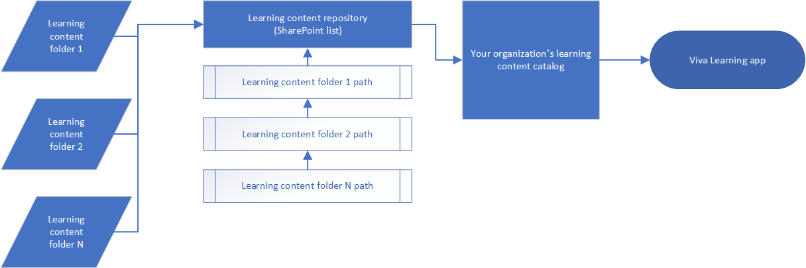
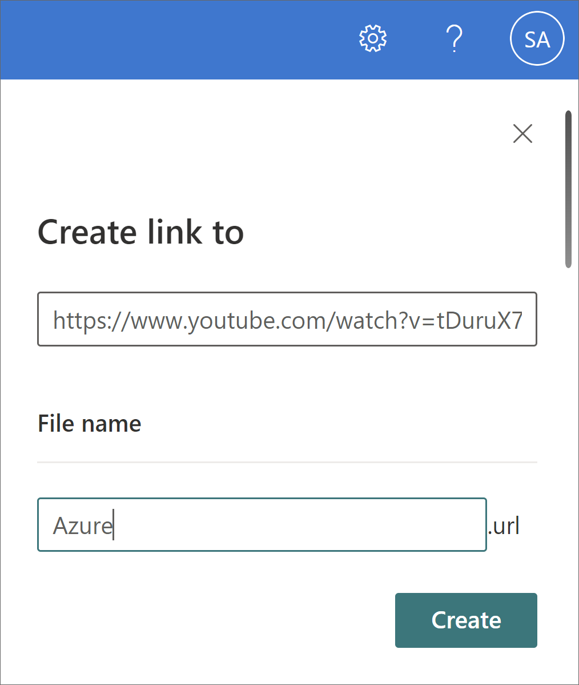
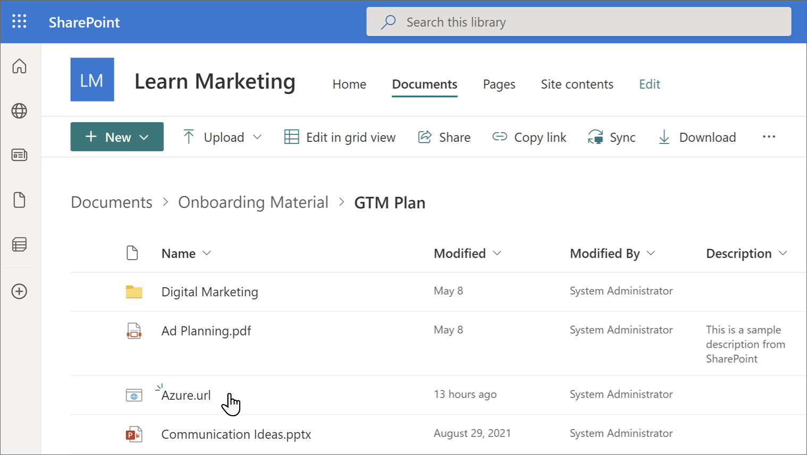
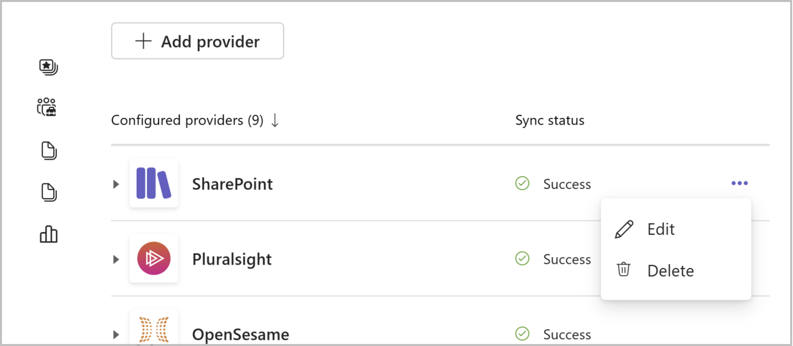
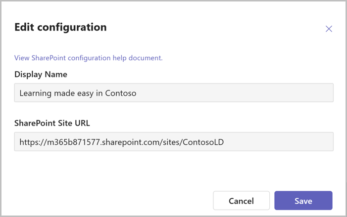

# Add SharePoint as a content source for Microsoft Viva Learning

You can configure SharePoint as a learning content source to make your organization's own content available in Viva Learning.

> [!NOTE]
> Content accessible through Viva Learning is subject to terms other than the Microsoft Product Terms. Any content you add to Viva Learning, such as SharePoint-hosted content, is subject to the privacy and service terms associated with that content.

 > [!VIDEO https://www.microsoft.com/videoplayer/embed/RE58RgE]  

## Overview

The knowledge admin (or global administrator) provides a site URL to where the [Learning Service](configure-sharepoint-content-source.md#learning-service) can create an empty centralized location in the form of a structured SharePoint list. This list is called the Learning App Content Repository. Your organization can use this list to house links to cross-company SharePoint folders that contain learning content. Admins are responsible for collecting and curating a list of URLs for folders. These folders should only include content that can be made available in Viva Learning.

Viva Learning supports the following document types:

- Word, PowerPoint, Excel, PDF
- Audio (.m4a, .mp3)
- Video (.mov, .mp4, .avi)
- [Linked objects](#add-linked-objects)

For more information, see [SharePoint limits](/office365/servicedescriptions/sharepoint-online-service-description/sharepoint-online-limits?redirectSourcePath=%252farticle%252fSharePoint-Online-limits-8f34ff47-b749-408b-abc0-b605e1f6d498).

>[!NOTE]
> You can use either a Modern or Classic SharePoint site. You can choose whether to use an existing site or create a new SharePoint site based on your organization's needs.

>[!NOTE]
> Ensure that the SharePoint site is a communication site. This functionality isn't compatible with team sites.

## Learning Service

The Learning Service uses the provided folder URLs to get metadata from all content stored in those folders. Within 24 hours of supplying the folder URL in the centralized repository, employees can search for and use your organization's content within Viva Learning. All changes to content, including updated metadata and permissions, will also be applied in the Learning Service within 24 hours.

## Configure SharePoint as a source

>[!NOTE]
> You must be a Microsoft 365 global administrator or knowledge admin to perform these tasks.

>[!NOTE]
> The admin tab is only available for admins with a Viva Suite or Viva Learning license.

To configure SharePoint as a learning content sources in for Viva Learning, follow these steps:

1. In the left navigation of the Microsoft 365 admin center, go to **Settings** > **Org settings**.

2. On the **Org settings** page, on the **Services** tab, select **Viva Learning**.

     

3. On the **Viva Learning** panel, under SharePoint, provide the site URL to the SharePoint site where you want Viva Learning to create a centralized repository. If your SharePoint site is new, you'll need to wait 1 hour after site creation to add it here. You must also be the owner of the SharePoint site.

     

     If your organization uses [Microsoft 365 Multi-geo](/microsoft-365/enterprise/microsoft-365-multi-geo), you can find your region or country at [Microsoft 365 Multi-geo availability](/microsoft-365/enterprise/microsoft-365-multi-geo#microsoft-365-multi-geo-availability). The **Viva Learning** panel also shows this information.

     

4. A SharePoint list is created automatically within the provided SharePoint site.

     In the left navigation of the SharePoint site, select **Site contents** > **Learning App Content Repository**.

     

5. On the **Learning App Content Repository** page, populate the SharePoint list with URLs to the learning content folders. Read [Folder URL document library curation](#folder-url-document-library-curation) for details about how to create the content folders.

   1. Select **New** to view the **New item** panel.

       

   2. On the **New item** panel, in the **Title** field, add a directory name of your choice. In the **Folder URL** field, add the URL to the learning content folder. Select **Save**. [Learn how to to create the folder URL](#folder-url-document-library-curation).

       

   3. The **Learning App Content Repository** page is updated with the new learning content.

       

   4. If your organization uses [Microsoft 365 Multi-geo](/microsoft-365/enterprise/microsoft-365-multi-geo) and you try to add a link to a folder that doesn't belong to the central location, you'll get an error message. All folders need to belong to the central location.
    In case you encounter issues with content, refer to the [export log file](/viva/learning/use-tabs?view=o365-worldwide#managing-providers) for a detailed summary of successful and failed content ingestion.
   
       

  > [!NOTE]
  > To allow for broader access to the Learning App Content Repository, a link to the list soon will be available in the Viva Learning interface where users can request access and ultimately help populate the list. Site owners and global administrators will be required to grant access to the list. Access is specific to the list only and does not apply to the site where the list is stored. For more information, see [Provide your own organization's content](#provide-your-own-organizations-content) later in this article.

>[!NOTE]
> Viva Learning ingests up to 1000 items and files as learning objects.

### Folder URL document library curation

Create a folder to store learning content for your organization.

1. Go to your Documents library and select **+ New** and choose **Folder**.

    

2. Enter a folder name.

    

3. Select **Create**. The folder will now show up in your document library.

    

4. Upload files that you want to publish as learning content in this folder. Apply Microsoft 365 permissions to the folders that contain learning objects and to any items within the folders that have unique permissions. [Learn how to use permissions for learning content](sharepoint-permissions.md).
​
5. To get the folder url, choose this folder and select **Copy link**.

   

> [!IMPORTANT]
> Users will only be able to view content in Viva Learning if you give them the correct permissions. [Configure permissions for SharePoint content](sharepoint-permissions.md).

#### Add linked objects

You can add links to both internal content from SharePoint and external content from sites such as YouTube or Vimeo that will pull through into Viva Learning.

> [!NOTE]
>When users access the content from Viva Learning, they'll be taken to the URL of the content in their browser.

> [!NOTE]
> You need a Viva Suite or Viva Learning license to access linked objects in Viva Learning. Without a license, you can discover  linked objects in Viva Learning, but can't consume them.

1. In your folder, select **New** and then choose **Link**.

    :::image type="content" alt-text="Screenshot of the documents library with New and Link selected." source="../media/learning/sp-new-link.png" lightbox="../media/learning/sp-new-link.png":::

2. Add the URL and choose a name.

   

3. Select **Create**.
4. The link will show up in your document library with the name you selected.

   

5. The linked object will show up in the Viva Learning app.

### Metadata

Default metadata (such as modified date, created by, document name, content type, and organization name) is automatically pulled into Viva Learning by the Microsoft Graph API.

Improve overall discovery and search relevance of the content by adding columns for description, thumbnail URL, duration, author, and tags.

If there's already a description column present, you can delete it and add a new one by following the steps below.

To add a metadata field, follow these steps first:

> [!IMPORTANT]
> You'll need to use the column names exactly as they're provided here for the metadata to pull through. Adding metadata is optional, but if it's not configured correctly, the learning objects and any changes to those objects will also not pull through.

1. Select the folder from your learning content repository.
2. From the **Documents** page, select **Add column**.
    

To add a description column to the document library page, follow these steps:

1. Follow the initial steps to create a column.
2. Choose **Multiple lines of text**.
3. Name the column ContentDescription.
4. Add custom descriptions for each item. If no description is supplied, Viva Learning will provide a default message that highlights the content as being from your own SharePoint library.

Next, provide a thumbnail image.

1. Follow the initial steps to create a column.
2. Choose **Hyperlink**.
3. Name the column ThumbnailWebUrl.
4. Add the URLs for each item.
>[!NOTE]
> Only public URLs work for this process. 

Next, add the duration of the content.

1. Follow the initial steps to create a column.
2. Choose **Number**.
3. Name the column Duration.
4. Provide the duration of the content in seconds.

Next, add tags.

1. Follow the initial steps to create a column.
2. Choose **Managed metadata**.
3. Name the column SkillTags.
4. Select **More options**.
5. Toggle to allow multiple values.  
    
6. You can either choose to use a predefined term set or a customized term set.

[Learn more about how to create a Managed Metadata column.](https://support.microsoft.com/office/create-a-managed-metadata-column-8fad9e35-a618-4400-b3c7-46f02785d27f)

Finally, add the author.

1. Follow the initial steps to create a column.
2. Choose **Multiple lines of text**.
3. Name the column ContentAuthor.
4. Add the author or authors of the content.

### Add a display name

>[!NOTE]
> The owner of the added site URL can only update the display name

>[!NOTE]
> Display names for already ingested learning objects are updated after 24 hours.

1. In the Viva Learning app, select the **Admin** tab. 
1. Navigate to **Manage providers**.
1. Look for the SharePoint provider and select the ellipses (**...**).
1. Select **Configure Provider**.

The display name is the organization or tenant name by default.

5. Update display name.
6. Click **Save**.

### Provide your own organization's content

Knowledge admins can access their organization's Learning App Content Repository in SharePoint, where they can provide references to cross-organization document libraries. Content within these libraries will be then surfaced as learning content in Viva Learning.

1. In Viva Learning, select the ellipses (**...**), and then select **Settings**.

    
  
2. Under **Settings**, select **Permissions**.

    

3. Select **Check access** to connect to your organization's centralized library.

### Delete content

1. Select the content you wish to remove from your Learning App Content Repository.
2. Choose **Delete** on the command bar, or select the ellipses and then select **Delete**.

>[!NOTE]
> Content you delete from the Learning App Content Repository will take approximately 24 hours to be removed from Viva Learning.

## Multi-geo

[Microsoft 365 Multi-geo](/microsoft-365/enterprise/microsoft-365-multi-geo) is designed to meet data residency requirements.

The site URL provided by the knowledge admin where the Learning App Content Repository resides needs to belong to the central location where your Microsoft 365 subscription was originally provisioned. 

Folders linked to in the repository should also belong to the central location. Viva Learning has added this restriction to conform to data residency requirements. 

In case you encounter issues with content, refer to the [export log file](/viva/learning/use-tabs?view=o365-worldwide#managing-providers) for a detailed summary of successful and failed content ingestions.

For more information, see [Multi-geo capabilities in SharePoint Online](/microsoft-365/enterprise/multi-geo-capabilities-in-onedrive-and-sharepoint-online-in-microsoft-365).

## Next steps

[Add learning management systems for Viva Learning](configure-lms.md) or [Add other content providers for Microsoft Viva Learning](configure-other-content-sources.md).
