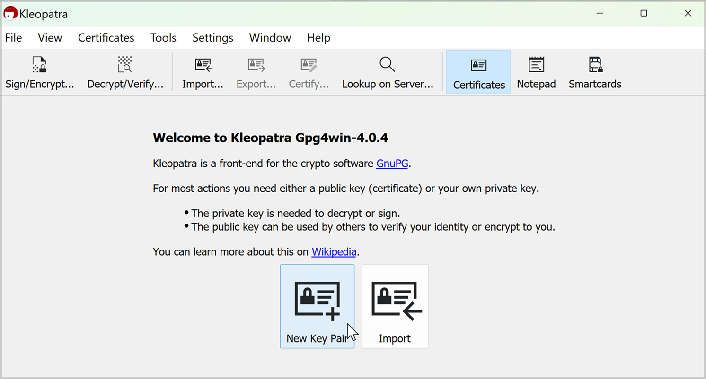
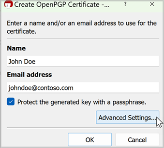
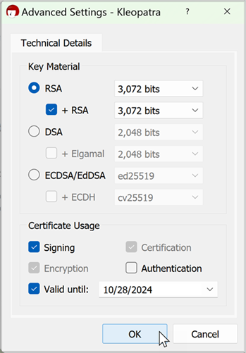
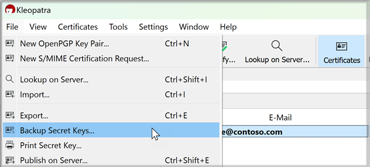
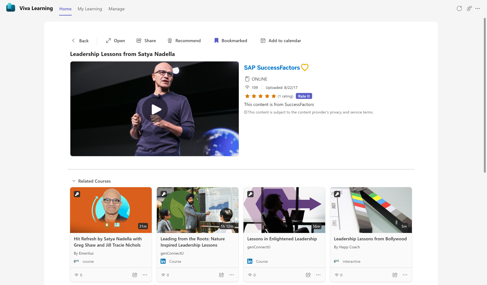
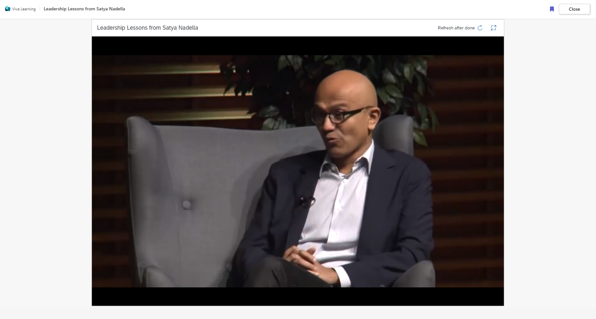

# Configure SAP SuccessFactors as a content source for Microsoft Viva Learning

This article shows you how to configure SAP SuccessFactors as a third-party content source for Microsoft Viva Learning. First, you'll need to edit the system configuration in the SuccessFactors Portal, then you'll need to complete the configuration in the Microsoft 365 admin center.

>[!NOTE]
>Content accessible through Viva Learning is subject to terms other than the Microsoft Product Terms. SAP SuccessFactors content and any associated services are subject to the SAP SuccessFactors privacy and service terms.

## Create your PGP pair key to enable integration

Use a PGP tool to generate a PGP key (public key, private key, private key passphrase) in order to enable this integration. 
We recommend using the Kleopatra tool, which can be downloaded at [Gpg4win](https://www.gpg4win.org/). Please ensure you are following the guidelines on [GNU Privacy Guard](https://gnupg.org/)

### PGP key generation instructions for Windows

1. Download the Kleopatra tool from [Gpg4win](https://gpg4win.org)
1. Open Kleopatra. Navigate to **Certificates** > **New Key Pair**.

1. Enter your name and email, then select “Protect the generated key with a passphrase.”

1. In **Advanced Settings**, change **Key Material** to **RSA**

1. Select OK to generate your key pair.
1. Enter a passphrase for your key pair and note this for future reference in the Microsoft 365 Admin center.

1. Navigate to **File** > **Backup Secret Key**. Save your secret key locally for future reference.

1. Navigate to **File** > **Export**. Save your public key file locally for future reference.

You have now successfully generated and saved your public and private key pair. Use the public key in the SAP SuccessFactors portal and the private key in the Microsoft 365 Admin Center.

### PGP key generation instructions for UNIX and Linux systems 

1. Download [GNU Privacy Guard](https://www.gnupg.org/).

1. On the GnuPG website, go to **Documentation**, then choose **Guides**
1. Open the GNU Privacy Handbook.
1. Follow the instructions in the section **Generating a new keypair**.

## Configure in your SuccessFactors portal

>[!NOTE]
>You'll need to have admin permissions in SuccessFactors to complete these steps.

1. Search Learning Administration in the search bar on the SAP SuccessFactors portal.

1. Obtain the required workflows to edit the PARTNER_EXTRACT configuration, which you can get to by going to **System Administration** > **Configuration** > **System Configuration** > **PARTNER_EXTRACT**.

2. Fill in the following parameters in the PARTNER_EXTRACT configuration. To edit the partner extract configuration in SuccessFactors, you'll need **Edit System Configuration** workflow permission in SuccessFactors.

    - Customer notification email for all job status
        - defaultJob.email=
        - Correctly formatted line should read like: 
            `defaultJob.email=johndoe@contoso.com`
    
    - Partner1
        - The maximum length of PartnerID is 10 characters. For Microsoft Viva Learning enter the value **MVL**.
            - partners1.partnerID=
            - Correctly formatted line should read like this: `partners1.partnerID=MVL` 
        -EncryptionKey is the PGP public encryption key. Important note: Do not copy over the header “BEGIN PGP PUBLIC KEY BLOCK” or the footer “END PGP PUBLIC KEY BLOCK”. You’ll need to copy the key exactly as it’s been generated; don’t remove new line characters. Only copy the key block, which should be a Base64 string.  
        - Correctly entered line should read like this example: 
            `partner1.encryptionKey=mQGNBGNQnd0BDADTFw7G/NmYjT53GlLudCzrk7GPpsoavv3bkJZfqf26Gzb8hYXiT9vj4Q9L/x51LDJPzoqI4Q6gMxjqUM2K/v0Sge+Mw/B1w7zfgO7Sa5+UvFNN8xUHOfeZ+zSR+0f8aeC9j9Lt4QlDFnV8cdVHqmhAfnobOYvjFV7MrhgQ065+IYrhnWgX9pyHEtsu3SCCFj74Etzv56gs4TGu0g/+5WVDH7Fbb0X5lvpVi+EwAwHHHDGK18BuPRWz1QTTTKdWAEfAlYd74P1p6Cafi5hhQYr9A+XKeh1msXC6wf+qm/drMR8DhMGqxYwzuTZJbgn3Mac1P3oeTbam+eBxPTylxVB0q8fQdDZEUd5UbRNnbS+KSkhilPS9DRO3AYlCpo4YQrjVg0Smh8p8n3tpv+vSlKXyrTqxJTclnMAWNMHZlgA8AShmqpMKcTglPdbl3YrP4Lhagj65KrlYLKiyBmzBttW+sZA5Fj4XVFZxNPzpJ6XuR5zbiU0JoeI7RdrI2C2als8AEQEAAbQjSm9obiBNaWdoZWxsIDxqb21pZ2hAbWljcm9zb2Z0LmNvbT6JAdcEEwEIAEEWIQRDSdMzH0p2mN2u3IKNg++JlW6RZgUCY1Cd3QIbAwUJA8Nj0wULCQgHAgIiAgYVCgkICwIEFgIDAQIeBwIXgAAKCRCNg++JlW6RZl/+DACVB8bcvv7gJXb6OPlYu37rKdY6IudtfnKzBS2N4kFD0nmSx1te39eB3lp4CCUF3MQbYvDXJbqwIeLp8/4iEpowAhMzcHZi5U/wYS2T2fobpiwF+6c9AxhQgk1jEKXEHRM2UKDXw2YeUPsoRj8HgPwPmwanxWwReBeLyHGkebBbALK4ow18EMYRlUMnbAr2XJx08dlo/ScINLuInPEQZ9dPqS67e7NutKwCDWknyyHARzxeBjm466obgZQUz1JOtGKFZQ6EYP+AsWNuhSw57yPq7m4hpS11SK0sL6ljDPBWfkJYrOSBUdbb+NeJRqmz7YJDFuFQp2TXFx4tcitrft8GutOIafp1VJNhxFAiUR5nRzTGZMZ2oZukP4HXnf1arCpdFcbnagJyPdZn8JQeIa/oThLUDBVDvD9cN4PKbgHDb0CyK63M5yiD3zLESGUS4YJi3inR3qQ3C2I5GOnseSofiXuNDIKEBHoLCa9pad257qMUH9Zh056SyAxsJxJ1GYW5AY0EY1Cd3QEMAMNPsaN/SDZQpE3ptYv75+jBACsu6yRol+n1NwtrbEYa4S7Y+LHJXriPbQKklmlLcmhDRqLRfG6ntXH6EEd56hXr5JX7pNBjlTLTiztqZ/iHtfP4tq54f0XnjkM7uVcF74xVp3jytGF5k7LUPKxvNzxlWuO8lLnaOdI2GpTFGd/x25fIquesi99/QZ7Vuu58lVf1SwAciC46Ac28im7kjnuNNJzSujfa6RfI4W3hT8U5CwZWQQl+keIzblb4boR7iMNkyHWXrfn8CT3efIIxRAaZuXzNGTCsjK6tpKPBjffu59nrcPcvIBMUgARVrgn1a+/zVSUzQKuTpH4pfu1YmyuC2Sj6hfLuc2y6DkRpBiNVHXpFc8HkmwooDbsYmWzBVPmqUKfJws4jPommRfmWT5vM/fSg4yvsCmwpUZ6fyrZGhyAdn3/ym7FoAfLKIRAs9PAmyo8f3GqgE5iSLsCN+YwNZSDk0mTVi1nCIOOsPSvYJ/xUX0usptexmyqXZvbgxwARAQABiQG8BBgBCAAmFiEEQ0nTMx9KdpjdrtyCjYPviZVukWYFAmNQnd0CGwwFCQPDY9MACgkQjYPviZVukWYcxwv+KwJ8UcD8PUbSckoGoQSURc38qI1EfQwc5jsGmWzRBxbCdO03jbbbAL8tN0DrkVKjU+aiTlBB8NODT9sOiJzgR+FzFSRsu3166GegJu6QTfVp0EoB2YeAnM3yhBCVlCkoZjX80KlN/u1Ie5h6A4txukR7/xHuEacn8GRJnry3z5ABUFeQiXX0M3wZ0N15JOZwkCHXL0HePfaOG/HZO9fJJkG/0jWsYUcgdqmWgenYnCsqRUnlE9b8Cat0DEUq5QjWaEqDPmx+3GEEvRaJsCrsX2u+TyxFLFuYFT1jXkTZVte0jfjxBJyNRNVVsvfTSCLU/eFdNC9BDiT4FwDCO0iNm46DbTSF+GCse82vMKbQ9TO8vKlhb2Eqzg+7ytzb8bEhkO/2oiYiUKn6jFLASeeWgifzSBQZKvIKJFFuA6n780CBu3/N98H7+8Ut0rHy/k6E9SHHXmvRj7k894A4ZjpLJanelZkTQLKvJk+EkzRXPhAoCVsTxFq/5RHgLKpBo5jL=cFz0`
    
    - Key Owner maps to the User-ID of public key 
        - partners1.keyOwner= 
        - Correctly formatted line should read like: `partners1.keyOwner=John Doe <john.doe@contoso.com`
    - Set it to "true" to enable the partner extract.
        - partners1.enabled=
        - Correctly formatted line should read like:`partners1.enabled=true `
    
    

Once you've completed these steps in the SuccessFactors portal, you'll need to complete the setup in the Microsoft 365 admin center.

>[!NOTE]
>Once you've finished the configuration in your SuccessFactors portal, SuccessFactors will generate the initial sync package. This may take up to 7 business days. Once the package is available in your SFTP folder path, Viva Learning will be able to begin communicating with SuccessFactors. If you can't find the package, contact your SuccessFactors support team.

## Configure in your Microsoft 365 admin center

>[!NOTE]
>You'll need to have admin permissions in Microsoft 365 to complete these steps.

### Prerequisite for configuration

Make sure that the SuccessFactors package is available in the SFTP folder path.

To obtain the folder path:

1. Navigate to **SF Admin Application** > **System Administration** > **Configuration** > **System Configuration** > **PARTNER_EXTRACT**.
2. Get the value of the defaultFtp.path property.

>[!NOTE]
>It may take up to 7 business days after configuration in your SuccessFactors portal for the SuccessFactors package to appear in your folder path. If you're still unable to find the package, contact your SuccessFactors support team.

### Admin center configuration

1. Navigate to your [Microsoft 365 admin center](https://admin.microsoft.com).

2. Navigate to **Settings** > **Org settings**. Search for *Viva Learning* and enable SAP SuccessFactors from the options.

3. Fill in the configuration details:

    **Display Name**: Enter the display name you want to appear for the SAP SuccessFactors carousel.

    **SFTP Host URL**: Navigate to **LMS Admin Application** > **System Administration** > **Configuration** > **System Configuration** > **CONNECTORS**. Get the value of the `connector.ftp.server` property.

    **User Name**: Follow the same steps you followed for the SFTP Host URL. Get the value of the `connector.ftp.userID` property.

    **Password**: Enter your password. Check with your LMS application owner for help with retrieving your password. Enter that password here.

    **Folder Path**: Navigate to **Learning Administration** > **System Administration** > **Configuration** > **System Configuration** > **PARTNER_EXTRACT**. Get the value of the `defaultFtp.path` property.
    Validate the existence of the folder path in the SFTP server. Create the folder if it doesn't exist.

    **Client's Host URL**: This is the BizX domain URL. You can get this from your BizX sign in URL. For example, if your BizX login URL is `organization.successfactors.com/sf/start/#/login` then the host URL is `organization.successfactors.com`.

    **Client's Learning Destination URL**: You can get this from the learning domain module URL. For example, if the learning domain URL is `organization.scdemo.successfactors.com/learning/...` then the Learning Destination URL is `organization.scdemo.successfactors.com`.

    **PGP Private Key**: PGP private key for decryption, which is the entire section between BEGIN PGP PRIVATE KEY BLOCK and END PGP PRIVATE KEY BLOCK. You'll need to copy the key exactly as it's been generated; don't remove new line characters.

    Note that different tools generate keys in different formats. Remove the header if one is present in the block (for example, the version). Copy only the key block, which should be a Base64 string.

    **PGP Private Key Passphrase**: You'll need to get the private key value from your IT admin or the team that provides your PGP key.

    **PGP Public Key**: You'll need to get public key value from your IT admin or the team that provides your PGP key. Important note: Don't copy over the header “BEGIN PGP PUBLIC KEY BLOCK” or the footer “END PGP PUBLIC KEY BLOCK”. You’ll need to copy the key exactly as it’s been generated. Don’t remove new line characters. Copy only the key block, which should be a Base64 string.  

    **Company ID**: Sign in to your SuccessFactors portal. Select your profile icon, then select **Show Version Settings**. You can view your company ID here.

    

    

4. Select **Save** to activate SuccessFactors content in Microsoft Viva Learning. There may be a delay before the content is available in Viva Learning.

5. Close out of the Viva Learning flyout and re-open it. If there are any issues, an error message will appear on the screen.

### Troubleshooting errors

To troubleshoot, close and re-open the flyout.  
Select the learning source you are trying to enable. Check the specific error fields.

In case an invalid Private and Public Key pair has been entered in MAC Portal an error will display "PGP Keypair validation failed. Possible reasons for this failure - 1. Incorrect values entered for fields -  SF Public Key, SF Private Key, SF Private Key Pass Phrase 2. PGP keys generated with incorrect algorithm.”

>[!Note]
> SuccessFactors courses will start appearing in Viva Learning within 7 days of successful setup.
Package generation from Success Factors takes up to 7 days. Once the package is generated, ingestion will be triggered and it will get completed within few hours based on package size.
SAP SuccessFactors deletes the Full Sync package from SFTP location automatically after 14 days from generation date.

All users within an organization will be able to discover all the tenant-specific courses, but they'll only be able to access and consume courses that they have access to. User specific content discovery is planned for future releases. In Viva Learning, we show the courses which are part of an active library in SAP SuccessFactors. 

>[!Note]
> You will see error messages in MAC if the inputs are entered incorrectly. To see the error messages, close out the Viva Learning window in MAC and reopen to refresh validation.

## Manage Permissions for SAP SuccessFactors

You can synchronize Permissions applied using assignment profile on courses in SuccessFactors within Viva Learning application.  If a user is restricted to a certain course in SuccessFactors, then that user will not be able to view, search or consume the same course within Viva Learning. This is a one-way sync from SuccessFactors into Viva Learning.

### Pre-requisites for catalog permissions sync

1. Viva Suite or Viva Learning license is required to set up SAP SuccessFactors integration with Viva Learning.  
    1. Any Microsoft 365 subscription that has Exchange Online and SharePoint Online will support groups. That includes the Business Essentials and Business Premium plans, and the Enterprise E1, E3, and E5 plan

2. Configure SAP SuccessFactors with Viva Learning: [Configure SAP SuccessFactors as a content source for Microsoft Viva Learning](/viva/learning/configure-successfactors-content-source)
    1. If SAP SuccessFactors is already configured in your Viva Learning application, then you can skip to step 3.  

3. The Initial sync package generated by SAP SuccessFactors should be available in the configured SFTP folder path.  

4. SAP SuccessFactors & Azure Active Directory user sync should be enabled.
    1. If the learner record sync is already enabled successfully in Viva Learning, then you can skip to step 5.
    1. Enable inbound user provisioning with SAP SuccessFactors to ensure that all users in Azure Active Directory have the right employee ID configured. [Prerequisite for learner record sync](/viva/learning/configure-successfactors-content-source#prerequisite-for-learner-record-sync)

## Programs and learning paths

You can bring programs or learning paths from SAP SuccessFactors into Viva Learning. The programs are ingested along with the other content catalog items.

If you’re setting up SuccessFactors integration for your tenant for the first time, programs will be automatically ingested along with other content.

If you’ve already integrated SuccessFactors and want to bring in programs, you’ll need to request the SuccessFactors support team to regenerate the full sync package for your tenants. Viva Learning will ingest the programs for your tenant once the package becomes available in your SuccessFactors folder path.

## Learner record sync

Check the **Enable Learner Record Sync** checkbox to enable assignments and course completion records to sync from the learning management system to Viva Learning. Users from your organization will then be able to see their assigned and completed courses from your LMS within Viva Learning.  

By checking this checkbox, you're allowing Viva Learning to fetch user information, user assignments, and completed courses. The user information from the LMS is only used for user mapping, and doesn't remain in storage. Only mapping-related information is deduced.  

>[!NOTE]
>The full sync file needs to be generated from SAP SuccessFactors if you enable the learner record sync at a later stage after enabling catalog sync

### Prerequisite for learner record sync

You'll need to enable inbound user provisioning with SAP SuccessFactors to ensure that all users in Azure Active Directory have the right employeeID configured. The steps required to enable this integration may vary depending on how your Azure Active Directory tenant is configured.

Refer to the scenario table below to pick the right integration steps for your setup.

| **Scenario** | **Do you have on-premises Active Directory?** | **Do you have an Azure AD tenant?** | **Are you using [AAD Connect](/azure/active-directory/hybrid/how-to-connect-sync-whatis) or [Cloud sync](/azure/active-directory/cloud-sync/what-is-cloud-sync) to sync on-premises identities to Azure AD?** | **Are you synchronizing employee data from SAP SuccessFactors to on-premises AD or Azure AD?** | **Recommended integration steps** |
| -- | -- | -- | -- | -- | -- |
| Scenario 1   | Yes | Yes  | Yes  | No  | - Review the cloud HR provisioning [deployment plan](/azure/active-directory/app-provisioning/plan-cloud-hr-provision).  - Configure [SAP SuccessFactors inbound user provisioning to on-premises Active Directory](/azure/active-directory/saas-apps/sap-successfactors-inbound-provisioning-tutorial).  |
| Scenario 2   | No  | Yes  | NA   | No  | - Review the cloud HR provisioning [deployment plan](/azure/active-directory/app-provisioning/plan-cloud-hr-provision).  - Configure [SAP SuccessFactors inbound user provisioning to Azure Active Directory](/azure/active-directory/saas-apps/sap-successfactors-inbound-provisioning-cloud-only-tutorial). |
| Scenario 3   | Yes | Yes  | Yes  | Yes | - If you're synchronizing SAP SuccessFactors data to on-premises AD using an IAM tool like Microsoft Identity Manager or a middleware service and the `employeeID` information is already present in AD and Azure AD then there is no additional configuration required.  |
| Scenario 4   | Yes | No   | No   | No  | - [Configure Azure AD tenant](/azure/active-directory/develop/quickstart-create-new-tenant) with Premium P1 license.  -  Review the cloud HR provisioning [deployment plan](/azure/active-directory/app-provisioning/plan-cloud-hr-provision) and setup [SuccessFactors to AD inbound provisioning](/azure/active-directory/saas-apps/sap-successfactors-inbound-provisioning-tutorial).  - [Set up AAD Connect Sync](/azure/active-directory/hybrid/how-to-connect-sync-whatis) or [Cloud sync](/azure/active-directory/cloud-sync/what-is-cloud-sync). |
| Scenario 5   | Yes | Yes  | No   | No  | - Review the cloud HR provisioning [deployment plan](/azure/active-directory/app-provisioning/plan-cloud-hr-provision) and setup [SuccessFactors to AD inbound provisioning](/azure/active-directory/saas-apps/sap-successfactors-inbound-provisioning-tutorial).  - [Set up AAD Connect Sync](/azure/active-directory/hybrid/how-to-connect-sync-whatis) or [Cloud sync](/azure/active-directory/cloud-sync/what-is-cloud-sync). |
| Scenario 6   | Yes | Yes  | No   | Yes | - [Set up AAD Connect Sync](/azure/active-directory/hybrid/how-to-connect-sync-whatis) or [Cloud sync](/azure/active-directory/cloud-sync/what-is-cloud-sync). |

### Steps followed for user sync

After you enable user sync, the EmployeeID is synced with each LMS user synced to Azure Active Directory.  

Viva Learning receives this EmployeeID in a zip package in an encrypted form, which is used for StudentID matching. As this information can only be decrypted by keys provided by admins, Viva Learning has no way to access this manually. 

## Play SAP SuccessFactors courses inline in Viva Learning

Viva Learning and SAP SuccessFactors integration allows seamless authentication (SSO) and in-app playback. Users can access SAP SuccessFactors content inline within Viva Learning instead of launching content in a browser.  

Content classified as online and instructor-led with online are consumed within Viva Learning and other content classifications are launched in the browser.

### Pre-requisite for enabling in-app playback and SSO

Refer to the [Azure Active Directory (AAD) single sign-on (SSO) integration with SAP SuccessFactors](/azure/active-directory/saas-apps/successfactors-tutorial) topic for configuration information on enabling in-app playback and SSO.

Ensure that the SSO configuration on AAD and SAP SuccessFactors is the same and that the users login method on SAP SuccessFactors is set to "SSO."

Log into Teams and Windows with the same user account for seamless consumption of SAP SuccessFactors content within Viva Learning.

You may encounter a “refused to connect” error or a blank screen the first time you consume SAP SuccessFactors content inline within Viva Learning. The content plays successfully on subsequent content launches, however. To resolve this issue, refer to the SAP Knowledge Base Article - [2169861](https://userapps.support.sap.com/sap/support/knowledge/en/2169861).

>[!NOTE]
> If the SSO on both AAD and SAP SuccessFactors are already configured in the tenant, as described in the above documentation, then no action is required.
