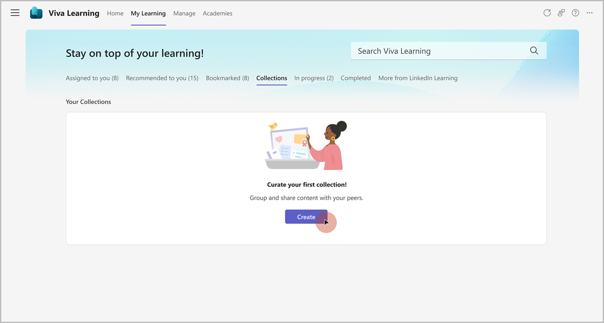
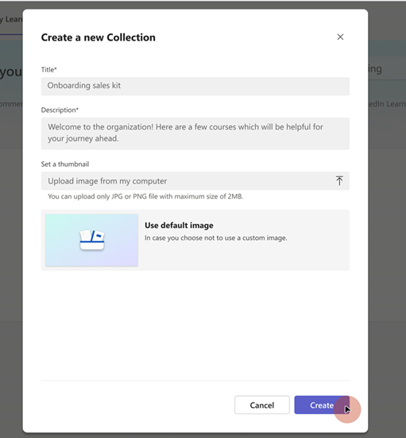
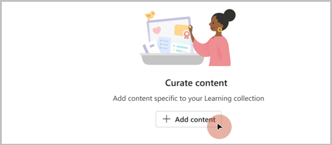
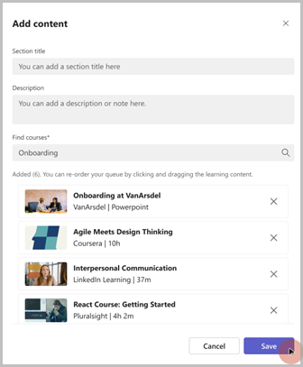
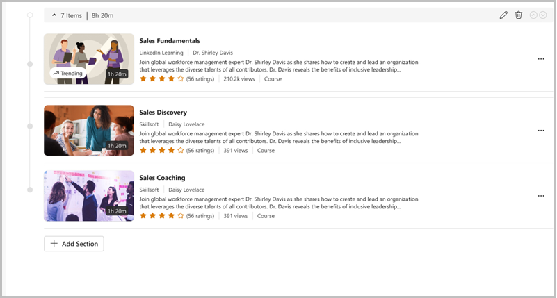

# Create collections in Viva Learning

A learning collection is a curation of learning objects or a sequence of learning activities that are relevant to the personal or social learning goals for employees of an organization.

In Viva Learning, you can curate your personal Learning collections using learning content from various different learning providers enabled for your organization. 

## Create a Learning collection

1. Go to the My Learning tab in Viva Learning and select **Collections**.
2. Select **Create**.

   

3. Add the title and description. Upload a thumbnail or choose a default thumbnail for your collection.
4. Select **Create**.

   

5. Select **Add content** to start adding content.

   

6. Add a section title and description to create sections in your collection.
    1. Search for relevant learning content from learning providers within Viva Learning.
    1. Choose the content and select **Add**.
    1. Reorder any content by dragging the added courses.

    

1. Select **Add Section** if you want to add another section and repeat the previous step. 

   

View and manage your collections under the **Collections** section in the **My Learning** tab. You can perform the following options by selecting:

- **Duplicate** to create a copy of existing collection. You can then modify the new collection as desired and consume it.

- **Delete** to delete the collection. Once deleted, the collection is no longer visible or discoverable.

- **Edit** the collection's details and content by selecting the **Edit** icon in the Collections details page. 

## Access Your Collections

1. Navigate to the **My Learning** tab and select the **Collections** section.
2. Select the Learning collection card.
3. Navigate to the **Details** page
4. Select the course thumbnail to play the course.

You can also share and recommend your curated collections with peers through the **Share** and **Recommend** options. 
