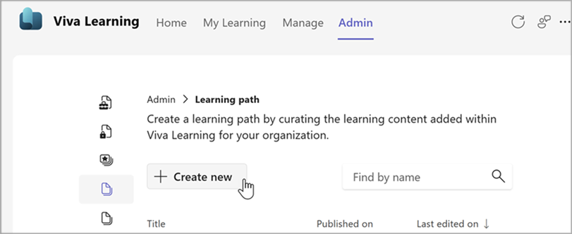
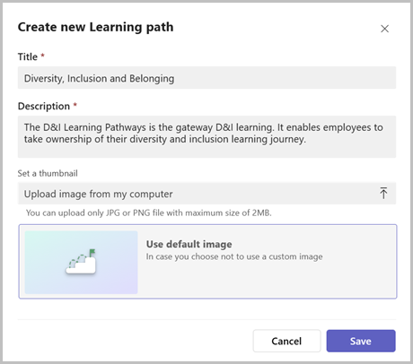
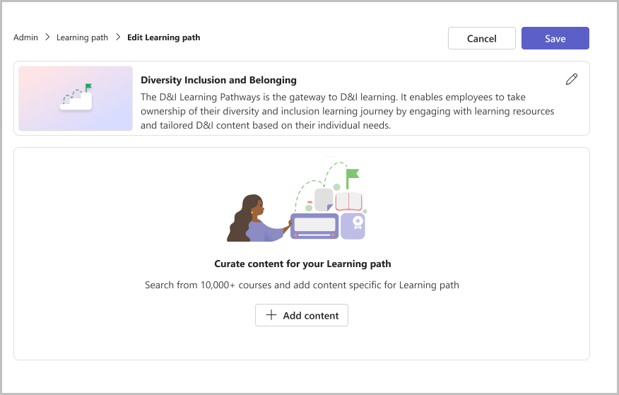
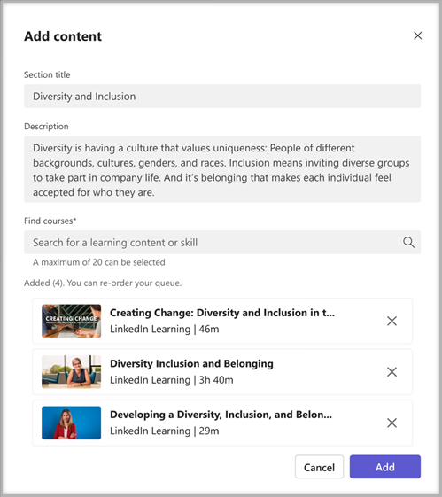
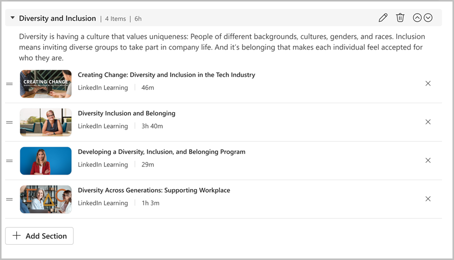
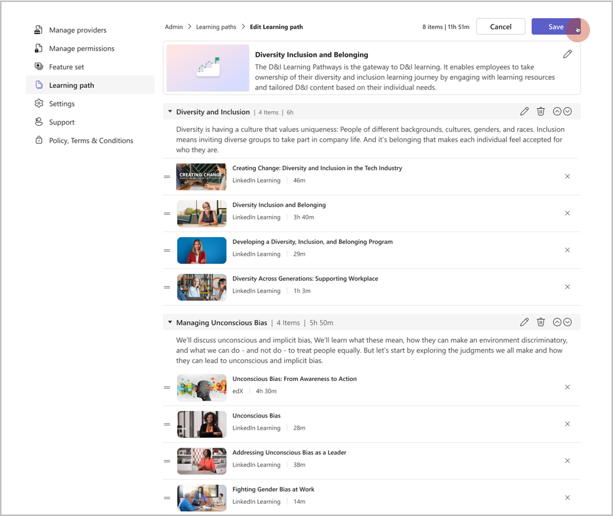
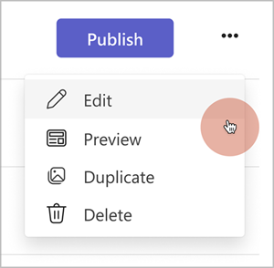

# Learning paths in Viva Learning

A learning path is a collection of learning objects or a sequence of learning activities relevant to the learning goals of employees, such as skill improvements or onboarding.

In Viva Learning, you can curate a learning path using learning content from different learning providers enabled for your organization. 

>[!NOTE]
>You need admin or knowledge manager permissions to create a learning path in Viva Learning.

## Create a Learning path

1. Go to the **Admin** tab in Viva Learning and click on **Learning path** on the left menu.
2. Click **Create new**.

3. Add a title and description. Upload a thumbnail or choose a default option. 
4. Click **Create**.

5. Click **Add content** to add your content.

6. You can take the following actions.
    1. Add a section title and description.
    1. Search for relevant learning content from learning providers within Viva Learning. 
    1. Select the content of your choice and click **Add**.
    1. Reorder the content by dragging the added courses. 

7. Click **Add Section** if you want to add another section to your learning path.

1. Reorder sections using the arrows if needed.
1. Click **Save**.

Your learning path is saved in drafts. You can edit, preview or publish the learning path now to make it available to employees in your organizations. 

>[!NOTE]
>You can't add or remove content from a learning path once it's published. You can only edit the title, description and thumbnail of a published learning path. 
 
### View and manage Learning path options

You can always view and manage your existing learning paths under the **Learning path** section in the **Admin** tab.

- Click **Publish** to publish the learning path and make it available for the organization employees. You can't add or remove content from a learning path once it's published. You can only edit the title, description, and thumbnail of a published learning path.
- Click **Edit** to update the learning path details. You can also edit the content for a draft learning path. Editing the learning path will not change its copy URL.
- Click **Preview** to display a preview of how the learning path will appear to the learner once published.
- Click **Duplicate** to create a copy of an existing learning path, which you can further modify and publish.
- Click **Delete** to delete the learning path. Once deleted, the learning path is no longer discoverable to employees in your organization. Deleting the learning path would remove any references like bookmarks or recommendation for that learning path.

Once a learning path is published, it shows up on the **Home page** in the **Browse courses** by the provider section under your tenant name carousel.

Employees can discover and play the course by clicking on the learning path card, navigating to the **details** page, and selecting the course thumbnail.

>[!NOTE]
>Nested Learning paths are not yet supported.
