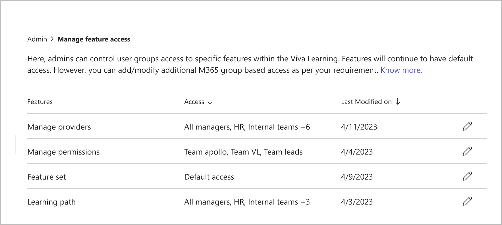
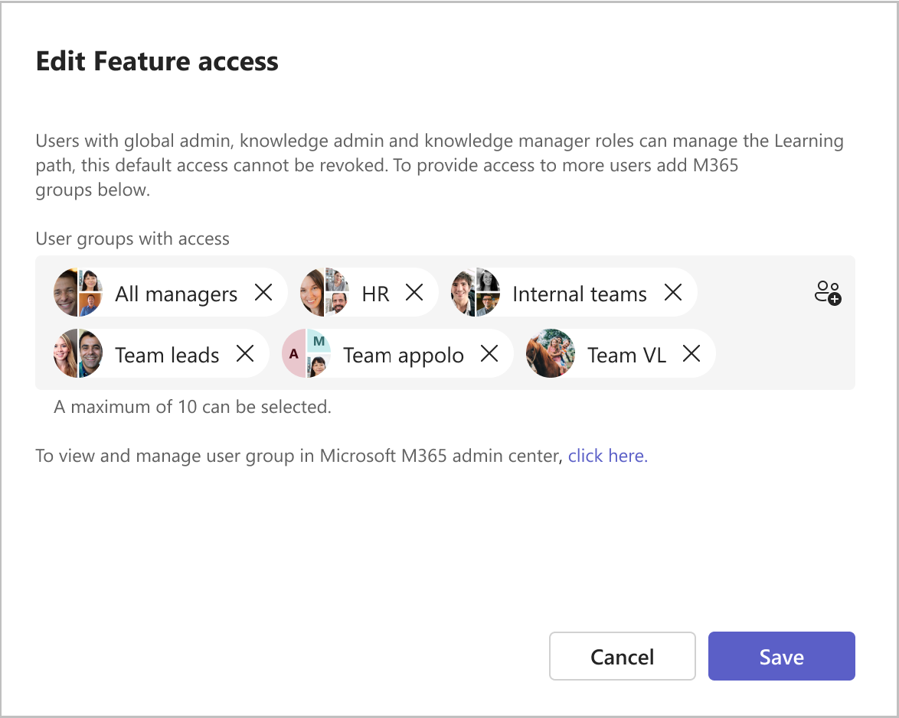

# Manage feature-level access in Viva Learning

Global admins and knowledge admins can now give access to non-admin users for managing features on Viva Learning admin tab.

This action can be done using Microsoft 365 groups. Any user who is part of Microsoft 365 group assigned to a specific feature gets the feature access in their Viva Learning admin tab.

## Prerequisites

Manage Feature Access is available for global admins and knowledge admins who have a Viva Suite or Viva Learning license.

## Manage Feature Access in Viva Learning

After a global admin or a knowledge admin manages access using Microsoft 365 groups, users within these groups can edit, update, and delete access for features similarly to a default admin.

> [!NOTE]
> Changes for newly added members in a group can take 24 hours to reflect. Changes reflect immediately for existing members.

Delegated access can be revoked by removing the group from **Edit Feature Access.**

You can create or manage the Microsoft 365 groups using the [Microsoft Admin Center](/microsoft-365/admin/create-groups/manage-groups)

To manage feature access:

1. Select the edit icon on the feature where you want to add, edit, or delete access.
2. You can view the **Edit feature access** window.
3. Add or delete the Microsoft 365 groups in **Edit feature access**.
4. Select **Save**.

The delegation access changes take place immediately in Viva Learning. The default admin roles continue to have access to the admin features and can’t be revoked.

> [!NOTE]
> The Microsoft 365 group has to be a part of both Learning path and Featured set to also get access to Academies.
