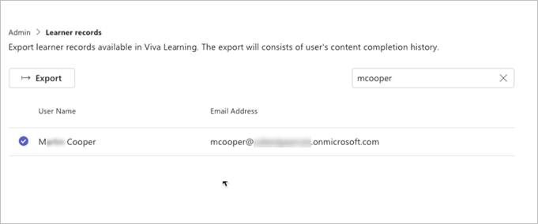

# Download Learner Completion Records 

As an admin, you can export the learner's course completion records available in Viva Learning. This will include all completion records synced into Viva Learning from the content sources as well as courses marked complete by the learner in Viva Learning.

1. Find a user by inputting their name or email ID in the search box. 

   

2. Choose from the options and select **Export**.
3. You receive the exported contents in a CSV file that you can open in Microsoft Excel. 

The following table describes the columns and values within the exported file. 

| Column Name | Description |
| --- | ---|
| Record Type | The category of how the learner originally engaged with the content.  **Self Initiated**  describes content was taken up by the user for self learning. An **assignment** is a content assigned to the learner in the LMS. **Recommendation** describes content that was recommended to the learner.|
| Content Title in Viva Learning | The title of the content as displayed in Viva Learning.| 
| Content Type in Viva Learning | The type of content, such as learning path, video, or course. |
| Content provider name| The name of the content provider that the content is ingested into Viva Learning from.| 
| External ID of the content | The unique identifier shared by the content provider for each content.|
| Completion status  | An indication of completion of the content.|
|Source of progress information| If the completion signal is coming from the provider, then this shows the name of the provider. If the completion is on account of the learner marking a content **Completed** in Viva learning, then we show **Viva Learning**.|
| Last Sync Date (UTC) | The date on which the Content provider last synced with Viva Learning. Any completions after this date will appear in Viva Learning in the next sync.|
| Type of Assignment or Recommendation | The assignment type, such as mandatory or optional. This is applicable only when the content provider has multiple assignment types and is synced to Viva Learning. |
| External id of  Assignment or Recommendation | The unique id as shared by the content provider for the assignment or recommendation.|
| Due Date (UTC) | The due date for the assignment or due date for the recommendation created in Viva learning.|
| Recommender name (for Viva Learning Recommendation) | The name of the recommender who recommended the content to the learner in Viva Learning.|
|Recommender email ID| The email ID of the recommender who recommended the content to the learner in Viva Learning.| 
|Date of Recommendation/Assignment (UTC) | The date of creation of the assignment that displays if the date is synched from the content provider. The date of the creation of the recommendation by the recommender in Viva Learning.| 