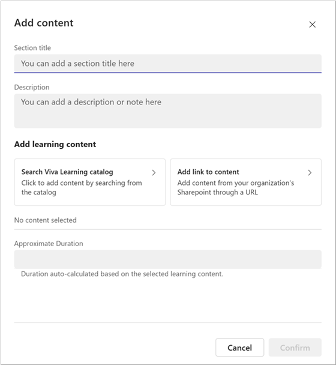
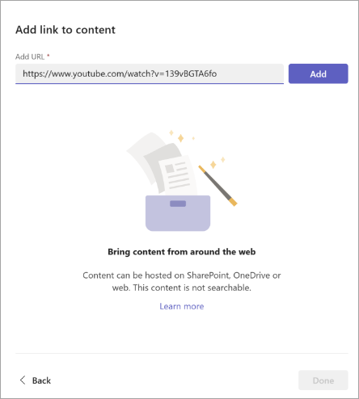

# Add link to content in Viva Learning

You can add link to content found in SharePoint, YouTube, Vimeo, news articles, and other sources into Viva Learning. Content can be bookmarked, recommended, and shared. 

Viva Learning supports the following document types, when adding content from SharePoint: 
- Word, PowerPoint, Excel, PDF 
- Audio (.m4a, .mp3) 
- Video (.mov, .mp4, .avi) 
- [Linked objects](#add-linked-objects)

> [!NOTE]
> - You need a Viva Suite or Viva Learning license to add link to content.   
> - This content isn't searchable in Viva Learning. 
> - The default language for this content is the one set by your organization's admin.  

1. Create a [learning path](creating-learning-paths.md) or [learning collection](creating-learning-collections.md).

2. Select **Add content** to add courses to your learning path.

3. Select **Add link to content**.

    

 
4. Paste the SharePoint URL or web link. Select **Add**.

    

5. Edit the title, thumbnail, and description.

6. Select **Done**. 

7. To edit content, go to the section and select the pencil icon. 

8. To delete content, go to the section, edit, and select the cross.

    

## Add linked objects

You can add links to both internal content from SharePoint and external content from sites such as YouTube or Vimeo included in Viva Learning.

To add a SharePoint page or SharePoint site, create a linked object and add the link using this process:

1. In your folder, select **New** and then choose **Link**. 

   :::image type="content" alt-text="Screenshot of the documents library with New and Link selected." source="../media/learning/sp-new-link.png" lightbox="../media/learning/sp-new-link.png":::

1. Add the URL and choose a name. 

    

1. Select **Create**. 

1. The link appears in your document library with the name you selected. 

    

The linked object now displays in the Viva Learning app. 

 
