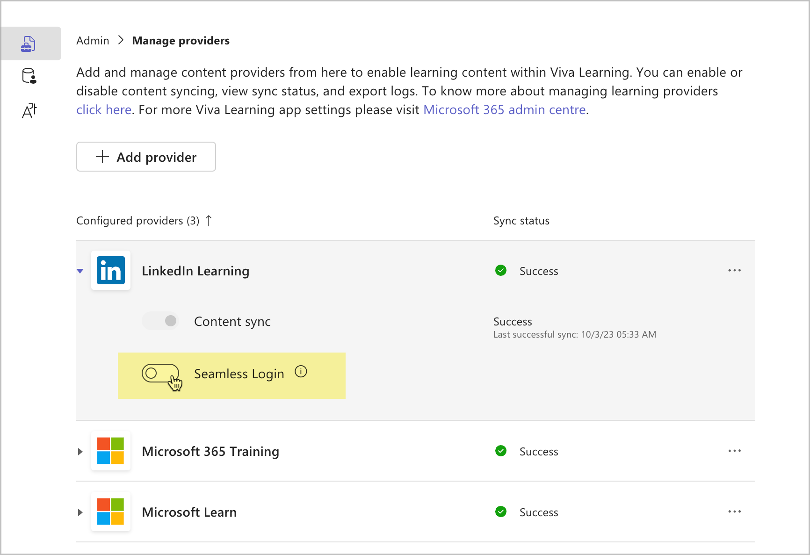
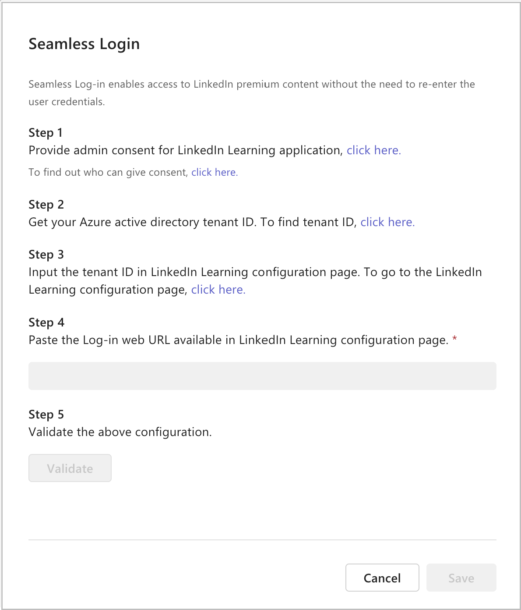
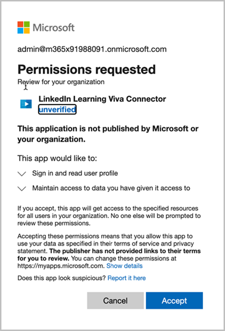
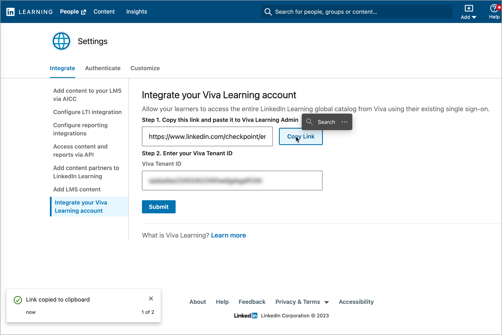

# Seamless login for LinkedIn Learning

Seamless login lets users access premium LinkedIn content with minimal reentering of enterprise credentials. 
Users still enter their personal LinkedIn credentials if they've connected their personal and enterprise LinkedIn accounts. 

To enable seamless login, admins can set up the following configurations:

1. Go to the **Admin** tab in Viva Learning and select **Manage providers**.

2. Turn on **Seamless Login** for LinkedIn in the Manage providers pane.

3. Provide **admin consent**.

  > [!IMPORTANT]
  > The consent is provided only by specific roles in the organization. Review who can [grant tenant-wide admin consent](learn.microsoft.com/en-us/entra/identity/enterprise-apps/grant-admin-consent?pivots=portal#prerequisites) in Enterprise applications.

4. Integrate with Viva Learning 
    1. Get the single sign-on WebURL from the LinkedIn Learning Admin page.  
    You can reach this url via the link shown or go to the **LinkedIn Admin configuration** > **Authenticate** > **Set up Viva Learning Authentication**.
    2. Enter the WebURL in Viva Learning.
    3. On the same LinkedIn Learning configuration page, enter the Entra tenant ID. The Entra ID is shown in the Viva Learning configuration. 

> [!IMPORTANT]
> On the LinkedIn configuration page, select **Submit** after entering the tenant ID and copying the Link to ensure that configuration is saved.

8. Select **Validate** and follow the steps to confirm the configuration works.

9. If prompted, use your organization's LinkedIn Learning credentials to sign in.

10. Select **Save** to save the configurations.

