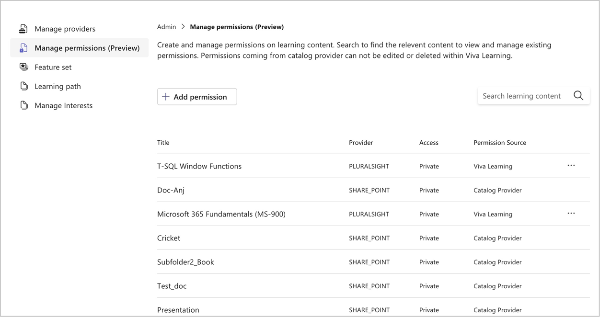
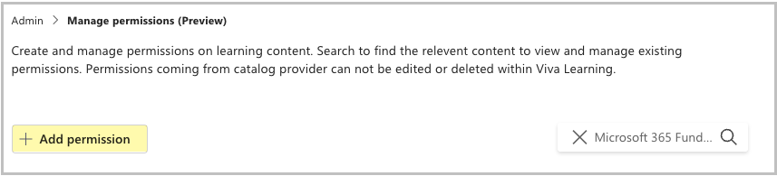
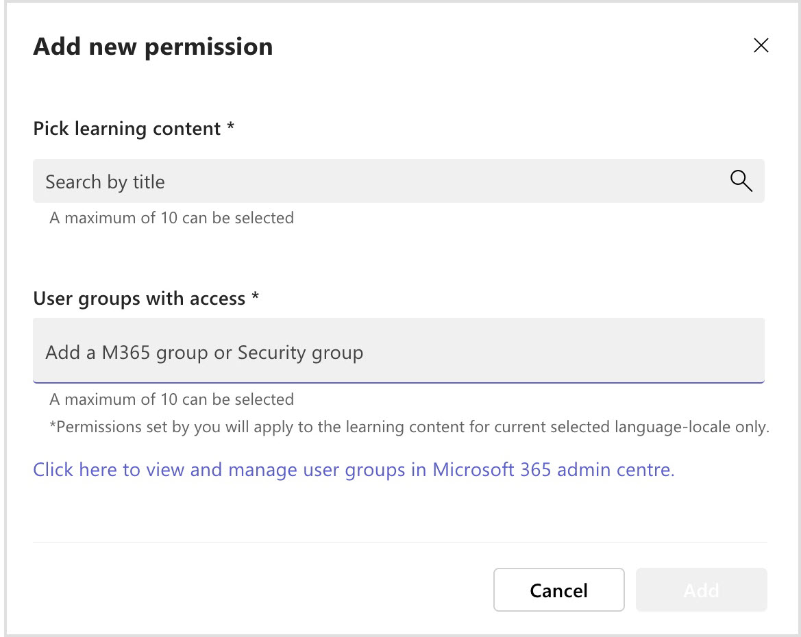
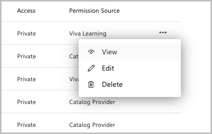

# Manage Catalog Access in Viva Learning

All content available in Viva Learning is discoverable by all users in the organization by default.  
Catalog access management allows you to restrict the ability of select users to view and discover courses. This lets your organization control whether a learning object is visible to a learner in Viva Learning.

Depending on your integration with Viva Learning, there are two methods by which your organization can control the access permissions:

## Control permissions within the LMS

Using the SAP SuccessFactors Learning Management System (LMS), organizations can set access permissions using assignment profiles. During the SuccessFactors  integration with Viva Learning, you can choose to enable a sync of permissions in SuccessFactors with Viva Learning.
Refer to the [Catalog permissions sync](viva/learning/configure-successfactors-content-source.md#catalog-permissions-sync) article for detailed steps and requirements.

Once the sync is complete, admins can view the courses for which permissions are applied within the **Admin** tab, by clicking **Manage Permissions**. 
Refer to the **View** permissions section below for more details.

## Create and manage permissions within Viva Learning

Use the Viva Learning permissions to restrict access to one or more learning objects to a select group of users 

>[!Note] 
>If you choose to control permissions using the LMS, then permissions can't be set within Viva Learning for courses coming from that LMS.

### Permissions Overview

When viewing permissions, you'll see the **title** of a learning object, the **provider** or source, and the associated **access** type and **permission source**.

There are two types of access: 

- **Private** access indicates that the access to a learning object is restricted.
- **Public** access indicates that there are no permissions associated with a learning object and that it's accessible within Viva Learning to everyone in the organization.

There are two types of permission sources:

- **Catalog provider** indicates that the permissions are coming from the LMS and you need to go to the LMS to views details of the permission.
- **Viva Learning** indicates that the permissions are set in Viva Learning. You can view, edit, or delete the permission by clicking the ellipses (**...**) next to it.

#### Add Permissions
You can select **Add permission** to create a new permission.

You can search and choose a maximum of 10 courses on which to apply permissions.

You then need to choose which user groups can access the course. Refer to the support documentation to learn more about [Microsoft 365 Groups](https://support.microsoft.com/en-us/office/learn-about-microsoft-365-groups-b565caa1-5c40-40ef-9915-60fdb2d97fa2).

#### Permission Actions

For learning objects with permissions created in Viva Learning, you have the following options.

- **View** the user groups that have access to the learning object.

- **Edit** to add or remove user groups that can access the learning object. 

- **Delete** to delete permissions created in Viva Learning. Once a permission is deleted, that learning object is accessible in Viva Learning by all users in the organization.

>[!Note]
> Permissions that originate from a catalog provider can't be deleted.
