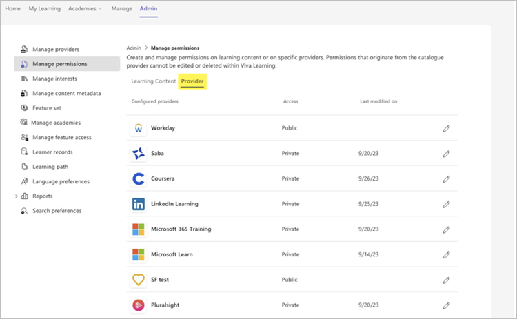

# Provider Permissions

You can control access to all catalog and content from a provider so a specific set of user groups can discover the content in Viva Learning.
Content from a provider is discoverable by everyone in your organization, by default. When content is shown to everyone, the access column displays "Public."

> [!NOTE]
> - Any changes to permissions - adding, editing, or deleting - can take up to two hours to reflect in Viva Learning.
> - You can select up to a maximum of ten user groups.
> - Only Microsoft 365 groups and Mail Enabled Security groups are supported.
> - Only members of the chosen groups can view the provider and its content within viva learning.

1. Go to the **Admin** tab, then **Manage Permissions**.

2. Under **Manage Permissions**, select the **Provider** tab.

3. To add permissions, select Edit (pencil icon).

4. Choose the user groups who need to get access.

5. Select **Save**. Now, only the members of this group can find this provider and its content in Viva Learning.

6. To edit permissions, navigate to the edit menu. You can add new groups or remove existing ones.

