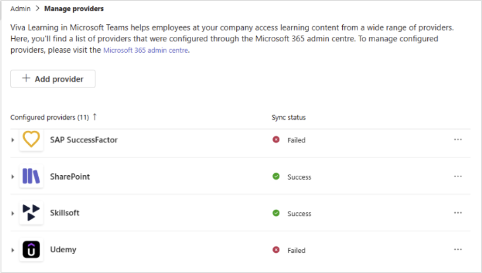
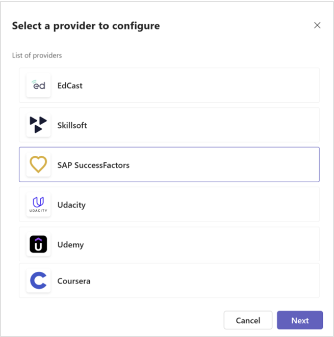
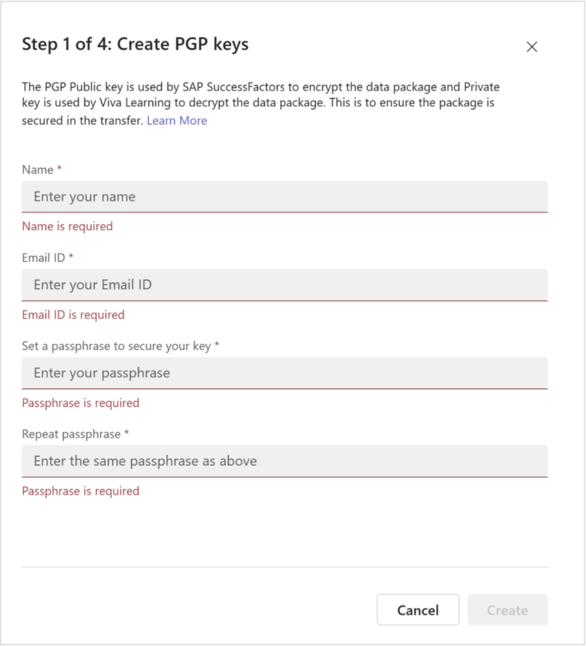
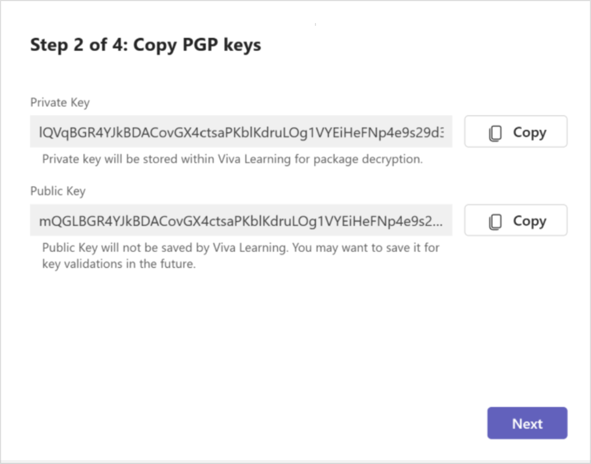
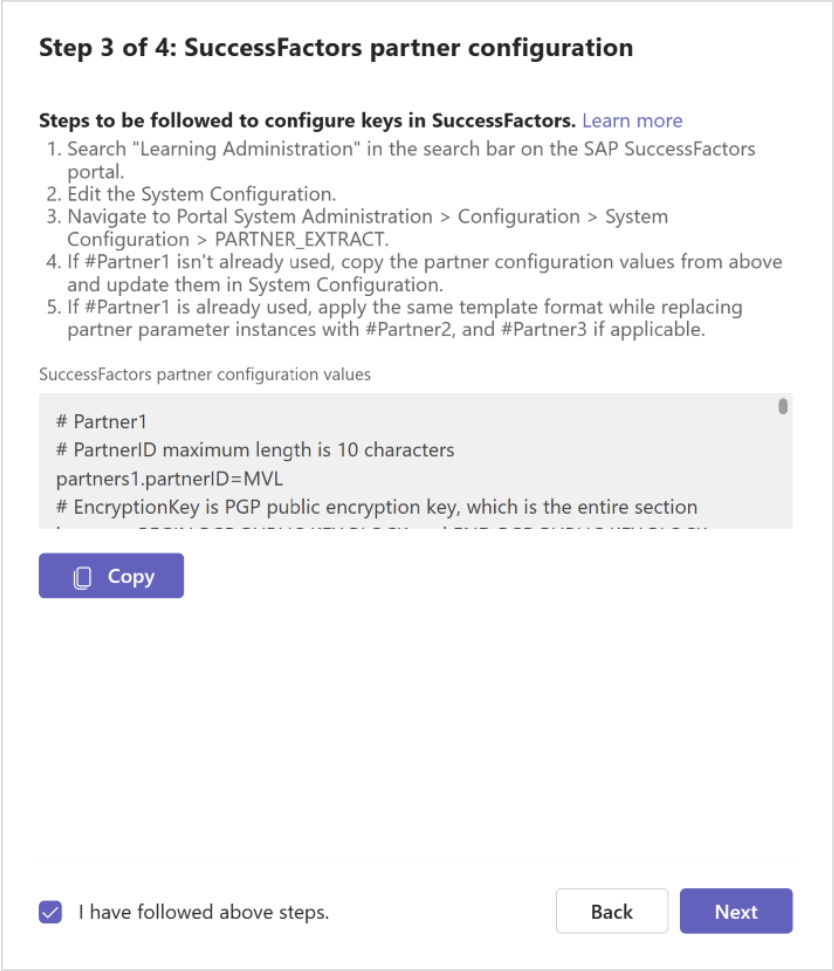
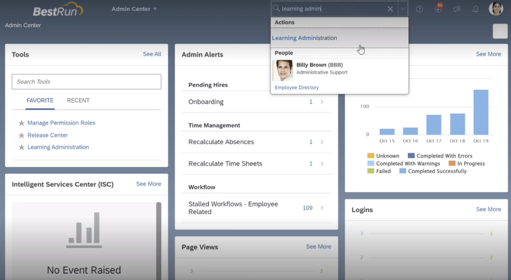
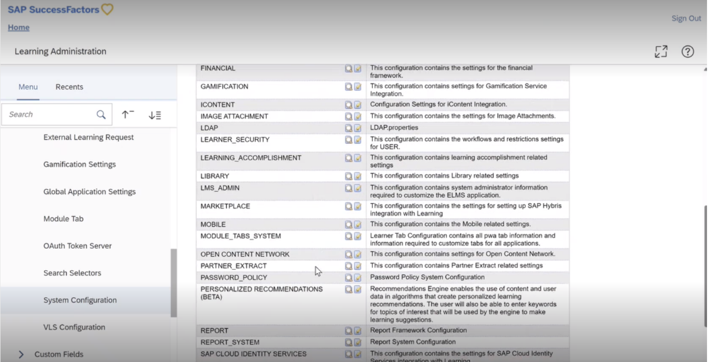
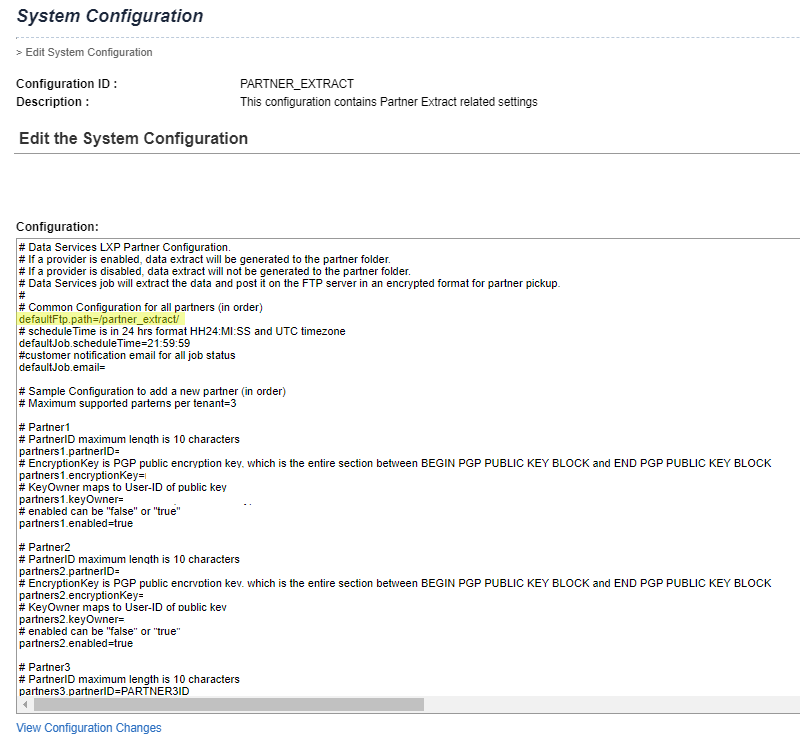
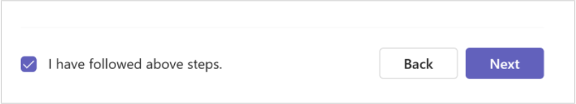
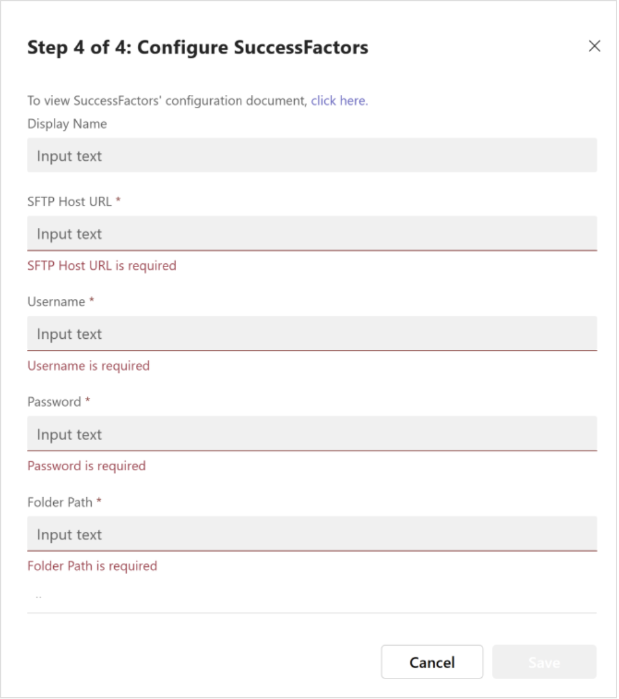

# Add SAP SuccessFactors as a content source

This article shows you how to configure SAP SuccessFactors as a third-party Learning Management System for Microsoft Viva Learning. First, you need to perform steps of onboarding in Admin tab under Viva Learning and then in SuccessFactors Portal.

>[!NOTE]
>Content accessible through Viva Learning is subject to terms other than the Microsoft Product Terms. SAP SuccessFactors content and any associated services are subject to the SAP SuccessFactors privacy and service terms.

## Prerequisites

There are two major integration stages for which admins require specific permissions.  

1. Viva Learning Admin Interface:  
    [Getting access to Viva Learning Admin access](/viva/learning/set-up-viva-learning#set-up-viva-learning)

    Admins can manage their Viva Learning content from within the Viva Learning app in Teams. Refer to [Manage content in the admin tab](/viva/learning/use-tabs#managing-providers) for more information.

2. SAP SuccessFactors Learning:

    Admin should have Learning Administration Access in the SAP SuccessFactors portal.  Learning administrators use the [Learning Administration](https://help.sap.com/docs/SAP_SUCCESSFACTORS_LEARNING/5fae31b1299d4033b665edabea7b9087/bd87dbf2b14c4fa29708b739ab40b1e1.html) module to manage the Learning Management System (LMS), including learner profiles, learning content, and learning needs management.

## Onboarding

1. Open the Viva Learning app either in Teams or through the web.
2. Go to the **Admin** tab in Viva Learning and select **Manage Providers**.

3. Select **Add Provider**.  

    

4. Select **SAP SuccessFactors** from the Provider list and select **Next**.

    

5. Enter the following details to generate PGP keys:
    - Name (Key owner name)
    - Email id (Key Owner email id)
    - Key Passphrase (Password)  

    

6. Select **Create**. PGP key pairs are now generated.  

    

7. Copy the Private key and Public Key individually and save it for later reference. **This is important as public key will not be saved within Viva Learning due to security reasons.** Select **Next**.

8. Viva Learning generates the partner configuration that needs to be updated in SuccessFactors Portal. Copy the configuration.

    

## Configure in your SuccessFactors portal

>[!NOTE]
>You'll need to have admin permissions in SuccessFactors to complete these steps.

1. Enter "Learning Administration" in the search bar on the SAP SuccessFactors portal, and then select the enter key.

   

2. Get the required workflows to edit the PARTNER_EXTRACT configuration located at **System Administration** > **Configuration** > **System Configuration** > **PARTNER_EXTRACT**.

   

3. Fill in the following parameters in the PARTNER_EXTRACT configuration. To edit the partner extract configuration in SuccessFactors, you need the **Edit System Configuration** workflow permission in SuccessFactors.

    

4. If #Partner1 isn't already used, update the copied Partner configuration from Viva Learning in System Configuration as shown below:

    ```console
        # Partner1

        # PartnerID maximum length is 10 characters

        partners1.partnerID=MVL

        # EncryptionKey is PGP public encryption key, which is the entire section between BEGIN PGP PUBLIC KEY BLOCK and END PGP PUBLIC KEY BLOCK

        partners1.encryptionKey=mQGLBGRU6jQBDACeXchGtcYCSnLDbnj8lygx4teNSArp0JHG4s0cQMNG6xhznrCgKQnfK3VYehddJnsN2mVpxqY4/
        KgOPDurNgRccPKKzVXZjEt2rC1wrzOv7uM5iUTXkGzUjyJ3vwW0ztPu3eqJg0V6elK/Q9cHEeX+IiTUhBdBX7XbDbW/CRgQ9XZZ0VmbnUhpYsEJuJFfk14a2JpeyZEDIzKfpBi7K6Hd5iPxMOr0Mme/
        UK4Sy3sh1sQ5ehNBZAKfPP029JCom9smywWCVuvbvdLtoU0Wqm7GMXZslUmxdZjksrEMPa4FYibtogUQmhoijGOhj+jmJCWrrIyVuj0SitFVvYvbeWyD0cCEnnRwjTYG2MdZdq8AOh+QhI4mHB2C+kch4hx3/
        z1NrWOLVbPa2NbJZK15FHdmI/ERIYD+hVsbXYA6RybJl3KxK/y/EsLRxZp5qjF261+kAinpHF4RWHfX0BdDKI1/ZS6ls9WQ
        +OH9GI26LMKBrigLNY6yrCXhRQDzBXT19FEABRO0JE1hbGFiaWthIFJveSA8bWFsYWJpa2Fyb3lAZ21haWwuY29tPokBnAQQAQIABgUCZFTqNAAKCRB1hXfnWY5lcLKfC/
        92uaXsACn91Awp7APofGgH4XNV7KeMPWEZ8Ko3VlexYUJQJBnOBSJfBxCJAQEfDMSgnbS3bfb2NEVr6VBTK3tVEWPSoCSDn/AGgO60SFCcYMy3fz2lL8toc6rbFxfFDHyRmaQKCxIF
        +2o4aOeRQ9oz1wAarszUNMcAHbGWbHk6j06Flu8flTfhJwqRMPTukPoCQnqXMSroNblov3gg8JCKlbauPeL64Oq7W78qdXjsIsM9gpq0Ly5PrVsSnn0+8a4Z4OYmaKLiZe9rQ
        +rMSTg6A04Lr24KpzFzZbXVlxZhqsh6xz1UtVQYx7AqO6X+mwjrvWzInW9B5wuqZ3wydklFJmNEBA5VPsRLZiZoXxtI1LmoVFdDDOIEdInfq9TB9kZryO+xuW/xnNfrIyCnfbAARO6Qt9ks7L1mVeA3oE8NaQ3shVI9LVfxh0/
        Edd2HIi2jjXdJ5DAAuFMV64eaucicHmxQzR5y7YiUZNFmVDgXlTR0fRgYF5s0IUaJKY2mJQ8==k/F5

        # KeyOwner maps to User-ID of public key

        partners1.keyOwner=John Doe<johndoe@contoso.com >

        # enabled can be "false" or "true"

        partners1.enabled=true

>[!NOTE]
>`partners1.path` and `partners1.email` are optional properties in SuccessFactors partner extract configuration.

5. If #Partner1 is already used, apply the same template format while replacing partner parameter instances with #Partner2, and #Partner3 as applicable.

6. Save the SuccessFactors partner configuration and come back to Viva Learning > Manage Providers to complete the Viva Learning configuration.

7. Check **I have followed the above steps** and select **Next**.

    

1. Fill in the configuration details:

    

- **Display Name**: Enter the display name you want to appear for the SAP SuccessFactors carousel.

 - **SFTP Host URL**: Navigate to the SAP SuccessFactors portal and select **LMS Admin Application** > **System Administration** > **Configuration** > **System Configuration** > **CONNECTORS**. Get the value of the `connector.ftp.server` property.

 - Validate SFTP url, username and password by visiting https://<sftp_url> and logging in using username and password.

- **User Name**: Follow the same steps you followed for the SFTP Host URL. Get the value of the `connector.ftp.userID` property. Ignore the password available in the configuration site.

     :::image type="content" source="../media/learning/sfsf-system-config-highlighted3.png" alt-text="Screenshot of System Config screen on connectors calling out admins to not enter the password in the connector.ftp.password field." lightbox="../media/learning/sfsf-system-config-highlighted3.png":::

    - **Password**: Check with your LMS application owner for help with retrieving your password. Enter that password here.

  - **Folder Path**: Navigate to **Learning Administration** > **System Administration** > **Configuration** > **System Configuration** > **PARTNER_EXTRACT**. Get the value of the `defaultFtp.path` property and join this value with the value of `partners1.path` from the "partnerID=MVL" partner configuration.
    
  - Validate the existence of the folder path in the SFTP server. Create the folder if it doesn't exist.

    - **Client's Host URL**: This is the BizX domain URL. You can get this from your BizX sign in URL. For example, if your BizX sign in URL is `organization.successfactors.com/sf/start/#/login` then the host URL is `organization.successfactors.com`.

    - **Client's Learning Destination URL**: You can get this from the learning domain module URL. For example, if the learning domain URL is `organization.scdemo.successfactors.com/learning/...` then the Learning Destination URL is `organization.scdemo.successfactors.com`.

    - **Company ID**: Sign in to your SuccessFactors portal. Select your profile icon, then select **Show Version Settings**. You can view your company ID here.

      

      

9. Select **Save** to activate SuccessFactors content in Microsoft Viva Learning.

10. Once the configuration is saved, the SuccessFactors provider is listed in the Manage Providers dashboard screen of the tenant.

11. Synchronization is attempted twice a day. Sync status and error logs can be reviewed on the dashboard screen.

## FAQs

- **How long does SAP SuccessFactors take to generate the Full package for synchronization once SuccessFactors Portal partner configuration is updated?**

    After you've finished the configuration in your SuccessFactors portal, SuccessFactors will generate the initial sync package. This may take up to seven business days. Once the package is available in your SFTP folder path, Viva Learning is able to begin communicating with SuccessFactors. If you can't find the package, contact [SAP SuccessFactors support](https://support.sap.com/en/my-support/product-support.html).

- **Why can’t I see the Full sync package now in SFTP 3 weeks after I have completed the SuccessFactors Portal configuration?**

     SAP SuccessFactors deletes the Full Sync package from SFTP location automatically after 14 days from generation date. It takes almost seven days to generate the Full sync package from the day the configuration is submitted in SuccessFactors Portal

- **Why can I see the course in Viva Learning application while getting a subscription error on playing the content?**

   Users can discover all the tenant level courses in Viva Learning that they have permission to view. They get a subscription error when playing third-party courses for which they don't have a valid subscription.

- **How can Viva Learning SuccessFactors Provider Configuration be edited?**

   Navigate to **Manage Providers** > **SuccessFactors Provider**.

- **How frequently does Viva Learning check for SuccessFactors availability?**

    Viva Learning checks for the availability of the SuccessFactors package every hour, starting from when SuccessFactors is initially configured in Viva Learning. The upcoming scheduled slot is available as a status on **Manage Providers** > **SuccessFactors**.

    SuccessFactors generates the main package and the keys package at different times.

    Viva Learning starts processing of these packages once both files are generated by SuccessFactors. We've observed a maximum of three-hour gap between the generation of both packages.

    If both packages are generated together, Viva Learning triggers processing within an hour. Otherwise, Viva Learning triggers processing within an hour of the availability of both packages.

- **What is the maximum size of a SuccessFactors package that Viva Learning supports?**

    Viva Learning supports the onboarding of SuccessFactors packages up to a size of 10 GB (compressed file).

- **Contact SAP SuccessFactors Support**
  - Create a [support incident](https://support.sap.com/en/my-support/product-support.html?anchorId=section_249481993) with SAP SuccessFactors support
  - [Incident creation](https://support.sap.com/content/s4m/help/support/cases.html#appoverview)
  - [Incident escalation](https://support.sap.com/content/s4m/help/support/cases.html#speed)

## Error Messages

The following table lists error codes and messages, when they're displayed, and next steps you can take to resolve them.

|Error code | Description | Next steps |
|---|---|---|
|USR_ERROR_SF_INITIAL_PACKAGE_NOT_FOUND| No new content ingested as the required package wasn't found in the SuccessFactors SFTP server.| Make sure that the SuccessFactors package is available. It may take up to seven working days to generate this package the first time you sync. If you can't find the package, contact your SuccessFactors support team.|
|USR_ERROR_SF_DELTA_PACKAGE_NOT_FOUND | No new content was ingested as the required package wasn't found in the SuccessFactors SFTP server. | Make sure that SF package is available in the configured folder path on your SF portal. If you can't find the package, contact your SuccessFactors support team.|
|USR_ERROR_SF_COMPRESSED_PACKAGE_SIZE_EXCEEDED |No new content was ingested because the compressed package size exceeded 2 GB.|Contact [Microsoft customer support](/viva/learning/help-support#) for more details.|
|USR_ERROR_SF_UNCOMPRESSED_PACKAGE_SIZE_EXCEEDED |No new content was ingested because the uncompressed package size exceeded 25 GB. |Contact Microsoft customer support for more details.|
|PGP Keypair validation failed |Possible reasons for this failure - Incorrect values entered for fields - SF Public Key, SF Private Key, SF Private Key Pass Phrase. |Navigate to the **SuccessFactors Provider** and select **Edit** under **…** and **Renew Keys**. Copy the Partner configuration and paste it in the SuccessFactors Portal. Save the configuration. Create ticket with the SuccessFactors support team to generate new package|
