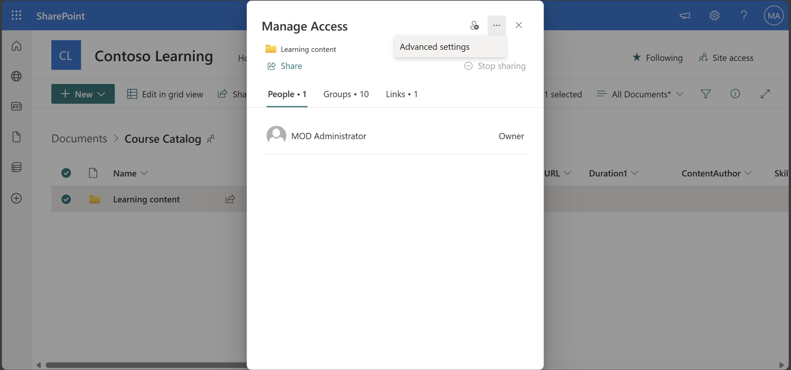
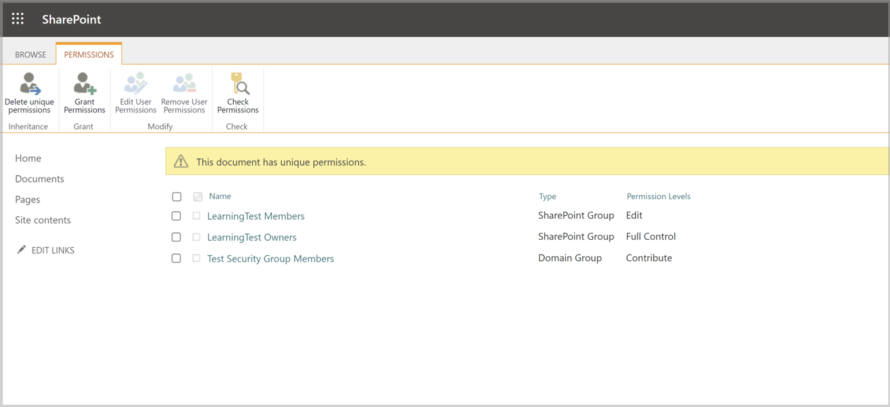

# Use Microsoft 365 Groups permissions with SharePoint content in Viva Learning

Document library folder URLs can be collected from any SharePoint site in the organization. Viva Learning follows all existing content permissions. Therefore, only content for which a user has permission to access is searchable and visible within Viva Learning. Any content within these folders will be searchable, but only content to which the individual employee has permissions can be used.

> [!NOTE]
> The admin tab is only available for admins with a Viva Suite or Viva Learning license.

> [!NOTE]
> Only the Microsoft 365 and Mail enabled security group (MESG) group type is supported. Viva Learning doesn't support user-based permissions. Viva Learning won't ingest files that don't have associated Microsoft 365 Groups or MESG permissions.

1. Create a group by following the steps in [Create a group in the Microsoft 365 admin center](/microsoft-365/admin/create-groups/create-groups) or [Create mail-enabled security groups](/exchange/recipients/mail-enabled-security-groups).

   > [!NOTE]
   > You need to be a site owner or site contributor to add permissions.

   > [!NOTE]
   > You'll need to add the owners as members in order for them to have access.

2. Go to the folder where you're storing learning content in SharePoint.
3. Select the vertical ellipses (**...**) on the item you want to control access to. If you want to control access to specific items in a folder, go to that folder.
4. Select **Manage access** and then **Grant access**.

    

    

6. Start typing the email address of the group you want to give access to, then select the group.

    

7. By default, users in the group are given Edit permissions. Select the pencil icon to choose between Edit and View permissions. The pencil icon will have a slash through it if the group has only view permissions. Users need a minimum of Can View permission.

    

8. Select **Grant access** to give your group access to the learning content.

9. Check whether the group you added is present on the folder and has "Domain Group" as its Type by selecting **Manage access**, then **More Options** and then **Advanced Settings**.

   

   

   > [!NOTE]
   > It will take approximately 24 hours for these changes to show up in the Viva Learning app.

9. If the group is not present:

   - A M365 group or MESG group can't be added directly to the file or folder in case the group is found on the folder or file nested in SharePoint groups.
   - To see if group is already present, click on the folder, go to **Manage access,** select **More options,** then **Advanced settings**> and finally **Check permissions**
   - Start typing the group name
   - If it is already present, remove it and add directly or add a different group

   :::image type="content" alt-text="Screenshot of the course catalog check permissions window with the option to check the name of the group" source="../media/learning/sharepoint-permissions-course-catalog-check-1.png" lightbox="../media/learning/sharepoint-permissions-course-catalog-check-1.png":::

   :::image type="content" alt-text="Screenshot of the course catalog check permission window with the user and group displayed below." source="../media/learning/sharepoint-permissions-course-catalog-check-2.png" lightbox="../media/learning/sharepoint-permissions-course-catalog-check-2.png":::

## Remove unintentionally surfaced content

1. To restrict access to the document library, select the **Show actions** option, and then select **Manage access**.

     

2. Delete the original document within the document library.

For more information, see [Sharing and permissions in the SharePoint modern experience](/sharepoint/modern-experience-sharing-permissions).
