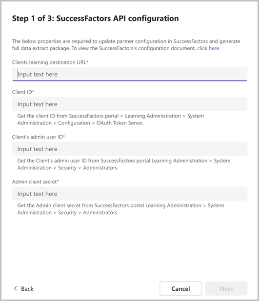
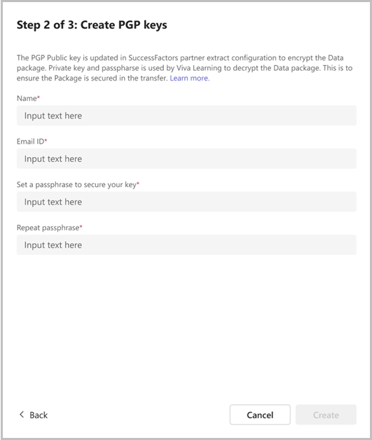
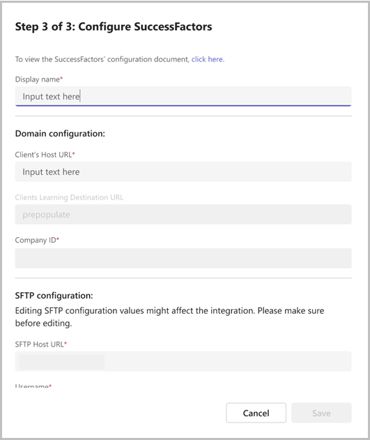
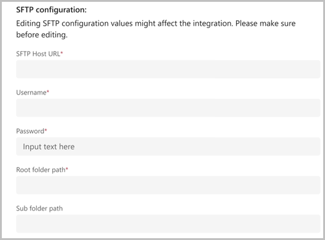
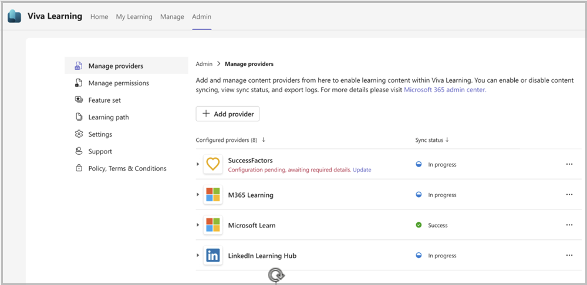
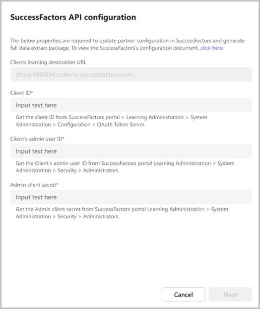

# Add SAP SuccessFactors as a content source

This article shows you how to configure SAP SuccessFactors as a third-party Learning Management System for Microsoft Viva Learning. This involves onboarding in the Admin tab under Viva Learning and then in SuccessFactors Portal.

> [!NOTE]
> This article outlines the updated experience for customers who are integrating Viva Learning with SuccessFactors for the first time. If you are a customer who has already added SuccessFactors as a content source, refer to our [**earlier documentation**](viva/learning/sfsf-add-as-content-source)

Content accessible through Viva Learning is subject to terms other than the Microsoft Product Terms. SAP SuccessFactors content and any associated services are subject to the SAP SuccessFactors privacy and service terms.

## Prerequisites

There are two major integration stages for which admins require specific permissions.  

1. Viva Learning Admin Interface:  
    [Getting access to Viva Learning Admin access](/viva/learning/set-up-viva-learning#set-up-viva-learning)

    Admins can manage their Viva Learning content from the **Admin** tab in Viva Learning app on Teams or using the browser. Refer to [Manage content in the admin tab](/viva/learning/use-tabs#managing-providers) for more information.

2. SAP SuccessFactors Learning:

    Users need Learning Administration Access in the SAP SuccessFactors portal.  Learning administrators use the [Learning Administration](https://help.sap.com/docs/SAP_SUCCESSFACTORS_LEARNING/5fae31b1299d4033b665edabea7b9087/bd87dbf2b14c4fa29708b739ab40b1e1.html) module to manage the Learning Management System (LMS), including learner profiles, learning content, and learning needs management.

## Onboarding

1. Open the Viva Learning app either in Teams or on the web.
2. Go to the **Admin** tab in Viva Learning and select **Manage Providers**.
3. Select **Add Provider**.  

    

4. Select **SAP SuccessFactors** from the Provider list and select **Next**.

    

###  SuccessFactors API Configuration 

This step is needed to establish the base connection between Viva Learning and the SuccessFactors system. 
It enables Viva Learning to trigger the full sync package and delta package generation from SuccessFactors for the initial syncs and subsequent ones. The user needs to provide the SuccessFactors API configuration details: 

> [!NOTE]
> Viva Learning only accesses the partner extract configuration API and the adhoc package generation API. This seamless integration with SuccessFactors is driven by SuccessFactors APIs and requires SuccessFactors admin details to have the following permissions. 
> - Edit System Configuration 
> - View System Configuration  

- **Client learning destination URL**: You can get this from the learning domain module URL. For example, if the learning domain URL is organization.scdemo.successfactors.com/learning/... then the Learning Destination URL is organization.scdemo.successfactors.com. 

- **Client ID**

- **Client’s admin user ID** 

- **Admin client secret** 

Refer to the **Properties required from SAP SuccessFactors** section for more details on obtaining the Client ID, Client’s admin user ID & Admin client secret properties from SAP SuccessFactors 

 
### Create PGP Keys 

SuccessFactors sends the data to Viva Learning in file packages. The files are encrypted by using PGP keys so that it can only be read by Viva Learning. 
This step generates the unique PGP key pair that will be used by SuccessFactors to encrypt the data package for Viva Learning. 

Admin needs to enter the following details to generate PGP keys: 

- **Name** (Key owner name)- Ideally this is the name of the person entering the details on this page. This data is needed by SuccessFactors. 

- **Email id** (Key Owner email ID) - Ideally this is the email ID of the person entering the details on this page. This data is needed by SuccessFactors. 

- **Key Passphrase** (Password): Enter a password with a minimum length of five characters. This is used to encrypt and decrypt the data package along with the PGP keys. Changing this in future leads to changing the PGP keys. The passphrase can be changed in the future via the EDIT path (see below) 

> [!NOTE]
> Once the PGP keys are created in Step 2 the attributes are updated in SuccessFactors partner extract configuration. The partner state is set to disabled till the next step is completed successfully. 

- **Partner ID** : Default as MVL 

- **PGP Public key**: Generated above

- **Key owner**: Name and email ID shared above 

### Configure SuccessFactors

In this step, admins need to enter the more configurations required to establish the connection and access to the data package. 

#### Display name and domain configuration 

- **Display Name**: This setting allows the Admin to customize the display name of the SAP SuccessFactors carousel that appears in Viva Learning. The default value is "SAP SuccessFactors" 

- **Client's Host URL**: This is the BizX domain URL. You can get this from your BizX sign in URL.  
For example,  if your BizX sign in URL is organization.successfactors.com /sf/start/#/login, then the host URL is organization.successfactors.com 

- **Client's Learning Destination URL:** It's prepopulated with the value you’ve provided in STEP 1 earlier.

- **Company ID**: This is your Company ID as per SuccessFactors.  Sign in to your SuccessFactors portal. Select your profile icon, then select Show Version Settings. You can view your company ID here. 

#### SFTP configurations

- **SFTP Host URL**: This password is required to access the SFTP server. Navigate to the SAP SuccessFactors portal and select **LMS Admin Application** > **System Administration** > **Configuration** > **System Configuration** > **CONNECTORS**. Get the value of the `connector.ftp.server` property.

- **User Name**: This is the username required to access the SFTP server. This value is prepopulated and doesn't need to be edited. This field is fetched from SuccessFactors from LMS Admin Application > System Administration > Configuration > System Configuration > CONNECTORS > connector.ftp.userID property.  

- **Password**: This is the password required to access the SFTP server. Check with your LMS application owner for help with retrieving your password. Enter that password here. 

- **Root folder path**: This is the root folder in the SFTP server where the data extract package created for this integration is saved by SuccessFactors. This value is prepopulated.  

    This field is fetched from SuccessFactors from **Learning Administration** > **System Administration** > **Configuration** > **System Configuration** > **PARTNER_EXTRACT** > **defaultFtp.path property**. 

     Verify if the root folder EXISTS in the SFTF server. The configuration may fail if the folder doesn't exist 

- **Sub folder path**: This is the sub folder under the root folder where the data extract package created for this integration is saved by SuccessFactors. The default value is “MVL”. You can change or remove this value. If this value is removed all, the data extract package is saved in the root folder configured above.  

    Verify if the root folder EXISTS in the SFTF server. The configuration may fail if the folder doesn't exist 

> [!NOTE] 
> Only one level of folder path is supported for the sub folder path. The folder should not exceed 256 characters

#### API configuration 

This section contains the values entered in the first step that was  outlined above. All the values are prepopulated and doesn't need to be reentered or edited. 

- **Client ID**: It's prepopulated with the value you have provided in step 1 earlier 

- **Client’ admin user ID**: It's prepopulated with the value you have provided in step 1 earlier 

- **Admin client secret**: It's prepopulated with the value you have provided earlier.

##### PGP configuration 

- **PGP Private Key**: It's prepopulated with the PGP private key created earlier 

- **PGP Private Key Passphrase**: 

#### Complete configuration 

After completing the previous steps, select **Save** to complete the SuccessFactors configuration in Microsoft Viva Learning for the content sync. 

Once the configuration is saved, the SuccessFactors provider is listed in the **Manage Providers** dashboard screen of the tenant. SuccessFactors generates the full data extract package in SFTP server. Viva Learning processes the package after the full data extract package  is generated. Synchronization occurs twice a day. Sync status and error logs can be reviewed on the dashboard.

> [!NOTE]  
> If you exit from saving SuccessFactors configuration from Step 2 or Step 3, then Viva Learning saves the configuration values entered up to that step. You can resume the configurations from where you left off.  For example, if you hit cancel in Step 2 – Create PGP keys, Viva Learning retains the configurations entered in Step 1. 

If you need to delete the draft configuration, you can delete the SuccessFactors provider. 

### Customers who have already completed SuccessFactors integration 

If you have configured SuccessFactors integration prior to this update (mention date), we highly recommend that you move to the new integration. This enables seamless integration with SuccessFactors by automatically updating the SuccessFactors partner extract configuration with Client ID, PGP keys, key owner, and other required properties. This helps in automatic generation of full data extract package and seamless integration driven by SuccessFactors APIs.  

1. Go to the **Admin** tab in Viva Learning and select **Manage Providers**. Under the configured SuccessFactors provider, you'll see 'Configuration pending, awaiting required details.' 

    The message remains until you migrate to the new integration process. If you leave the process midway, the configuration isn't retained.

2. Select **Update**

    Selecting update opens a one-time screen to provide SuccessFactors API configurations that provide seamless integration with SuccessFactors. This integration is driven by SuccessFactors APIs, which requires SuccessFactors admin details having the following permissions: **Edit System Configuration** and **View System Configuration** 

    Viva Learning  only accesses partner extract configuration API and ad-hoc package generation API.  

3.  Provide the following SuccessFactors API configuration details: 

    a. **Client ID**  

    b. **Client’s admin user**  

    c. **Admin client secret** 

    Refer to the 'Properties required from SAP SuccessFactors' section for more details to get the required properties from SAP SuccessFactors. 

4. Select **Next** and save the API configurations  

> [!NOTE]
> - You can also provide API configuration details by selecting Edit  for the SuccessFactors provider. 
> - When you renew PGP keys and update the sub folder path value, SuccessFactors generates a full data extract package. 

### Properties required from SAP SuccessFactors 

Follow the steps documented in the table to get the values of the required three properties from SAP SuccessFactors:

| Properties  | Description  |
|---|---|
| Client’s Admin User ID  | This admin user needs a role assigned to Search Library and View Library permissions to execute the catalog service API.  There's no need to provide any other permissions for this admin user in SuccessFactors.  |
| Admin Client Secret  | The admin client secret is the generated client secret for the respective admin user. Go to System Administration > Security > Administrator and search for the admin.  |
| Client ID  | The client ID is required to execute the API. Navigate to System Administration > Configuration > OAuth Token Server.  |

### Permissions required for the admin role in SAP SuccessFactors 

Follow these steps to assign the required permissions to a role and assign that role to an admin in SAP SuccessFactors: 

1. Create a role in comprised of the **Search library** and **View library** permissions.

    1. To create a new role, navigate to **System Administration** > **Security** > **Role Management** > **Create a new role** > enable **Edit System Configuration** and **View System Configuration** permissions for the role. 
    Or use an existing role that has the two permissions already assigned. 

2. Assign the new role to an admin user. 
    1. To assign a role to the admin user, navigate to **System Administration** > **Security** > **Administrator** > search for the admin > **Edit summary of an admin** > **Assigned Roles** > Add the created role. 

## FAQs

- **How long does SAP SuccessFactors take to generate the Full package for synchronization once SuccessFactors Portal partner configuration is updated?**

    After you've finished the configuration in your SuccessFactors portal, SuccessFactors will generate the initial sync package. This may take up to seven business days. Once the package is available in your SFTP folder path, Viva Learning is able to begin communicating with SuccessFactors. If you can't find the package, contact [SAP SuccessFactors support](https://support.sap.com/en/my-support/product-support.html).

- **Why can’t I see the Full sync package now in SFTP 3 weeks after I have completed the SuccessFactors Portal configuration?**

     SAP SuccessFactors deletes the Full Sync package from SFTP location automatically after 14 days from generation date. It takes almost seven days to generate the Full sync package from the day the configuration is submitted in SuccessFactors Portal

- **Why can I see the course in Viva Learning application while getting a subscription error on playing the content?**

   Users can discover all the tenant level courses in Viva Learning that they have permission to view. They get a subscription error when playing third-party courses for which they don't have a valid subscription.

- **How can Viva Learning SuccessFactors Provider Configuration be edited?**

   Navigate to **Manage Providers** > **SuccessFactors Provider**.

- **How frequently does Viva Learning check for SuccessFactors availability?**

    Viva Learning checks for the availability of the SuccessFactors package every hour, starting from when SuccessFactors is initially configured in Viva Learning. The upcoming scheduled slot is available as a status on **Manage Providers** > **SuccessFactors**.

    SuccessFactors generates the main package and the keys package at different times.

    Viva Learning starts processing of these packages once both files are generated by SuccessFactors. We've observed a maximum of three-hour gap between the generation of both packages.

    If both packages are generated together, Viva Learning triggers processing within an hour. Otherwise, Viva Learning triggers processing within an hour of the availability of both packages.

- **Why do I see the “Configuration failed. Resolve” error on the **Manage providers** page for the SuccessFactors provider?**

    You're seeing this message because the SuccessFactors API configuration values ('Client ID', 'Client’s admin user ID' and 'Admin client secret') that you provided earlier are no longer valid. Select **Resolve** to provide the correct values.

- **What is the maximum size of a SuccessFactors package that Viva Learning supports?**

    Viva Learning supports the onboarding of SuccessFactors packages up to a size of 10 GB (compressed file).

- **Contact SAP SuccessFactors Support**
  - Create a [support incident](https://support.sap.com/en/my-support/product-support.html?anchorId=section_249481993) with SAP SuccessFactors support
  - [Incident creation](https://support.sap.com/content/s4m/help/support/cases.html#appoverview)
  - [Incident escalation](https://support.sap.com/content/s4m/help/support/cases.html#speed)

## Error Messages

The following table lists error codes and messages, when they're displayed, and next steps you can take to resolve them.

| Error code  | Description  | Next steps  |
|---|---|---|
| USR_ERROR_SF_INITIAL_PACKAGE_NOT_FOUND  | No new content ingested as the required package wasn't found in the SuccessFactors SFTP server.  | Make sure that the SuccessFactors package is available. It may take up to seven working days to generate this package the first time you sync. If you can't find the package, contact your SuccessFactors support team.  |
| USR_ERROR_SF_DELTA_PACKAGE_NOT_FOUND  | No new content was ingested as the required package wasn't found in the SuccessFactors SFTP server.  | Make sure that SF package is available in the configured folder path on your SF portal. If you can't find the package, contact your SuccessFactors support team.  |
| USR_ERROR_SF_COMPRESSED_PACKAGE_SIZE_EXCEEDED  | No new content was ingested because the compressed package size exceeded 2 GB.  | Contact Microsoft customer support for more details.  |
| USR_ERROR_SF_UNCOMPRESSED_PACKAGE_SIZE_EXCEEDED  | No new content was ingested because the uncompressed package size exceeded 25 GB.  | Contact Microsoft customer support for more details.  |
| PGP Keypair validation failed  | Possible reasons for this failure - Incorrect values entered for fields - SF Public Key, SF Private Key, SF Private Key Pass Phrase.  | Navigate to the SuccessFactors Provider and select Edit under … and Renew Keys. Copy the Partner configuration and paste it in the SuccessFactors Portal. Save the configuration. Create ticket with the SuccessFactors support team to generate new package  |
| USR_ERROR_ACCESS_DENIED,  PARTNER_ERROR_UPDATE_PARTNER_EXTRACT_CONFIGURATION_FAILED,   PARTNER_ERROR_FETCH_PARTNER_EXTRACT_CONFIGURATION_FAILED, PARTNER_ERROR_UNKNOWN_ERROR, PARTNER_ERROR_GATEWAY_TIMEOUT, PARTNER_ERROR_WEB_SERVER_IS_DOWN, PARTNER_ERROR_UPDATE_PARTNER_EXTRACT_CONFIGURATION_FAILED, PARTNER_ERROR_FETCH_PARTNER_EXTRACT_CONFIGURATION_FAILED   | Your changes couldn’t be saved. Ensure that the values for the properties below are correct and try again.  OR   Your changes couldn’t be saved. Make sure the values for Client’s Admin User ID, Admin client secret & Client ID are valid and try again.  OR  Your changes couldn’t be saved. Make sure the values for Client’s Learning destination URL, Client’s Admin User ID, Admin client secret & Client ID are valid in the previous step and try again.  | Make sure to provide valid values for SuccessFactors API configurations.  |
| PARTNER_ERROR_INTERNAL_SERVER_ERROR, PARTNER_ERROR_SERVICE_UNAVAILABLE   | Your changes couldn’t be saved due to an error with the SuccessFactors API. Try again later.  | Contact Microsoft customer support for more details.  |
| SYS_ERROR_CLIENT_REQUESTS_LIMIT_EXCEEDED   | The SuccessFactors API throttling limit has been reached. Try again later.  | Contact Microsoft customer support for more details.  |
|  PARTNER_ERROR_PARTNER_EXTRACT_CONFIGURATION_PARTNER_LIMIT_EXCEEDED   | Your changes couldn’t be saved. You already have three partners configured in the SuccessFactors partner extract configuration. Ensure that you have at least one partner slot available and try again.  | Navigate to SuccessFactors Partner extract configurations (Learning Administration > System Administration > Configuration > System Configuration > PARTNER_EXTRACT) and ensure that you have at least one partner slot available for Viva Learning integration and try again.  |
| USR_ERROR_SF_LEARNING_DESTINATION_TENANT_URL_INVALID   | Your changes couldn’t be saved. Make sure the values for Client’s Learning destination URL is valid and try again.  | Make sure to provide valid value for Client’s Learning destination URL.  |
| NA  | Your changes couldn’t be saved. Try again after later.  | Contact Microsoft customer support for more details.  |
| VLS-SF-CONFIG-ERROR-00001   | PGP key generation failed. Try again.  | Contact Microsoft customer support for more details.  |
| USR_ERROR_PARTNER_EXTRACT_CONFIGURATION_API_SECRETS_TEST_CONNECTION_FAILED  | Your changes couldn’t be saved. Make sure the values for Client’s Admin User ID, Admin client secret  and Client ID are valid and try again.  | Make sure to provide valid values for SuccessFactors API configurations.  |