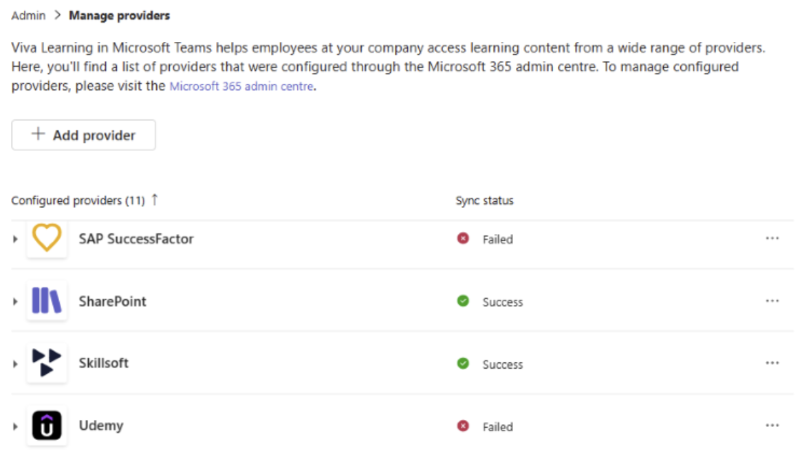

# Manage providers in Viva Learning

You can configure providers from **Manage Providers** in Viva Learning Admin. 

The **Add Provider** list shows you the available providers for configuration. Once a provider is confirmed, it appears on the **Configured Providers** list. 

> [!NOTE]
> Features in the Viva Learning Admin tab require both:
> - Viva Suite or Viva Learning license
> - Global admin, knowledge admin, or knowledge manage role
  
Review this article to [Learn how to assign roles](../microsoft-viva-admin-roles.md).

To create a set of featured content that will show up for your users, select the **Create featured set** in the top left corner.

## Managing Providers

Navigate to **Manage Providers** for a detailed view of all configured learning providers and to manage the learning providers and respective offerings. Refer to [Manage learning management systems](../learning/configure-lms.md) and [Add other content providers](../learning/configure-other-content-sources.md) for more information.

The following features are accessible by the listed admin roles: 

**Manage Providers**: global admin, knowledge admin, knowledge manager (read only)
**Admin Tab**: global admin, knowledge admin, knowledge manager 

### Manage Providers Configuration 

You can configure providers using **Manage providers** in Viva Learning Admin. The **Add providers** list displays the available providers for configuration. 
Once a provider is configured, it appears in the **Configured providers** list. 

Adding a provider requires either a Global Admin or Knowledge Admin role. Review this [article](../microsoft-viva-admin-roles.md) to Learn how to assign roles. 

You can edit or delete an existing configured provider directly from **Manage providers**. 

> [!NOTE]
> If you delete all learning providers, the Viva Learning Teams app will be empty.

 

1. Open the **Viva Learning** App in Teams or go to the Viva Learning [Web App](https://aka.ms/VivaLearningWeb).

2. Go to the **Admin** tab in Viva Learning and select **Manage Providers** on the left menu. 
  
1. Select **Add Provider**. 

1. Select the provider you want to configure and select **Next**. 

1. Add provider configurations as applicable and select **Save**. This adds the provider in the **Configured providers** list. 

You can track the current sync status, last successful sync time, next scheduled sync time, ingestion logs, and trigger full sync for each component in the expanded view:

 - **Sync status** and **timestamp**: Check the current sync status (success/failed/in progress) of catalog, learner records, and catalog permissions.  
    
 - **Manual sync trigger**: Trigger the sync manually for a delta/full sync. Once a full sync is triggered, the sync status is updated accordingly. 

 - **Export log**: Admins can refer to the export log file for a detail about successful and failed sync cycles. 

> [!NOTE]
> The sync status, sync time stamp and export logs are only currently available for catalog sync for all providers. 
>Sync status and sync timestamp for learner records are only available for SAP SuccessFactor. Manual sync trigger is only available for catalog in SharePoint and SAP SuccessFactor.

## How content shows up in the My Learning page

The **My Learning** tab helps users take control of their learning journey. Users are able to track assignments, recommendations, bookmarks, recent history, and completed courses on this page.

- **Recommended to you**: Recommendations from your peers show up here.

- **Bookmarks**: Content bookmarked by the user will be shown here.

- **Recently viewed**: The user's 20 most recently viewed items are shown under this tab. The most recently viewed item is shown first.

- **Completed**: Courses completed by the user show under this tab.

## Feature sets

To create a set of featured content that will show up for your users, select **Create featured set** in the top left corner. 

