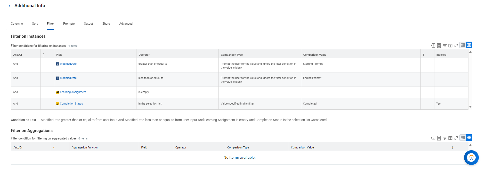

# Configure Workday in Microsoft Viva Learning

This document outlines how to configure Workday as a content source in Microsoft Viva Learning. The integration is based on Workday RaaS APIs (Report as a Service). Integration supports catalog, assignment, and completions data from Workday. Catalog covers Blended Courses, Digital courses, Lesson, Program, and External provider integrated on Workday.

> [!NOTE]
> Catalog, assignments, and completion data are retrieved using RaaS (REST APIs). Thumbnails for Workday hosted content is retrieved using SOAP APIs, while thumbnails for third party content configured on Workday are retrieved using the RaaS report. The Workday-hosted thumbnails are stored in Viva Learning as metadata.

## Prerequisites

You need the following permissions and scenarios in place to complete the Workday configuration process:

- Viva Learning Admin access
- Workday Admin access, 
- User mapping between Microsoft Entra ID (formerly Azure Azure Active Directory) and Workday should be in place (check the RaaS report creation section for more details).
-  Workday Web Service Endpoint & RaaS reports are available for Viva Learning integration with no inhibition by any network or firewall policies.

## Configuration to enable Workday integration

The workday integration process consists of three primary steps:

1. Create an Integration System User (ISU) account and assign required security access in Workday.
2. Create four RaaS reports for catalog, user, assignment or assignment completion, and self-enrollment completion data.
3. Once all configuration parameters are generated on Workday, you can configure Workday in the Viva Learning admin portal.

## Create an integration system user (ISU) on the Workday portal and assign required security access

Integration system user (ISU) account is required for Microsoft Viva Learning to access your Workday tenant. ISU can be created from Workday portal. ISU also requires relevant security group access with permission to access Workday Learning Web Services and learning catalog.

1. Access the **Create Integration System User** task. Workday automatically sets the value of **Session Timeout Minutes** to zero to prevent the integration system user session from expiring. Expired sessions can cause the integration to stop before it successfully completes.

2. Create a username and password. Workday recommends using **ISU_Microsoft_Viva_Learning** for the username. **Note:** The username can be customized.

3. Access the **Create Security Group** task and select **Integration System Security Group (Unconstrained)**.
4. Provide a group name. Workday recommends using **ISU_Microsoft_Viva_Learning**. It doesn’t need to be the same as the ISU name. 
    
5. Link your group to the integration system user. This lets Workday assign the integration system user as part of the Microsoft Viva Learning security group.
    
6. You need these domains in the Integration and System functional areas: Integration Security, security Configuration. Access the **Maintain Permissions for Security Group** task to update domain security policies.

7. In Domain Security Policy Permission, add **Get Only** access to the following domain security policies.

| Domain security policy | Description |
|-----| ----- |
| Reports: Learning Record  | This domain provides access to reports that display data related to the learning record. This permission is required for accessing RaaS report for Assignment and completion sync. |
| Manage: Learning Content | This domain provides access to certain administrative tasks to manage learning content. This permission is required for accessing RaaS report for catalog sync. |
| Worker Data: Active and Terminated Workers | This domain provides access to reporting fields and data sources that include terminated workers. This domain policy is required for certain fields (Firstname, lastname, email address, ID) in User RaaS report.  |
| Worker Data: Current staffing information | Provides information on workers' current information such as status, length of service, seniority. Includes web services. This domain policy is required for certain fields (Worker is Terminated) in User RaaS report. |
| Workday Accounts | This domain provides access to the management of Workday Accounts. This domain policy is required for certain fields (username) in User RaaS report. |

8. Run the **Activate Pending Security Policy Changes** task.
9. **Advance security**: These are **optional** steps for advance security access on ISU.

    1. **Optional**: **Set up course-segmented security on Workday portal**:
    You can configure which learning content displays in Viva Learning by restricting the integration system user's access by using segmented security. You can segment security based on security categories or topics.

        1. Access the **Create Learning Security Category** task or the **Create Learning Topic** task. Create security segments or topics to restrict access and add these to your learning content. You need the Learning Segment Setup domain in the System functional area.
        Select the Inactive checkbox if you want to disable permissions for members of the security group. You can't inactivate the security group when you:
            - Grant the security group permission to the Security Configuration domain.
            - Include the security group as a member of another security group.
            - Specify the security group as an administrator for another security group.

        1. From the **Security Groups** prompt, select security groups to identify who has permission to access the securable content.
        1. From the **Access to Segments** prompt, select security segments that you want members of the specified security groups to be able to access. Workday-owned security groups include:
            - Job Application - Contingent Worker
            - Job Application – Employee
            - Job Application – External
        1. You can't combine different types of security segments in a segment-based security group.

            **Example scenario:** You want a Benefits Administrator to be able to manage only benefits-related documents. You don't want them to be able to manage payroll-related documents. Workday secures access to manage all worker documents to the Worker Data: Add Worker Documents and Worker Data: Edit and Delete Worker Documents domains.   
            You can create **Document Categories** - Benefits segment to identify benefits-related documents. You can then use the security segment to create a segment-based security group so Benefits Administrators can access only the benefits-related documents. 

        1. Next steps:  Users with access to a domain through both a segment-based and a non-segment-based security group have permission to access all segments. Make sure you associate non-segment-based security groups with users who have permission to access all segments by:
            - Reviewing all security groups on the policy before adding segment-based security groups. 
            - Reviewing the included security groups in an aggregation security group.   
        1. To provide security permissions: 
            - Add the security group to security policies. 
            - Activate pending security policy changes. 
            - Activate the security group when you want to enable the permissions on an inactive security group. 

    2. **Optional:** Edit domain security policies on Workday portal. You can configure which security groups have permission to access the secured items in a domain. You need the Security Configuration domain in the System functional area.
        1. Access the **Domain Security Policies for Functional Area** report.
        2. Select a security policy.
        3. Select **Edit Permissions**.
        4. Select the **View** or **Modify** checkbox to grant the security groups access to the report or task securable items.
        5. Select the **Get** or **Put** checkbox to grant the security groups access to integration and report or task securable actions.
    3. Activate pending security policy changes on Workday portal.
        Create an active timestamp using the **Activate Pending Security Policy Changes** task. Security policy changes made since the previous active timestamp take effect immediately. The active timestamp now reflects the current time, regardless of pending changes. You can run these reports to view a detailed list of the security policy changes you’re activating: Domain security policies with pending changes, Business process security policies with pending changes.

        1. Access the **Activate Pending Security Policy Changes** task.

        1. Describe your changes in the **Comment** field.
        1. Check the **Confirm** checkbox to activate your changes.
        1. You can use the **View All Security Timestamps** report to roll back to a previous timestamp.

## Create RaaS reports for catalog, user, assignment, and completion data

This section consists of steps required for enabling catalog, user, assignment, and completion data sync in Workday and Viva Learning integration. 
Admins are required to create a custom RaaS report on the Workday portal. Once you have created integration system user of Workday portal and have provided all security access, follow these steps to create the required RaaS reports.  

> [!NOTE]
> All RaaS reports (catalog, user data, LRS) should be created from same user account or a single user should be given report ownership at Workday portal. This username should be inserted under Reporting URL attribute in Viva Learning Manage Provider. Review this example: `https://wd2-impl-services1.workday.com/ccx/service/customreport2/microsoft_dpt6/username/Viva_Learning_Catalog_Report.`

> [!NOTE]
> Admins need to create a custom report manually. This is a one time process. We are only supporting the report structure mentioned in this support article, any other changes in reports are not recommended.

1. Ensure that the **Workday to AAD user sync** is in place for your tenant.  
Enable inbound user provisioning with Workday to ensure that all users in Workday are synced to Azure Active Directory (AAD).
If you're already a Microsoft 365 customer, Workday to AAD user sync should be in place for your tenant. Check with your organization admins for details around same. Otherwise, you can refer to the steps mentioned here to enable the provisioning. [Tutorial: Configure Workday for automatic user provisioning with on-premises Active Directory](/entra/identity/saas-apps/workday-inbound-tutorial)

### Create RaaS report on Workday portal for catalog sync

This report should be created from master Admin account of Workday to avoid any privacy and security related concerns. Currently we're syncing historic and present assignments.

1. Sign in to the **Workday Portal**.
    1. Sign in to Workday Portal.
    1. Search for the task “Create Custom Report.”
2. Configure the report parameters.
    1. Give Report Name as `Viva Learning Catalog Report`. The report name must exactly match this string.
    1. Set Report Type as “Advanced.”
    1. Mark checkbox “Enable as Web service.”
    1. Mark checkbox “Optimized for performance.”
    1. In the “Data Source” field, go to “All” and select “Learning Content”. Select **OK**.
    
3. Add report fields.
    1. Once you select **OK**, Data Source has "Learning Content" as a value. Remove any existing value in the Data Source Filter field and add "Manageable Learning Content".
    1. Add the fields in “Columns” as outlined schema. You see three objects for field “rating”, select the one with a hash (#) icon next to it. To handle the "Is effective" flag in Workday, you're required to create a calculated field `CatalogEffectiveDate` and add it in the catalog RaaS. Detailed steps are mentioned in this section. 

| Business object| Field | Column heading override| Column heading override XML alias|
| --- | ---- | ---- | --- |
| Learning content | Workday ID | LearningObjectID| Learning Object ID|
| Learning Content | Title | Title | Title |
| Learning Content | Description | Description | Description |
| Learning Content | Link to Learning content | DeepLinkUrl | DeepLinkUrl |
| Learning Content | Duration in Minutes | Duration | Duration |
| Learning Content | Inactive Status | Inactive | Inactive |
| Learning Content | Learning Content Type | ContentType | ContentType |
| Learning Content | Content Provider | ContentProvider | ContentProvider |
| Learning Content | Exclude from Search and Browse | IsNonSearchable | IsNonSearchable |
| Learning Content | Rating | Rating | Rating |
| Learning Content | Skill Level | DifficultyLevel | DifficultyLevel |
| Learning Content | Topic | Topics | Topics |
| Learning Content | Skills | Skills | Skills |
| Learning Content | Third Party Content Thumbnail Image URL | ExternalImageURL | ExternalImageURL |
| Language | User Language Code | Locale | Locale |
| Learning Content | CatalogEffectiveDate | EffectiveDate | EffectiveDate | 

1. To create calculated field CatalogEffectiveDate follow the below steps. Once added, add it back in the catalog RaaS.
    a. Field name: CatalogEffectiveDate 
    b. Go to Calculations, under “Field Type,” select **Date**. 
    c. For year, month and day select **Extract Year from Date Field**. Enter field value as “Effective Date.” 

4. Under “Group Column Headings”, add the below fields:

| Business Object | Group column heading | Group column heading XML Alias |
| --- | --- | --- |
| Languages | Languages | Languages |
| Learning content | learningContent_group | learningContent_group| 

5. Add filters to the report. 
    1. Create a new filter condition by selecting “Create Calculated Field for Report” under Fields section.
    
    

    6. Add the following values to create the calculated field "ModifiedDate."
        - Field name: **ModifiedDate**
        - Go to calculations, under "Field type," select **Date**"
        - For year, month, and day, select **Extract Year from Date Field**. Enter the field value as **Last Functionality Updated**.
    
    

    1. Add following values in “Filter on Instances”. For #2 and #3, follow the steps mentioned below for adding calculated field. 
        
    | And/Or | `(` | Field | Operator | Comparison Type | Comparison Value | `)` | Indexed | 
    | --- | --- |-- |----  | --- | ---- | ---|-----| 
    | And | | Learning Content Type | exact match with the selection list | Prompt the user for the value |  Prompt #1 || Yes | 
    | And | | Modified Date | greater than or equal to | Prompt the user for the value | Prompt #2 | | Yes | 
    | And | | Modified Date | less than or equal to | Prompt the user for the value | Prompt #3 | | Yes |
    | Or  |   `(`  |     Learning Content Type  |     exact match with the selection list  |     Prompt the user for the value and ignore the filter condition if the value is blank  |     Prompt #1  |   |     Yes  |
    |  And  |       |     CatalogEffectiveDate  |     greater than or equal to  |     Prompt the user for the value and ignore the filter condition if the value is blank  |     Prompt #2  |       |     Yes  |
    |     And  |       |     CatalogEffectiveDate  |     less than or equal to  |     Prompt the user for the value and ignore the filter condition if the value is blank  |     Prompt #3  |     `)`  |     Yes  |

    

6. **Add the Prompts:** Go to **Prompts**. Mark “Display Prompt Values in Subtitles” and add following prompt values. You can directly copy paste these values. 

    | Field | Prompt Qualifier | Label for Prompt | Label for Prompt XML Alias | Default Type | Default value | Required | 
    | - | - | - | - | - | - | -| 
    | Learning Content Type | Prompt #1 | contentType | contentType | No default value | | Yes | 
    | ModifiedDate | Prompt #2 | Start_Date | Start_Date | No default value | | Yes | 
    | ModifiedDate | Prompt #3 | End_Date | End_Date | No default value | | Yes |
    |     Prompt #2  |     Start_Effective_Date  |     Start_Effective_Date  |     Specify default value  |     01/01/2024  |       |
    |     CatalogEffectiveDate  |     Prompt #3  |     End_Effective_Date  |     End_Effective_Date  |     Specify default value  |     01/01/2024  |       |

    

7. Go to **Advanced** and select the field **Optimized for Performance**.

> [!NOTE]
> After isEffective date changes, it is not possible to turn on optimized for performance. Considering the data volumns in hand, we can advise customers to uncheck this field.

8. Share the report with Integrated System User (ISU), which you created while enabling catalog sync. Go to the **Share** section in report, select the option “**share with specific authorized groups and users**” and add ISU name in the **Authorized users** field.  
9. Save the report. Select **OK**. 

    

    1. Generate report URL. This URL is required as an input parameter on Viva Learning Admin tab. The same user who created the report should generate the URL.
        1. Select the report > **Web Service** > **View URLs**.

         
        1. In next window, select any contentType and any date range and select **OK**.
    
        1. Select **JSON**, this opens a new window.
    

    1. In the next window, provide the Workday credentials and sign in. It downloads the JSON.
    1. Copy the URL from browser and append it post Viva_Learning_Catalog_Report. That is, the report name 
        1. for example, for Microsoft test tenant the URL is: `https://wd2-impl-services1.workday.com/ccx/service/customreport2/microsoft_dpt6/svasireddy/Viva_Learning_Catalog_Report?Start_Date=2023-03-01-08:00&End_Date=2023-05-14-07:00&contentType!WID=9882927d138b100019b928e75843018d&format=json` 
 
        1. After appending, the final URL for test tenant: `https://wd2-impl-services1.workday.com/ccx/service/customreport2/microsoft_dpt6/svasireddy/Viva_Learning_Catalog_Report` 
        1. Save the final URL, this is used as an input config parameter on Admin portal while enabling the configuration.  
    1. Once configuration is complete on the Admin portal, within the next 24 hours delta sync calls the report API, and accordingly data reflect in Viva Learning. Refer to this document for details on enabling integration on Admin portal. 

> [!NOTE]
> Assignments with the completion status “manually waived” are not shown on the Viva Learning UX. 

### Create RaaS report on Workday portal for user data sync

 Create this report from the primary Workday admin account to avoid any privacy and security related concerns. Currently we're syncing historic and present assignments. 

1. **Sign in to the Workday Portal**
    1. **Sign in** 
    1. Search for "Create Custom Report" 
2. Configure the report parameters 
    1. Name the report "Viva Learning Users Report". The report name must match this string. 
    1. Check "Enable as Web service" 
    1. Check "Optimized for performance" 
    1. In the "Data source," go to "All" and select "Workers for HCM reporting." Select **OK**.
3. Add report **Fields**.
    1. Add the fields in "Columns":
        
    | Business Object | Field | Column Heading Override | Column Heading Override XML Alias | 
    |  - | - | - | - | 
    | Worker | Workday ID | UserId | UserId | 
    |Worker | Preferred Name – First Name | FirstName | FirstName | 
    |Worker | Preferred Name – Last Name | LastName | LastName |
    | Worker | User Name | UserName | UserName |
    | Worker | Worker is Terminated | Terminated | Terminated | 
    |Worker | Public Primary Work Email Address | Email_Address | Email_Address |
    |     Worker  |     Employee ID  |     Employee_ID  |     Employee_ID  |

    2. **Add filters to the report**
        1. Add following values in “Filter on Instances”. Follow the steps mentioned below for adding calculated field. 
    
        | And/Or | Field | Operator | Comparison Type | Comparison Value |
        | - | - | - | - | - |
        | And | Hire Date | greater than or equal to | Prompt the user for the value | Starting Prompt | 
        |And | Hire Date | less than or equal to | Prompt the user for the value | Ending Prompt |

    3. Add the Prompts: Go to Prompts. Mark “Display Prompt Values in Subtitles” and add following prompt values. You can directly copy paste these values.  

    | Field | Prompt Qualifier | Label for Prompt | Label for Prompt XML Alias | Default Type | Default value | Required | Don't prompt at run time| 
    | - | - | - | - | -| - | - | - |
    | Contingent Worker type | Contingent_Worker_Type | No default value | | | Yes |
    | Employee Type | Employee_Type | No default value | | | Yes | 
    | Worker Types | Worker_Types | No default value | | | Yes | 
    | Include Terminated workers | Include_Terminated_Workers | Specify default value | Yes | | Yes |
    | Hire Date | Starting Prompt | Start_Date | Start_Date | No default value | | Yes | 
    | Hire Date | Ending Prompt | End_Date | End_Date | No default value | | Yes | |

    4. Go to **Advanced** and select the field `Optimized for Performance.` 

    4. Share the report with Integrated System User, which you created while enabling catalog sync.

    5. Save the report. Select **OK**. 

    6. Once configuration is complete on Admin portal, within the next 24 hours delta sync calls the report API, and accordingly data reflect in Viva Learning. Refer to this document for details on enabling integration on Admin portal. 

### Create RaaS report on Workday portal for assignment by organization and their completion status

This report should be created from the primary Workday admin account to avoid any privacy and security related concerns. Currently we're syncing historic and present assignments. Here, learner record sync is abbreviated as **LRS**.

> [!NOTE]
> Currently in Viva Learning, the mapping logic of the Workday and Entra ID (formerly Azure Active Directory) user accounts is based on user’s first name, last name, and username.
 
1. **Sign in to the Workday Portal**
    1. **Sign in**.
    2. Search for the tasks "Create Custom Report."

2. Configure the report parameters 
    1. Name the report "Viva Learning LRS Assignments Report". The report name must match this string. 
    2. Set Report Type as “Advanced.”
    3. Mark checkbox “Enable as Web service.”
    4. In the “Data Source” field, go to “All” and select "Learning Assignments Records”. Select **OK**.
3. Add report fields.
    1. Once you select **OK**, the “Data Source” automatically sets the value as “Learning Assignment Records.” For the “Data Source Filter” field, remove any existing value and add “Assignment Records for ~Person~from Learning Organization”. You can copy this value and paste in the field directly.
    1. 2.4.c.2.	Add the fields in “Columns” as outlined below. You see two objects for “Learning Enrollment," select the one with a blue icon next to it.
    
    |Business Object | Field | Column Heading Override | Column Heading Override XML Alias| 
    | - | - | - | - | 
    | Learning Assignment | Workday ID | AssigmentId | AssigmentId
    Worker | Workday ID | LearnerId | LearnerId| 
    | Learning Content | Workday ID | LearningObjectId | LearningObjectId| 
    | Learning Assignment | Due Date | DueDate | DueDate|
    |Learning Assignment | Assignment Status | CompletionStatus | CompletionStatus| 
    | Learning Assignment | Assigned Date | AssigmentDate | AssigmentDate| 
    |Assigned By | Workday ID | AssignerId | AssignerId |
    |Learning Assignment |  Assignment Record Completion Moment | CompletionDate | CompletionDate | 
    | Learning Assignment | Required | AssignmentType | AssignmentType | 

> [!NOTE]
> The In progress status from Workday doesn't sync to Viva Learning.

1. Under “Group Column Headings”, add below fields

| Business Object | Group Column Heading XML Alias | 
| - | - | 
| Assigned By | Assigned_By_group |
| Learning Assignment | Learning_Assignment_group |
| Learning Content | Learning_Content_group |
| Worker | Worker_group |

1. Under Prompt mark “Display Prompt Values in Subtitles” and, add following prompt values. You can directly copy paste these values. In “Default Value” field for “learning Organization for Learning Assignment”, provide default value of top organization (root organization) for which you need report being pivoted. 

| Field | Label for Prompt XML Alias | Default Type | Default value | Required | Don't Prompt at Runtime |
| - | - | - | - | - | - | 
|  Learning Organizations for Learning Assignment | Learning_Organizations_for_Learning_Assignment | No default Value | | Yes | | 
| Include Subordinate Organizations | Include_Subordinate_Organizations | Specify default value | Yes | Yes | Yes | 

1. Add date filters to the report for delta sync. 
        1. Go to “Filters”. Select “+”, In “And/Or” select And. in “Field” select “create calculated field for report”.
        1. In next screen, write “Field name” as ModifiedDate and select “Function” as Build Date. Select **OK**.
        1. In next screen, add following values under Date Fields and select **OK**.

    | Field | Value |
    | - | - | 
    | Extract Year from Date Field | Last Functionally Updated |
    | Extract Month from Date Field | Last Functionally Updated |
    | Extract Day from Date Field | Last Functionally Updated |

    1. Add following values in remaining fields of the start filter:

    | Field | Value |
    | - | - |
    | Operator | Greater than or equal to |
    | Comparison Type | Prompt the user for the value and ignore the filter condition if the value is blank |
    | Comparison Value | Starting Prompt | 

    1. Add another filter and with following values and select “OK”.

    | Field | Value |
    | - | - | 
    | ModifiedDate | (No specified value) |
    | Operator | Comparison Type | 
    |Comparison Value | less than or equal to |
    | Prompt the user for the value and ignore the filter condition if the value is blank | Ending Prompt | 

    1. Go to **Prompts**. 
        1. Select **Populate Undefined Prompt Defaults**. This will add the start and ending prompt for Modified date, which is defined in previous step.
        1. Add following values in the new prompts and select **OK**.
                - For Starting Prompt, add value `Start_Date` in fields **Label for Prompt** and **Label for Prompt XML Alias**
                - For Ending Prompt, add value `End_Date` in fields **Label for Prompt** and **Label for Prompt XML Alias**
    2. Go to **Advanced**. Uncheck the field **Optimized for Performance**

    1. Save the report. Select **OK.**
    1. Share the report with Integrated System User and respective security group, which you created while enabling content sync.
    1. Within the next 24 hours LRS sync calls the report API and accordingly data reflect in Viva Learning, provided Admin has enabled LRS on Admin portal. Refer to this document for configuration steps on Admin portal.
    1. The assignments with completion status “manually waived” aren't displayed. 

### Create RaaS report on the Workday portal for completion status of self-enrollment

This report should be created from the primary Workday admin account to avoid any privacy and security related concerns. Currently we're syncing historic and present assignments. 
 
1. **Sign in to the Workday Portal**
    1. **Sign in**.
    2. Search for "Create Custom Report."

2. Configure the report parameters 
    1. Name the report "Viva Learning Self Enrollment Report". The report name must match this string. 
    2. Set Report Type as “Advanced.”
    3. Mark checkbox “Enable as Web service.”
    4. In the “Data Source” field, go to “All” and select "Learning Enrollments”. Select **OK**.

1. Add report fields.
    1. Once you select **OK**, the “Data Source” automatically sets the value as “Learning Enrollments.” Leave the “Data Source filter” field blank.

    | Business Object | Field | Column Heading Override | Column Heading Override XML Alias |
    | - | - | - | - |
    |Learning Enrollment | Workday ID | EnrollmentId | EnrollmentId |
    | Learning Enrollment Participant | Workday ID | LearnerId | LearnerId |
    | Learning Content Detail | Workday ID | LearningObjectId | LearningObjectId |
    | Learning Enrollment | Completion Status | CompletionStatus | CompletionStatus |
    | Learning Enrollment | Completion Date | CompletionDate | CompletionDate |
    | Learning Enrollment | Record Start Date | StartDate | StartDate | 

    

    1. Add the fields in “Columns” as per below schema. You see two objects for “learning Assignment”, select the one with a blue icon next to it.

    2. Under “Group Column Headings”, add these fields: 

    | Business Object | Group Column Heading XML Alias |
    | -- | -- | 
    | Learning Content Detail | Learning_Content_Detail_group |
    | Learning Enrollment | Learning_Enrollment_group | 
    | Learning Enrollment Participant | Learning_Enrollment_Participant_group | 

    1. Add filters to the report for delta sync.
        1. Go to “Filters”. Select “+”, In “And/Or” select And. in “Field” select “create calculated field for report”.
        2. In next screen, write “Field name” as ModifiedDate and select “Function” as Build Date. Select **OK**.
        1. In next screen, add following values under Date Fields and select **OK**.

        | Field | Value |
        | - | - |
        | Extract Year from Date Field | Last Functionally Updated |
        | Extract Month from Date Field | Last Functionally Updated |
        | Extract Day from Date Field | Last Functionally Updated |

        1. 	Add following values in remaining fields of the start filter:

        |Field | Value|
        | - | - |
        | Field | ModifiedDate |
        | Operator | Greater than or equal to |
        | Comparison Type | Prompt the user for the value and ignore the filter condition if the value is blank |
        | Comparison Value | Starting Prompt |

        1. Add another filter and with following values and select **OK**.

        |Field | Value|
        | - | - |
        | Fields | ModifiedDate |
        | Operator | Less than or equal to |
        | Comparison Type |  Prompt the user for the value and ignore the filter condition if the value is blank |
        | Comparison Value | Ending Prompt |
        
        f.	Go to filter and add 2 new “And” filters and input following values:

        
    - f.1. Field: Learning Assignment; Operator: is empty
    - f.2. Field: Completion Status; Operator: in the selection list; Comparison Type: value specified in the filter; Comparison Value: completed 

    

    ### Modify the prompts

    1. Go to **Prompts**
        1. Select **Populate Undefined Prompt Defaults**. This adds the start and ending prompt for the Modified date, which is defined in previous step.
    
        

        1. Add following values in the new prompts and select “OK”.
            - For Starting Prompt, add value StartDate in fields Label for Prompt and Label for Prompt XML Alias
            - For Ending Prompt, add value EndDate in fields Label for Prompt and Label for Prompt XML Alias
    1. Go to **Advanced.** Uncheck the field **Optimized for Performance**. 
    1. Save the field. Select **OK**.
    1. Share the report with Integrated System User and respective security group, which you created while enabling content sync.
    1. Within the next 24 hours LRS sync calls the report API and accordingly data reflect in Viva Learning, provided Admin has enabled LRS on Admin portal. Refer to this document for configuration steps on Admin portal.

> [!NOTE]
> Lessons are not supported in self-enrollment completion status.

## Generate connection parameters in Workday portal

This section outlines how to generate connection parameters on your Workday portal.

### Retrieve the Workday Web Service endpoint

You can find the required Workday Web Service endpoint on the Workday Data Centers page on Community.

1. Use the Workday [resource page](https://resourcecenter.workday.com) to identify which Workday Production Data Center your tenant is in.

1. Now that you know your data center, fill in your information inside the {brackets} to get your URL. You need this URL for integration in your Microsoft 365 admin center. `https:// {**Production Data Center URL Prefix**}/ccx/service/{**Tenant name**}/Learning/v39.2`
 
1.An example of a URL: `https://wd3.myworkday.com/ccx/service/yourorg/Learning/v39.2`

### Enable OAuth for Workday, generate Client ID, client secret and refresh token

To enhance the security and maintain the integration, we have enabled OAuth for Workday.

This avoids dependency from ISU’s username and password and handles the scenario if ISU leaves the company. Refer to below steps to generate client ID and Client secret required for configuration on admin portal. 
OAuth access is applied at client level, so it will not impact any other sign in flow of other clients linked to Workday. To know more about OAuth, you can refer to [Workday’s OAuth documentation.](https://resourcecenter.workday.com/en-us/signin.html?fromURI=https://signin.resourcecenter.workday.com/app/workdayciam_aembetadoc2_1/exkd1j067lBdQMGYl4x7/sso/saml)

1. Enable OAuth for the tenant 
    1. Access the **Edit Tenant Setup - Security** task. 
    2. Scroll down, in the **OAuth 2.0 Settings section**, select the **OAuth 2.0 Clients Enabled** check box.
    
    

1. Create the client for OAuth. 
1. Search for **Register API client for integrations** task. Enter client name as "VivaLearning" and set expiry of refresh token as "Never" and Scope (Functional Areas) the following. To edit any existing OAuth settings, you can use the **view API client for integrations** action.

    - "Organizations and Roles”
    - “Learning core”
    - “Staffing”
    - “System”
    - “Tenant nonconfigurable”  

    

4. After creation of API client for integration, you'll get the ClientID and client Secret. Copy the client Id and client secret. This is used on admin portal.

5. Generate refresh token 
    1. Search for task- "View API client", go to tab “API clients for integration”. It shows all clients. Open the "VivaLearning" client created in previous step. 
    1. Select the ellipses (...), then **API client** and **Manage Refresh Token for Integration**. 
    
    

    1. Select the ISU created initially during Viva Learning setup.
    
    
    
    1. Enable “Generate new refresh token” checkbox, select **OK**.
    1. Copy the generated refresh token. 

### Get org ID

You need to enter the org IDs for which you want to get assignment and completion records. If you want to pull the data for all employees you can do so by adding all child org IDs for root ID in Workday. Follow below steps for same.

To generate the org IDs for a single department, please follow below steps.

1. Go to your Workday portal. Search for the organization for which you want to sync the assignment and completion records. If you want to select the data for all employees, search for root org.
2. Select the organization under category Organizations.

1. Select the ellipses (...) and select **Integration IDs** and then **View IDs**.

1. Select the Workday ID mentioned above. Save this ID for later as this will be used as a configuration parameter.

5. Run following report “Headcount Report” on Workday and select root org. It gives you a list of all departments under root org.

6. Select ellipses (...) and select **Integration IDs** and then View IDs.

7. Select the Workday ID mentioned above. Save this ID for later as this will be used as a configuration parameter.

8.	In large tenant, generate org IDs for departments under root ID

9. If your tenant has large employee base, instead of adding the root ID you can add the child of root in configuration form.

10. Run the “Headcount Report” on Workday and select root org. It gives you a list of all departments under the root org.

## Configure Workday on Viva Learning Admin tab

You need to have premium Viva Learning license to configure Workday. Global Admin or Knowledge Admin role is required to access Viva Learning Admin tab.

1. Sign in to your Viva Learning app
2. Navigate to Admin tab, then select Manage providers from left navigation menu. 

1. Select **Add provider** and select **Workday**. Select **Next**.

4. Fill in the following required configuration details for Workday:

    a.	Display name: This is the name of the carousel under which Workday learning content appears for your organization in Viva Learning. If you don't enter a name, it displays the name "Workday".

    b.	Workday catalog RaaS report URL: Enter the report URL, which was generated while creating RaaS for catalog. This URL consists of address for API endpoint and Workday username.  

    c.	Client ID, Client Secret, and refresh token: These are the values you created while enabling OAuth.

    d.	Org ID (only If you want to enable the LRS). Manual full sync triggering is required for co-dev post adding/deleting any org ID. Full sync can be triggered from Manage providers.

5. Select **Save** to activate Workday content in Viva Learning. It may take up to 24 hours for the content to display in the Viva Learning app.

6. Once configured, Workday appears in the Configured providers list. You can track the sync status, sync time stamp and can download the sync logs.

7. If you want to enable LRS (Learner record sync) in Assignment and Completion, enable the LRS toggle.
 
8. You can also use **Manage providers** to edit or delete the Workday configuration.
 
9.	Admins can also trigger full sync for catalog from “Full Sync” toggle in the catalog row.

## Enable SSO for Workday

Viva Learning and Workday integration allows seamless authentication (SSO). On Teams Desktop and Web, users can directly consume a course on Workday portal without the need to sign in via Workday credentials. On Teams mobile, user need to enter the credentials for first time. 

Refer to the [SSO integration between Workday and Viva Learning](/entra/identity/saas-apps/workday-tutorial).
