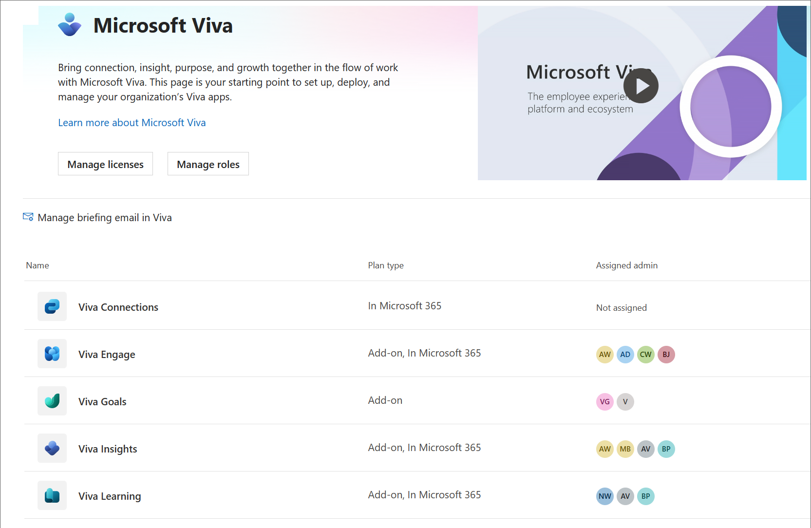
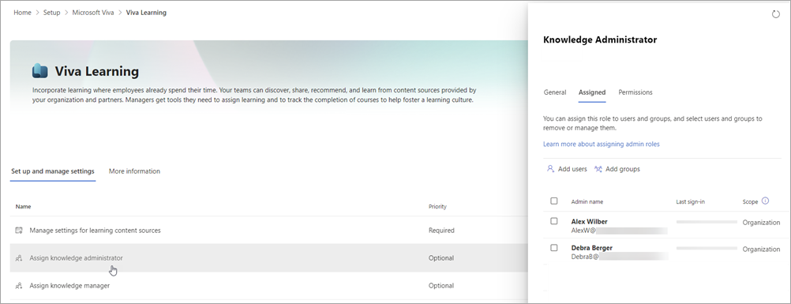

# The new Microsoft Viva admin experience

With the new Microsoft Viva admin experience, admins can initiate setup, deployment, and manage licenses for all generally available Viva apps from a central location in the Microsoft 365 Admin Center.

> [!NOTE]
> This article is intended for Targeted Release customers. Some functionality is introduced gradually to organizations that have set up the targeted release options in Microsoft 365. If you're not part of the targeted release program, you may not yet see this feature or it may look different than what is described in this help article. Features are subject to change. If you are not in the Targeted Release program, see [Set up Microsoft Viva](/viva/setup-microsoft-viva).

## Getting to the admin experience

1. Sign into your account as an Microsoft 365 admin.
2. In the search bar, enter Viva.
3. Select **Microsoft Viva**.

Alternatively, you can go to the Microsoft 365 admin center, select **Setup** on the left navigation, and then select the **Microsoft Viva** tile.

This brings you to the [Microsoft Viva admin page](https://admin.microsoft.com/Adminportal/Home?source=applauncher#/featureexplorer/collections/VivaExperiences).

Things you can do on this page:

- **Licenses and roles**:  You can select **Manage licenses** or **Manage roles** to go directly to the Microsoft 365 Licenses page or to the Microsoft 365 Role assignments page. On the Role assignments page, you can search for Viva in the search box to narrow the roles to those specific to Viva.
- **Plan types**:  You can see the type of Viva plan purchased or included with Microsoft 365 in the **Plan type** column.
- **Assigned admins**:  You can see quickly whether admin roles have been assigned for each app, and who the roles are assigned to in the **Admins** column. Hover over the profile circles to get the names of people who are assigned roles
- **App pages**:  You can select an app to go to that app's settings page.
- **Briefing email**: Select the **Manage briefing email in Viva** to select whether people in your organization should receive [briefing emails](/viva/insights/personal/Briefing/be-overview?WT.mc_id=365AdminCSH_inproduct).

## App settings pages

Each app has its own settings page, and they may differ. The Viva Insights and Viva Learning pages utilize the new experience. Other pages will evolve over time. Here's an example of the Learning admin page:

In this example you can:

- See at a glance which settings are required in the **Priority** column.
- Select a setting in the list, and get a panel where you can set the options without leaving the page. In this example, you see the panel to assign knowledge managers.
- Select the **More information** tab to get detailed guidance on setting up the app.
