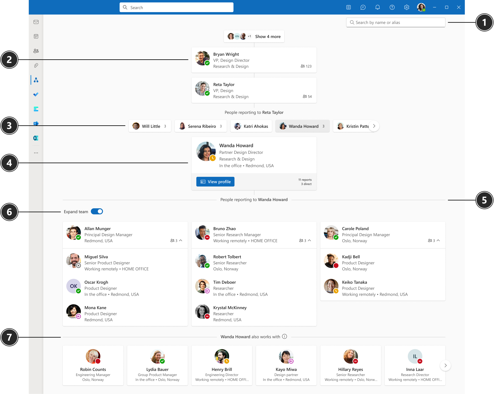

# Introducing Org Explorer
Org Explorer helps you visualize and explore your company’s internal structure, its teams, and people. It's available to enterprise users that have a license with Microsoft Viva Suite, Microsoft Viva Suite with Glint, and Microsoft Viva Employee Communications and Communities (mini bundle). 

## Availability

Org Explorer is available in Outlook.

|#  |Element  |Function|
|----------|-----------|------------|
|1    |Search       |Type a person’s name or alias and select from the suggestions that appear.  |
|2|Manager chain   |The manager chain shows all the managers above the person in focus. The number of reports will show to the right of the person. You can hover over the number to view both direct and indirect reports.|
|3    |Peers       |Peers are people who report to the same manager as the person in focus. If the peer has people reporting to them, the number of reports will show. You can hover over the number to view both direct and indirect reports.  |
|4    |Person in focus    |When you select a person in Org Explorer, the page displays org information about them. For example, contact information, who their manager is, people reporting to them, and who they collaborate with. You can also select __View profile__ to view their [profile card](https://go.microsoft.com/fwlink/?linkid=2258586).   |
|5    |People reporting to       |People reporting to the person in focus are listed in the section below the person.       |
|6    |Expand team       |Use the toggle to show/hide next-level reports and expand teams.         |
|7|Works with|The people in the Works with section represent people who are [relevant to or working with the person in focus](/graph/people-insights-overview#including-a-person-as-relevant-or-working-with). The relevancy is based activities like in-common meetings, emails, and other collaboration patterns.|

## Where is the organization information collected from?

The organizational information you see about users in Org Explorer is from Microsoft Entra ID – Microsoft Entra ID. [Learn more about user information](/graph/api/resources/users?).

## How is the "Works With" data generated?

The data in the "Works With" section is based on public relationships, like in-common meetings, email, and other collaboration patterns. The insights are returned by the people API.

To turn off Works with section, see [Customizing people insights privacy in Microsoft Graph](/graph/insights-customize-people-insights-privacy).

## Setting up Org Explorer

If a user is enabled for Microsoft Viva, they are also enabled to use Org Explorer. There is no specific set-up process for Org Explorer.

## Removing Org Explorer

You can turn off Org Explorer by unassigning the People in Viva license in the admin center. For exact steps, see [Unassign Microsoft 365 licenses from users](/microsoft-365/admin/manage/remove-licenses-from-users).

## Additional resources

[Org Explorer](https://go.microsoft.com/fwlink/?linkid=2224220)

[Explore your organization](https://go.microsoft.com/fwlink/?linkid=2223751)

[Search for a person](https://go.microsoft.com/fwlink/?linkid=2224126)
