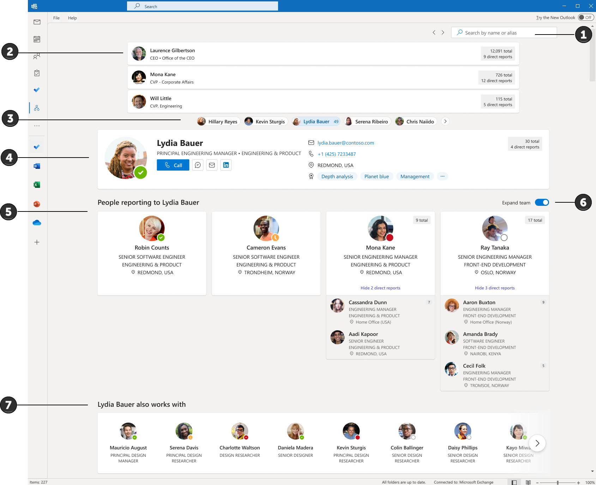

# Introduction to Org Explorer
Org Explorer helps you visualize and explore your company’s internal structure, its teams, and people. It's available to all enterprise users that have the Microsoft Viva suite or Microsoft Viva suite with Glint.

## Availability

Org Explorer is available in Outlook.

|#  |Element  |Function
|----------|-----------|------------|
|1    |Search       |To search for a person, type their name or alias in the search box.        |
|2|Manager chain   |The manager chain shows all the managers above the person in focus
|3    |Peers       |Peers are people that report to the same manager as the person in focus.       |
|4    |Person in focus    |When you select a person in Org Explorer, the page displays org information about them. For example, contact information, who their manager is, people reporting to them, and who they collaborate with.      |
|5    |People reporting to       |People reporting to the person in focus are listed in the section below the person.        |
|6    |Expand team       |Use the toggle to show/hide next-level reports and expand teams.         |
7|Works with|The people in the Works with section represent people who are [relevant to or working with the person in focus](https://learn.microsoft.com/graph/people-insights-overview#including-a-person-as-relevant-or-working-with).|

## Where is the organization information collected from?

The organizational information you see about users in Org Explorer is from Azure Active Directory – AAD. [Learn more about user information](https://learn.microsoft.com/graph/api/resources/users?view=graph-rest-1.0).

## How is the "Works With" data generated?

The data in the "Works With" section is based on public relationships, like in-common meetings, email, and other collaboration patterns. The insights are returned by the people API.

To turn off Works with section, see [Customizing people insights privacy in Microsoft Graph](https://learn.microsoft.com/graph/insights-customize-people-insights-privacy).

## Setting up Org Explorer

If a user is enabled for Microsoft Viva, they are also enabled to use Org Explorer. There is no specific set-up process for Org Explorer.

## Removing Org Explorer

You can turn off Org Explorer by contacting Microsoft support. To contact support, you can use in-app support in Outlook for desktop or the Microsoft 365 admin center (see sections below).

Note: When Org Explorer is disabled users will still see the app icon in Outlook. If a user selects the app in Outlook, a message will indicate that Org Explorer is disabled.

### Contact support in Outlook for desktop

Go to Outlook on desktop for Windows.

Select **Help > Contact Support** in the navigation pane.

Select **Yes** to continue.

Describe your request and select **Submit**.  

### Contact support in the Microsoft 365 admin center

Go to the [admin center](https://admin.microsoft.com).

On the bottom right side of the page, select  **Help & support**.

Enter a search term, for example “Org Explorer”.
Select Contact Support at the bottom of the page.

Enter a description of your request, confirm your contact number and email address, select your preferred contact method, and then select Contact me. The expected wait time is indicated in the Contact support pane. [Learn more about getting support in the admin center](https://learn.microsoft.com/graph/insights-customize-people-insights-privacy).

## Additional resources

[Org Explorer](https://go.microsoft.com/fwlink/?linkid=2224220)

[Explore your organization](https://go.microsoft.com/fwlink/?linkid=2223751)

[Search for a person](https://go.microsoft.com/fwlink/?linkid=2224126)
