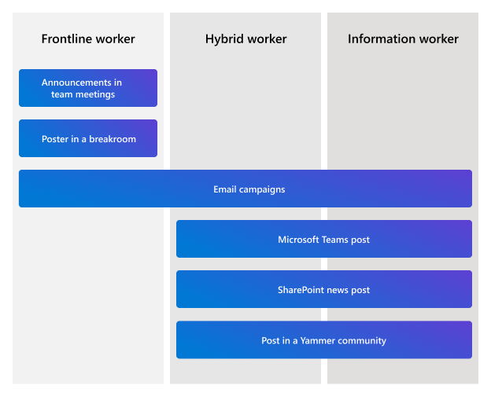

# Plan for all Viva apps

[Microsoft Viva](https://www.microsoft.com/microsoft-viva) currently includes several apps that make an impact on their own and become even more powerful when used together. Learn more about [individual Viva apps](discover-more-about-each-viva-module.md) and how you can use [two or more apps together](learn-how-to-combine-modules.md) to create personalized employee experiences for your organization.

The guidance in this article can help you plan to deploy all these Viva apps in your organization.

|:::image type="icon" source="media/viva-confirm-licensing.png":::   Step 1  |:::image type="icon" source="media/viva-requirements.png":::   Step 2 |:::image type="icon" source="media/viva-learn.png":::   Step 3 | :::image type="icon" source="media/viva-prepare.png":::   Step 4|
|:---------:|:---------:|:---------:|:---------:|
|Confirm you’ve got the right licensing in place. |Meet technical requirements.|Learn more about the roles in each phase.|Prepare to launch and scale adoption with end-users.|

## Step 1: Confirm the right licensing is in place

To get all the apps in the Viva suite, you'll need a license for Microsoft 365 or Office 365 (E1, A1, G1, E3, A3, G3, E5, A5, G5), Microsoft 365 Business Basic, Business Standard, Business Premium, or Exchange Online Plan 1 or Plan 2 to be eligible for Microsoft Viva.

Then, purchase the [Microsoft Viva suite](https://www.microsoft.com/microsoft-viva/pricing?rtc=1).

>[!NOTE]
> Viva Sales isn't included in the Viva suite license.

## Step 2: Meet technical requirements

After you’ve got the right licensing in place, review additional requirements to get the Viva app up and running. For more details, [review minimum requirements and planning considerations](discover-more-about-each-viva-module.md).

|App name |Requirements |
|:-------:|-------------|
|:::image type="icon" source="media/logos/connections-launch-c-64.svg":::   **Viva Connections** | - SharePoint home site   - Global navigation enabled and customized   - Modern SharePoint sites |
|:::image type="icon" source="media/logos/insights-launch-c-64.svg":::   **Viva Insights** | No technical requirements besides licensing for personal and team insights |
|:::image type="icon" source="media/logos/learning-launch-c-64.svg":::   **Viva Learning** | - A Microsoft Teams team (if you're creating a learning tab in Teams)   - SharePoint site to connect internal resources to Viva Learning |
|:::image type="icon" source="media/logos/topics-launch-c-64.svg":::   **Viva Topics** | No technical requirements besides licensing |
|:::image type="icon" source="media/logos/engage-launch-c-64.svg":::   **Viva Engage** | No technical requirements besides licensing |
|   **Viva Goals** | No technical requirements besides licensing |
|:::image type="icon" source="media/logos/viva-sales-logo-1.png":::   **Viva Sales** | No technical requirements besides licensing |

## Step 3: Get guidance on roles for each phase

Review the different roles in each phase before you start planning. Each app needs a few key roles that will help ensure success throughout the planning, build, and launch phases.

### Get guidance on Viva Connections

|Coordinate and plan |Build and set up |Deploy and launch |
|--------------------|-----------------|------------------|
|- Work with **your organization’s stakeholders** and business partners (such as HR and communications) to identify the most valuable workflows and tasks that can be completed in Viva Connections. |- A **SharePoint admin** sets up a home site (if you don’t already have one) in the Microsoft 365 admin center. SharePoint admins may also help modernize classic SharePoint sites and pages where needed. 
 - A **Microsoft Teams admin** adds your organization’s version of Viva Connections as an app and chooses settings in the Teams admin center. 
 - **Site owners and authors for the home site** design the home site content, navigation, and Dashboard. 
 - Additional **site owners and authors** may need to update content or news relevant to the Viva Connections experience. |- Collaborate with **champions** (early adopters) to help other people at the organization adopt Viva Connections.
 - Recruit **executive sponsors** to help evangelize Viva Connections at large company meetings and in broad communications. 
 - Encourage **Business owners and managers** in HR and other departments to help teams and individuals find value and adopt new ways of working. |

### Get guidance on Viva Insights

|Coordinate and plan |Build and set up |Deploy and launch |
|--------------------|-----------------|------------------|
|- Work with your **organization’s stakeholders** and business partners to identify who does what to get Viva Insights set up, introduced, and adopted within your organization. |- **Microsoft 365 enterprise or global admin** [assigns licenses](insights/personal/Setup/configure.md), [assigns roles](insights/advanced/setup-maint/assign-admin-roles.md), and [configures app access](insights/personal/Setup/configure.md). 
 - **Insights Administrator** then works with the enterprise or global admin to [set up advanced insights](insights/advanced/setup-maint/setup.md) and the **Microsoft Teams Service Administrator** to [deploy the Viva Insights app in Teams](insights/personal/teams/viva-teams-app-admin-tasks.md). |- After app access is set up, the admin and business leaders can then plan a rollout strategy for introducing Viva Insights to their organization. For rollout ideas, see [Roll out Viva Insights and Conduct a user pilot](insights/personal/Setup/deployment-guide.md).|

### Get guidance on Viva Learning

|Coordinate and plan |Build and set up |Deploy and launch |
|--------------------|-----------------|------------------|
|- Work with **Business leaders** and **HR** in your organization to define learning goals. 
 - Find out if any third-party content sources or learning management systems you’re already using can integrate with Viva Learning.|- The **Microsoft 365 global admin, SharePoint admin**, or **Knowledge admin** chooses which content sources to use in the Microsoft 365 admin center. 
 - The **Microsoft 365 global admin**, **Knowledge admin**, or **Knowledge Manager** uses the admin tab in Viva Learning to [choose how content shows up for your organization](learning/use-tabs.md). 
 - The **Microsoft Teams admin** can enable or disable Viva Learning from the Teams admin center (Viva Learning is enabled by default). 
 - The **Microsoft 365 global admin** or **Knowledge admin** can [create a Learning App Content Repository in SharePoint to integrate with Viva Learning.](learning/configure-sharepoint-content-source.md)|- **Managers** can [recommend learning content](https://support.microsoft.com/office/recommend-and-manage-content-in-viva-learning-77f9dcbf-41a8-4b19-b4d1-b99c406f37b8) to their teams, and **Team members** can share content with each other. 
 - **Managers** and **Subject matter experts** can create custom learning content that the **Microsoft 365 global admin** or **Knowledge admin** can add to the Learning App Content Repository in SharePoint.|

### Get guidance on Viva Topics

|Coordinate and plan |Build and set up |Deploy and launch |
|--------------------|-----------------|------------------|
|- **Stakeholders, knowledge managers, communications leads, champions**, and **topic contributors** make up your core knowledge team. 
 - **Core team** selects a rollout approach, identifies, and prioritizes scenarios, ensures technical and business readiness, and develops a communications plan.|- **Microsoft 365 global admin** or **SharePoint admin** sets up Viva Topics and configures settings in the Microsoft 365 admin center. 
 - **Knowledge managers** manage topics in the topic center, including reviewing AI-suggested topics, confirming topics are valid, removing topics that you don’t want visible to users, and editing existing topics or creating new topics. 
 - **Topic contributors** edit existing topics or create new topics.|- **Corporate communications leads** use various communication channels to announce Viva Topics. 
 - **Champions and core team** can help spread awareness through engagements and training events.|

### Get guidance on Viva Engage
**If your organization is already using Yammer**

>[!NOTE]
> Viva Engage is integrated with Teams. It surfaces employee experiences powered by Yammer services.  

|Coordinate and plan |Build and set up |Deploy and launch |
|--------------------|-----------------|------------------|
|- Work with **stakeholders and your IT team** to identify how you can leverage your existing Yammer strategy in Viva Engage. | - [Set up Viva Engage](https://support.microsoft.com/topic/getting-started-with-microsoft-viva-engage-729f9fce-3aa6-4478-888c-a1543918c284) in Microsoft Teams. | - Work with community leaders and active users to promote Viva Engage.  
 - Consult the [Yammer adoption resources](https://adoption.microsoft.com/yammer/) to help integrate Yammer communities on Viva Engage into your organization. |

**If your organization is not using Yammer**

|Coordinate and plan |Build and set up |Deploy and launch |
|--------------------|-----------------|------------------|
|- Work with your **corporate communications specialists and leadership teams** to determine how you can best use Viva Engage to support communities in your organization. | - Your **admin** will [set up Yammer for your organization](/yammer/get-started-with-yammer/admin-key-concepts) and assign admin roles for Yammer: 
 - **Verified admins** are in charge of security-related tasks, and can configure and customize Yammer for your organization, and can manage users and groups. 
 - **Network admins** can configure and customize Yammer, and can manage users and groups. 
 - **Group admins** can configure and customize their groups, and can manage day-to-day operations for their groups. | - Work with leadership teams, employee resource groups, and employee social groups to develop active and vibrant communities on Viva Engage. 
 - Consult the [Yammer adoption resources](https://adoption.microsoft.com/yammer/) to help integrate Yammer communities on Viva Engage into your organization. |

### Get guidance on Viva Goals

|Coordinate and plan |Build and set up |Deploy and launch |
|--------------------|-----------------|------------------|
|- If your organization is already using OKRs (objectives and key results) to set and align business priorities, work with **organizational, division, and team leaders** to determine how best to express these in Viva Goals. If your organization is new to OKRs, work with your organization’s **stakeholders and business partners** to determine the initial levels or divisions of your organization for which you want to set OKRs in Viva Goals. Determine a cadence for reviewing and adjusting your OKRs. | - Your **admin** will sign into Viva Goals for the first time using their Azure Active Directory credentials and create an organization. If your business is choosing to divide OKRs into multiple organizations, your admin can create more than one organization. 
 - **Organizational admins** can add users to organizations, or users can sign into Viva Goals and request to join organizations. Organization admins will need to approve these requests. 
 - **Members** of an organization can create teams and assign **Team owners** and **Team admins**, who can add users to teams and approve requests to join teams. 
 - Your **Microsoft Teams admin** can set a Teams app policy to pin Viva Goals in Microsoft Teams for everyone in your organization. | - If your organization is already using OKRs, work with **stakeholders and division leaders** to migrate their OKRs into Viva Goals. 
 - For every level in your organization, such as the whole business, divisions, and teams, share news with members that OKRs are now in Viva Goals. 
 - Consult the [Viva Goals adoption guide](https://adoption.microsoft.com/files/viva/goals/Viva-Goals-Adoption-Guide.pdf) to learn more about integrating Viva Goals into your organization. |

### Get guidance on Viva Sales

|Coordinate and plan |Build and set up |Deploy and launch |
|--------------------|-----------------|------------------|
|- Work with **sales team leaders** and the team that manages your organization's CRM workflows to come up with an adoption plan for Viva Sales. | - Your **Microsoft 365 admin** will install Viva Sales from the Microsoft 365 admin center or the Microsoft commercial marketplace. 
 - Your **Microsoft Teams admin** will create an app setup policy and pin the app for users. | - Work with your **sales team leaders** to train your salespeople in using Viva Sales with your CRM. 
 - Share the [Viva Sales end user training content](https://support.microsoft.com/topic/introduction-to-microsoft-viva-sales-e1b89ece-e97f-4a9d-9cdc-9018fde0a6a5) with your sales teams. |

## Step 4: How to get started

Technically, the Viva apps don't need to be installed in a specific order. Each app has a unique setup and deployment process.

### Get started with Viva Connections

- Create a Viva Connections Dashboard with cards.
- Target cards to specific audiences.
- Prepare content for the Feed and Resources.
- Upload the app to the Teams admin center.
- [Review the getting started guide for Viva Connections.](connections/viva-connections-setup-guide.md)

### Get started with Viva Insights

- Decide which types of insights are needed ([personal](insights/personal/introduction.md), [team](insights/org-team-insights/teamwork-habits.md), [organization](insights/org-team-insights/org-trends.md), and [advanced](insights/advanced/introduction-to-advanced-insights.md)).
- [Review the getting started guide for Viva Insights.](insights/advanced/setup-maint/setup-overview.md)

### Get started with Viva Learning

- [Choose which learning content sources to use.](learning/content-sources-365-admin-center.md)
- [Manage how content shows up for your org.](learning/use-tabs.md)
- [Review the getting started guide for Viva Learning.](learning/set-up-viva-learning.md)

### Get started with Viva Topics

- Choose which SharePoint sites you want to crawl for topics.
- Identify which topics, if any, you want to exclude from topic experiences.
- Choose which users you want to make topics visible to.
- Identify which users you want to give permissions to manage topics or to create or edit topics in the topic center.
- Choose the name that you want to give your topic center.
- Review the [Get your environment ready](topics/topic-experiences-get-ready.md) and [Set up Viva Topics](topics/set-up-topic-experiences.md) guidance.|

### Get started with Viva Engage

- [Set up Yammer](/yammer/get-started-with-yammer/admin-key-concepts) for your organization.
- [Install Viva Engage](https://support.microsoft.com/topic/getting-started-with-microsoft-viva-engage-729f9fce-3aa6-4478-888c-a1543918c284) in Microsoft Teams.

### Get started with Viva Goals

- Create an organization in Viva Goals and set organizational objectives and key results.
- Create teams that have unique OKRs.
- [Integrate with the goal-setting platforms](/viva/goals/integrations-overview) and tools your organization is already using.

### Get started with Viva Sales

- Install Viva Sales from the Microsoft 365 admin center.
- Add the app to Microsoft Teams.
- Integrate Viva Sales with your CRM.

## Step 5: Prepare to launch and scale adoption with end users

Viva apps can be launched at the same time or in a phased approach, depending on what is best suited to your organization. Consider a phased approach based on the apps that are available, the most valuable to your organization, and which apps will be the most useful and appealing to specific audiences.

**Leverage champions and early adopters**: A champion will create a center of enthusiasm that grows adoption, build a circle of influence among their teams, identify business challenges and possible solutions, provide feedback to the project team and sponsors, and reduce strain on the core project team through active, ongoing engagement.

Learn more about [how to build a champion program at your organization.](https://view.officeapps.live.com/op/view.aspx?src=https%3A%2F%2Fadoption.microsoft.com%2Ffiles%2Fchampions%2FChampion-Program-Plan-Template.pptx&wdOrigin=BROWSELINK)

**Meet your audience where they are**: There are several methods of sharing the availability of the Viva apps like email, SharePoint news, or post in Teams or a Yammer community for example. [Get more information, templates, and resources to help your organization promote and adopt Microsoft Viva.](https://adoption.microsoft.com/viva/)

Consider where and how different audiences currently get news and announcements. For example, frontline workers might get the most important news in team meetings and from posters in break rooms, and hybrid workers might be used to getting SharePoint news in Outlook.

The following chart shows how to reach different types of workers to recruit them as champions.

- **Frontline workers** are employees whose primary function is to work directly with customers or the general public providing services, support, and selling products, or employees directly involved in the manufacturing and distribution of products and services.
- **Hybrid workers** spend some or all of their time working remotely from locations other than the office.
- **Information workers** often have desktop or laptop computers and are more likely work more on various types of documents and data  than directly with customers.

Consider using the following methods to reach your audience:

- **Announce your organization’s instance of Microsoft Viva at an event**: Kick off the announcement about the availability of the apps at an all-hands (or sometimes called a Town Hall) meeting where everyone in the organization will attend or can view a recording later.
- **Use communication tools like SharePoint news and Viva Engage communities**: Share details about the launch along with any change management guidance or end-user training in an [organizational news post](https://support.microsoft.com/office/create-and-share-news-on-your-sharepoint-sites-495f8f1a-3bef-4045-b33a-55e5abe7aed7#:%7E:text=In%20SharePoint%20Online%2C%20you%20can%20add%20news%20posts,instructions%20Create%20the%20news%20post%20.%20See%20More), [Viva Engage communities](https://support.microsoft.com/office/start-a-conversation-in-yammer-da65b1c3-6651-4141-8dbd-d50d61b98a6e), and [Microsoft Teams channels.](https://support.microsoft.com/en-us/topic/getting-started-with-microsoft-viva-engage-729f9fce-3aa6-4478-888c-a1543918c284)
- **Consider hosting training events or offering office hours**: Make sure end-users get the most from Viva by offering ongoing support the first 30 days after launching.
- **Use the Viva email and poster templates**: Get a jump start on creating [communication materials for the Viva Connections launch.](https://adoption.microsoft.com/viva/)

## Learn more

[Microsoft Viva – Microsoft Adoption](https://adoption.microsoft.com/viva/)

[Microsoft Viva Overview | Microsoft Docs](microsoft-viva-overview.md)

[Combine Microsoft Viva apps for a more powerful experience](learn-how-to-combine-modules.md)
