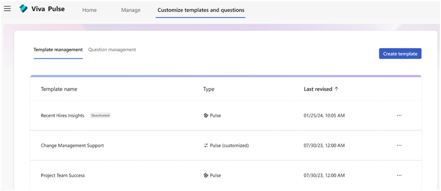

# Manage available surveys and questions

## Admin management of survey template and question libraries

Viva Pulse provides both survey templates and stock questions that can be added to a survey. As an admin, you can manage the survey templates and stock questions available to your users. This includes managing the stock content and adding and publishing your own survey templates or questions. Survey templates and standalone questions are managed independently, and any changes impact all authors across your company.

Both sets of content can be viewed and managed in the **Customize templates and questions** tab.

 
All admins within a company see the same information and statuses. Admins can update any survey templates and standalone questions, including content created or updated by other admins. A limited number of survey templates and standalone questions are locked for editing and can be identified by a **View only** tag.

**Sources can include:**

* _Pulse_: These surveys are provided as part of the Pulse app, and haven't been edited by the admin
* _Pulse (customized)_: These surveys are also provided as part of the Pulse app but a Viva Pulse Admin within the company published at least one update
* _Company created_: A Viva Pulse Admin for the company created and published the survey themselves

**Statuses can include:**

* _Active_: The template is visible and available for use by all licensed users within the company
* _Deactivated_: The template is only visible to the Viva Pulse admins within the Template management view

## Survey templates

Survey templates can be viewed and managed in the **Template management** section under the **Customize templates and questions** tab, which is available to Viva Pulse Admins.

When viewing this section, you see a table containing all the active and deactivated survey templates in your organization.

### Viewing and updating provided survey templates

All survey templates regardless of status are shown in the **Template management** section, ordered by the Last revised date, with the most recently added or updated at the top of the list.

The list can be sorted by **Template name**, **Template source**, or the **Last revised** date.

Clicking a row opens the survey template so the details of the template can be reviewed and updated, if desired. This includes the template name, the questions in the template, who made the last update and what language(s) are supported. The next step allows you to review and update the survey template description, which gives Pulse users context on the purpose of the survey.

As an admin, you can update the templates as needed to make sure they match your company’s needs. When you’re happy with your updates, save them as **Active** to make the new version of the survey template available to all Pulse users in your company.

### Creating new survey templates

To create a new survey template, click the **Create template** button. This opens a blank survey template where you can add a survey name and questions.

Up to 25 questions can be added using any combination of the Question Library or custom questions. The default language of the survey is the same as the language of the admin who created it.

When the survey template has a name and at least one question, the **Next** button becomes active. Clicking **Next** takes you to the step where you can add a brief description of the survey template that shows on the **Pulse homepage** and **Browse all** page, and which helps authors decide which template fits their needs. This is required before saving the survey.

### Saving survey templates

When all the required fields are filled out, a new or updated survey template can be saved. There are two options when saving:

* _Save as activated_: This saves the survey and makes it available to all users within the company. Company created surveys show at the top of the **Browse all templates** page in a section called **Provided by your company**
* _Save as deactivated_: This saves the survey but leaves it only available to Viva Pulse Admins within the company, and only from the Template management section under the **Customize templates and questions** tab. No other users can see or use the survey template until or unless it's set to **Active**.

Draft versions aren't automatically saved. To save work in progress, use the **Save as deactivated** option.

### Removing survey templates

There are two options to remove survey templates: deactivating and deleting; these options vary for templates based on the source.

**Deactivating a survey template**

Deactivating a survey can be undone at any time by marking it as **Active** again. Survey template status can be managed by clicking the **…** on the row for the desired survey template.

Surveys that were originally provided with the Pulse app and have a source of either **Pulse** or **Pulse (customized)** can only be deactivated.

When a survey has a state of **Deactivated**, it's not available for authors to use when sending a new Pulse, nor can authors resend a pulse that was previously sent using the template. Pulses already in progress aren't be impacted, nor are historical reports.

**Deleting a survey template**

Surveys that are **Company created** can be deleted and deactivated. The **Delete** option is available by clicking the **…** on the row for the desired survey template. Deleting a survey template can't be undone.

## Standalone Questions

Standalone questions are shown to authors in the question library and can be added to a pulse they're preparing to send. These questions can be viewed and managed in the **Question management** section. When viewing this section, you see a table containing all the active and deactivated standalone questions in your organization. Some questions are included in both survey template(s) and the question library and must be updated independently. Updating a question in a survey doesn't impact the same question in the question library and vice versa.

### Viewing and updating provided standalone questions

All standalone questions regardless of status are shown in the **Question management** section, ordered by the **Last revised** date, with the most recently added or updated at the top of the list.

The list can be sorted by **Question text**, **Topic**, **Type**, or the **Last revised** date.

Clicking a row opens the question so the details can be reviewed and updated, if desired. This includes the question text, multiple choice question options (if applicable), and the topics the question is associated with.

As an admin, you can update the questions as needed to make sure they match your company’s needs. When you’re happy with your updates, save them as **Active** to make the new version of the question available to all Pulse users in your company.

### Creating new standalone questions

To create a new question, click the **Create question** button, then choose the type of question you want to create. This opens the selected blank question template where you're prompted to add question text, multiple choice options (if applicable), and choose the desired question library topics.

All questions must have between one and four topics assigned. The General topic can only be used by itself, not along with other topics.

When the required fields are completed, the **Save** button becomes active. Clicking **Save** gives you the option to save the question as either **Activated** or **Deactivated**.

### Saving standalone questions

When all the required fields are met, a new or updated question can be saved. There are two options when saving:

* _Save as activated_: This saves the question and makes it available to all users within the company. The questions you create show alongside Pulse provided questions within the **question library**. 
* _Save as deactivated_: This saves the question but leaves it only available to Viva Pulse Admins within the company, and only from the **Question management** section under the ****Customize templates and questions** tab. No other users can see or use the questions until or unless it's set to **Active**.

Draft versions aren't automatically saved. To save work in progress, use the **Save as deactivated** option.

### Removing standalone questions

Removing questions works similarly to removing survey templates, with two options available (delete or deactivate) depending on the question source.

**Deactivating a standalone question**

Deactivating a standalone question can be undone at any time by marking it as **Active** again. Standalone question status can be managed by clicking the … on the row for the desired question.

Questions that were originally provided with the Pulse app and have a source of either **Pulse** or **Pulse (customized)** can only be deactivated.

When a question has a state of **Deactivated**, it's not available for authors to use when sending a new Pulse, nor can authors resend a pulse that was previously sent using the template. Pulses already in progress aren't be impacted, nor are historical reports.

**Deleting a standalone question**

Questions that are **Company created** can be deleted and deactivated. The **Delete** option is available by clicking the **…** on the row for the desired survey template. Deleting a standalone question can't be undone.
