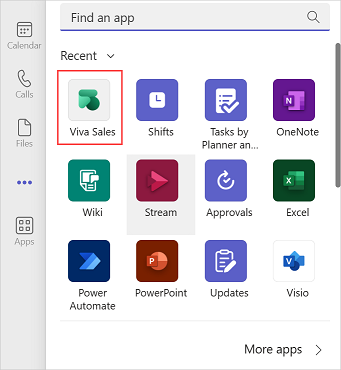
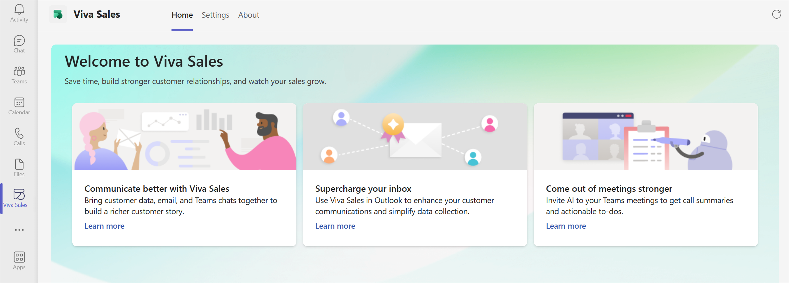
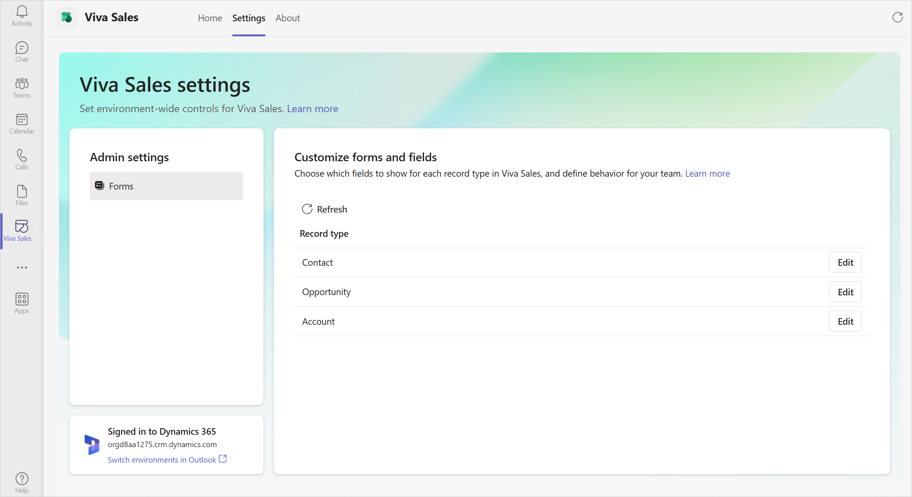

# Administrator settings for Viva Sales

Viva Sales can be customized to an organization's business needs. As a CRM administrator, you can manage environment-specific settings for Viva Sales from a central location and control Viva Sales experience across Outlook and Teams. For example, you can customize the CRM information displayed in Viva Sales across Outlook and Teams to give sellers quick access to the fields most relevant to their flow of work.

The following administrator settings are available:

- **Customize forms and fields**: Allows you to specify what information should be displayed in Viva Sales across Outlook and Teams. You can also control which records and fields sellers can edit directly in Viva Sales. More information: [Customize forms and fields](customize-forms-and-fields.md)

## Prerequisites

- Administrators must have the latest version of the Viva Sales app in Teams. For information on updating an app in Teams, see [Update an app in Teams](https://support.microsoft.com/office/update-an-app-in-teams-3d53d136-5c5d-4dfa-9602-01e6fdd8015b).
- Administrator must sign in to Viva Sales in Outlook.
    1. [Launch Viva Sales from Outlook](https://support.microsoft.com/topic/use-viva-sales-in-outlook-ec3605f9-fdb0-4593-9c5b-b43a76c07081).
    2. On the **Welcome to Viva Sales!** screen, select **Sign in to get started**, and then select your CRM and environment to use. 

> [!IMPORTANT]
> Administrator settings are visible only when you sign in to Viva Sales in Outlook with your administrator credentials. More information: [Who can access administrator settings?](#who-can-access-administrator-settings)

## Who can access administrator settings?

### Dynamics 365

|Requirement type  |You must have  |
|---------|---------|
|Security role     |  System Administrator or System Customizer **Note**: If you're using a custom security role, [additional privileges are required to use Viva Sales](install-viva-sales.md#additional-privileges-required-for-dynamics-365-customers).  |

### Salesforce

|Requirement type  |You must have  |
|---------|---------|
|Permission    |  User profile needs to have **Modify All Data** or **Manage Data Integrations** permission  |

> [!NOTE]
> Changes in user permissions or security roles in CRM can take up to 15 minutes to reflect in Viva Sales app for Teams.

## Access administrator settings

**Prerequisite**: Viva Sales app must be added to Teams. More information: [Add the Viva Sales app to Teams](#add-the-viva-sales-app-to-teams)

You can access administrator settings from the Viva Sales app in Teams. Administrator settings are specific to the CRM environment you sign in to from Viva Sales in Outlook. Each environment will have its own set of configurations for Viva Sales. If you want to configure Viva Sales for another environment, you must [switch environments in Outlook](#how-can-i-switch-crm-environments).

When you open administrator settings, following tabs are available:

- **Home**: Serves as the landing page for the Viva Sales app.

- **Settings**: Contains all the settings for an administrator.

- **About**: Displays details of the Viva Sales app.

> [!VIDEO https://www.microsoft.com/en-us/videoplayer/embed/RWWVKG]

**To access administrator settings**

1.  Sign in to Microsoft Teams with your administrator credentials.

2.  In the navigation bar on the left, select **Viva Sales**.

    If **Viva Sales** isn't visible, select **More added apps** (**…**), and then select **Viva Sales**.
    
    
    
    The **Viva Sales** app is opened with the **Home** tab selected.
    
    

3.  On the **Settings** tab, update the settings.

    - **Forms**: Allows you to [customize forms and fields](customize-forms-and-fields.md).

    

## Add the Viva Sales app to Teams

1.  Sign in to Microsoft Teams with your administrator credentials.

2.  In the navigation bar on the left, select **Apps**.

3. Search for **Viva Sales** and select it.

4. Select Add in the **Viva Sales** window.
    

## FAQ

### Can I access administrator settings if I don't have Microsoft Teams?

No. Administrator settings are currently accessible only through the Viva Sales app for Teams. 

### Which CRM environment are administrator settings for?

The settings are specific to the environment signed in to from Viva Sales in Outlook. If you want to customize Viva Sales for another environment, you must [switch environments in Outlook](#how-can-i-switch-crm-environments).

### How can I switch CRM environments?

Your organization may have multiple environments for you and your sellers to work in. Environments help to reduce the risk of making unintended changes to a production environment, for example. You can test customizations in a development environment to make sure they don’t disrupt your business operations or your customers' experience before you deploy them to your production environment.

You'll need to switch CRM environments from Viva Sales in Outlook and come back to Viva Sales app in Teams:

1. [Sign out of Viva Sales in Outlook](https://support.microsoft.com/topic/sign-out-of-viva-sales-7c62164a-ee27-48c7-93a0-c18bb1055cd6).
2. In the **Welcome to Viva Sales!** pane, select **Sign in to get started**, and then select your CRM and environment to use.
3. Come back to Viva Sales app in Teams and refresh the **Settings** tab to see the new environment.

### Why do I see the message "Sign in to Viva Sales in Outlook first"?

You need to be signed in to a CRM environment from Viva Sales in Outlook.

[Launch Viva Sales from Outlook](https://support.microsoft.com/topic/use-viva-sales-in-outlook-ec3605f9-fdb0-4593-9c5b-b43a76c07081). On the **Welcome to Viva Sales!** screen, select **Sign in to get started**, and then select your CRM and environment to use. 

Come back to the Viva Sales app in Teams and refresh the **Settings** tab. 

### Why do I see the message "Settings are coming soon"?

Personal settings for Viva Sales will also be accessible through the **Settings** tab, and will be launching soon. If you're a CRM administrator, you should already see administrator settings in the **Settings** tab, and you shouldn't see this message – check that you have the right permissions or security roles. More information: [Who can access administrator settings?](#who-can-access-administrator-settings)

### Can I work with administrator settings from my mobile device?

Mobile device is currently not supported. You must work with administrator settings from a desktop.

### Are the Dark and High Contrast themes from Teams supported?

The Dark and High Contrast themes from Teams are currently not supported. 

