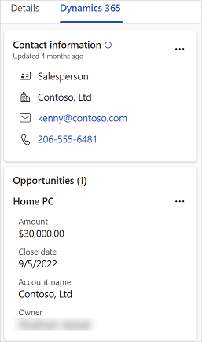
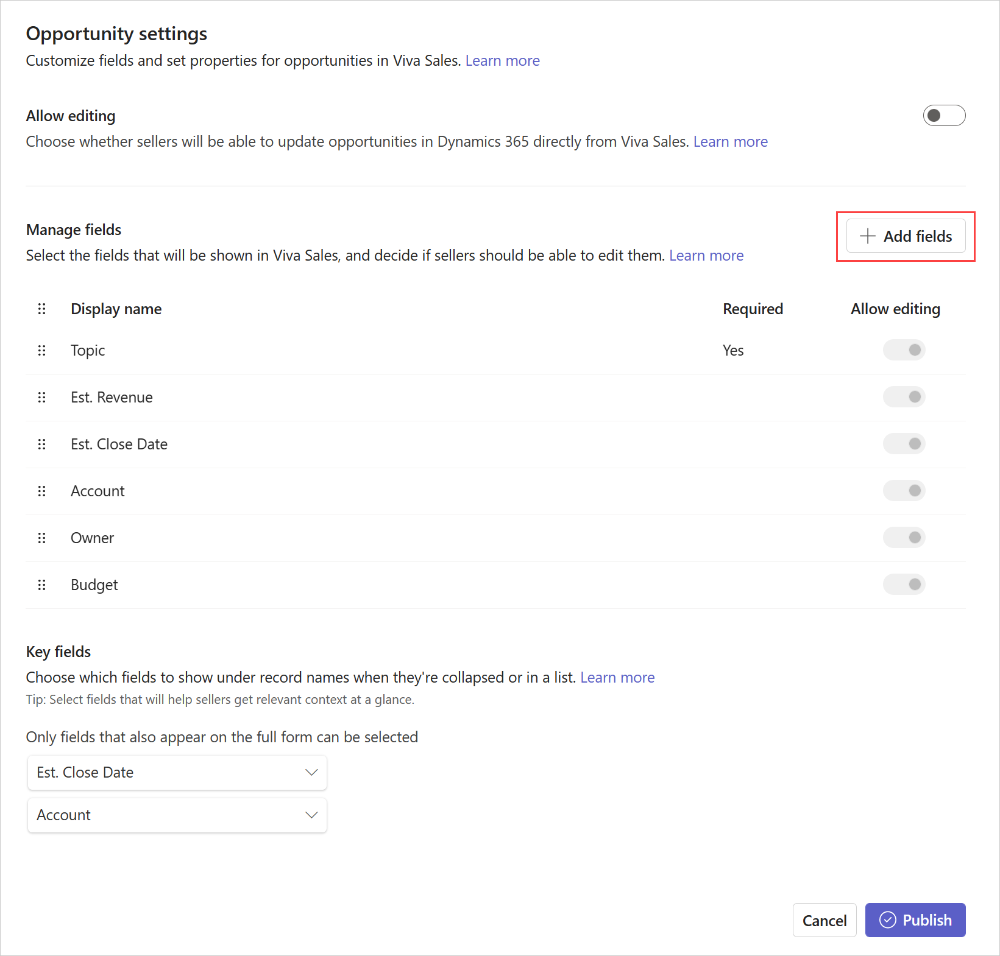
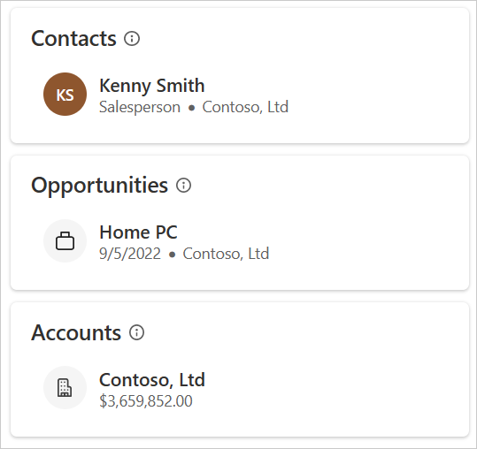
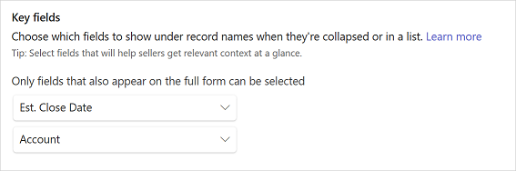
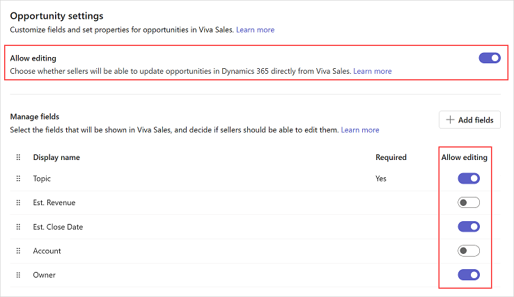
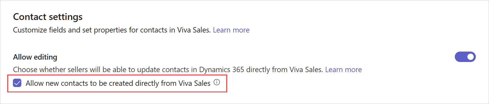
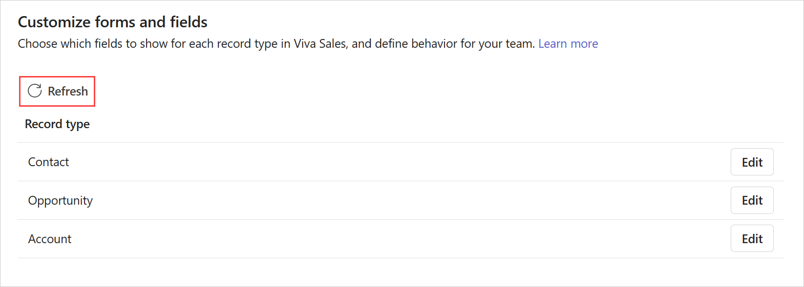

---
title: 
description: 
ms.date: 01/11/2023
ms.topic: article
ms.service: dynamics-365-sales
author: sbmjais
ms.author: shjais
manager: shujoshi
---

# Configure forms and fields

As a CRM administrator or Sales enablement manager, you can customize the CRM information displayed in Viva Sales. It helps your sellers to see relevant information from their CRM.

CRM forms and fields customization is environment specific. Each environment will have its own set of configurations. You can configure out-of-the-box contact, account, and opportunity records. Record names, field names, and mandatory fields are displayed as-is as defined in CRM.

You can configure the following for CRM records:

- **Detailed view**: This view provides you with the main interface for viewing and interacting with CRM data.

- **Mini view**: This is the lightweight view that displays only two fields for a CRM record.

- **Editing of records**: Control which records should be editable in Viva Sales.

- **New contact creation**: Configure if sellers can create new contacts and edit existing contacts inline in Viva Sales.

## Customize detailed view of CRM records

You can control the detailed views for CRM records in Viva Sales by selecting the fields that should be displayed and the order in which they should be displayed. The changes to the detailed view are reflected in the Viva Sales pane and adaptive cards shares in Teams chat.

### Add fields

1.  In Viva Sales admin settings, select **Forms**.

2.  Select the record type to which you need to add fields.

3.  In the **Manage fields** section, select **Add fields**.

Field names are displayed as follows:

-   Display name for Dynamics 365 users

-   Field label for Salesforce users

**\[Notes**:

-   You can add out-of-the-box and custom fields to a record's form.

-   You can add a maximum of 40 fields.\]

4.  In the **Add fields** window, select the fields you want to add to the form, and then select **Add**.

The new fields are added towards the end of the existing fields. You can [reorder fields](#reorder-fields) as you want.

5.  Select **Publish** to save the changes.

### Remove fields

1.  In Viva Sales admin settings, select **Forms**.

2.  Select the record type from which you need to remove fields.

3.  In the **Manage fields** section, hover over the field you want to remove from the form, and then select **Delete field** .

4.  Select **Publish** to save the changes.

### Reorder fields

1.  In Viva Sales admin settings, select **Forms**.

2.  Select the record type in which you need to reorder fields.

3.  In the **Manage fields** section, hover over the field you want to reorder, and then select **Move up**  or **Move down** **.**

**Note**: You can also hover over the field and then click-and-drag to change its order.

4.  Select **Publish** to save the changes.

## Customize mini view of CRM records

Each record type has a mini view that displays limited information under record names when they're collapsed or in a list. The mini view is available at various places in the Viva Sales pane such as the quick view for the CRM tab. The mini view includes a fixed title and two configurable subtitle fields.

**\[Notes**:

-   The available fields for the mini view are the ones that are available in the detailed view.

-   Mini view settings impact the results when searching for connected records. In Dynamics 365, the search behavior for connected records depends on the quick find view. You must ensure that the fields set for the mini view in Dynamics 365 exist in the quick find view, otherwise, the search list will not show the additional fields. In Salesforce, the search is performed on name and the additional fields selected in mini view.\]

### Select fields for mini view

1.  In Viva Sales admin settings, select **Forms**.

2.  Select the record type in which you need to select fields for mini view.

3.  In the **Key fields** section, select the fields using the available list.

4.  Select **Publish** to save the changes.

## Configure editing of records and fields

You can control which records should be editable in Viva Sales so that sellers can update those records directly from Viva Sales. You can also choose to restrict editing to selected fields in a record.

If a record is not allowed to be edited from Viva Sales, sellers must open the record in CRM and update the details as required.

By default, contacts are editable. For other records, you must turn on the option to allow editing.

**To allow editing of records and fields**:

1.  In Viva Sales admin settings, select **Forms**.

2.  Select the record type for which you need to allow editing.

3.  Turn on the **Allow editing** toggle.

When the toggle is turned on, all relevant fields are allowed to be edited from Viva Sales.

4.  To restrict editing for specific fields, go to the **Manage fields** section, and then turn off the **Allow editing** toggle for corresponding fields.

5.  Select **Publish** to save the changes.

## Configure new contact creation behavior

You can configure if sellers can create new contacts and edit existing contacts inline in Viva Sales or go to their respective CRM to add and edit a contact. By default, new contacts are created inline in Viva Sales.

**To configure new contact creation**:

1.  In Viva Sales admin settings, select **Forms**.

2.  Select **Contact**.

3.  On the **Contact settings** page, select **Allow new contacts to be created directly from Viva Sales**.

4.  Select **Publish** to save the changes.

## FAQ

**Are changes in the CRM reflected automatically in Viva Sales?**

The changes made in CRM are not reflected automatically in Viva Sales. You must select **Refresh** on the **Customize forms and fields** page to get the latest updates from CRM.

**Why delete is disabled for a few fields in contact record?**

If you enable new contact creation from within Viva Sales, you can't remove a field, from the contact form, that's marked as required in CRM.

**Which fields are not available for customization?**

Following fields are not allowed to be added from the admin settings page:

**Dynamics 365**

-   Fields whose data type is File, Image, or Rich text.

-   Entity Id

-   All fields where **IsValidODataAttribute** is set to false. More information: [AttributeMetadata.IsValidODataAttribute Property (Microsoft.Xrm.Sdk.Metadata) \| Microsoft Learn](https://learn.microsoft.com/en-us/dotnet/api/microsoft.xrm.sdk.metadata.attributemetadata.isvalidodataattribute?view=dataverse-sdk-latest)

**Salesforce**

-   Fields whose data type is Geolocation, Text area (rich), Text area (encrypted), or External Lookup Relationship.

-   Entity Id

**How many fields can be added to a record?**

You can a maximum of 40 fields per record.

**Why some fields are non-editable, although the record is set as editable?**

There are two cases for a field to be non-editable:

-   Field is calculated

-   Field is required in a contact record and creation is set to inline in Viva Sales

