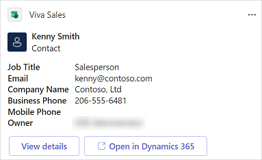

# Customize forms and fields

As an administrator, you can customize the CRM information that's displayed in Viva Sales to give your sellers a more relevant view. To know more about privileges required to access administrator settings, see [Who can access administrator settings?](administrator-settings-for-viva-sales.md#who-can-access-administrator-settings).

CRM forms and fields customization is environment-specific—each environment has its own set of configurations. For out-of-the-box contact, account, and opportunity records, you can configure:

- **Editing of records**: Control which records can be edited in Viva Sales
- **New contact creation**: Control whether sellers can create new contacts and edit existing contacts inline in Viva Sales
- **Detailed view**: The main interface for viewing and interacting with CRM data
- **Mini view**: A lightweight view that displays only two fields from a CRM record

Record names, field names, and mandatory fields are displayed as they're defined in the CRM.

> [!NOTE]
> If you change the name of a record type in CRM, they are not updated in Adaptive Card or messaging extensions in Teams. For example, if you rename Account to Customer, the name in Adaptive Card and messaging extensions will show as Account.

## Prerequisites

CRM administrators must access administrator settings from the Viva Sales app in Teams. More information: [Administrator settings for Viva Sales](administrator-settings-for-viva-sales.md)

## Configure editing of records and fields

You can control which records and fields sellers can edit directly in Viva Sales. If a record isn't allowed to be edited in Viva Sales, sellers must update the record in the CRM.

By default, contacts are editable. For other records, you must turn on the option to allow editing.

> [!VIDEO https://www.microsoft.com/en-us/videoplayer/embed/RE5fHzM]

1.  In Viva Sales admin settings, select **Forms**.

2.  Select a record type for which you need to allow editing.

    

3.  Turn on **Allow editing** to allow sellers to edit all relevant fields in that record type.

4.  To restrict editing for specific fields, in the **Manage fields** section, and turn off **Allow editing** for corresponding fields.

    

5.  Select **Publish** to save your changes.

## Configure new contact creation

You can control whether sellers can create contacts inline, directly in Viva Sales, or must do so in the CRM. By default, new contacts are created inline in Viva Sales.

**To configure new contact creation**:

1.  In Viva Sales admin settings, select **Forms**.

2.  Select the **Contact** record type.

3.  Under **Allow editing**, select **Allow new contacts to be created directly from Viva Sales**.

    

4.  Select **Publish** to save your changes.

## Customize the detailed view

To customize the detailed view of CRM records in Viva Sales, select fields to include in the view and the order in which they should appear. Changes to the detailed view are reflected in the Viva Sales pane in Outlook and Adaptive Cards shared in Teams chat.

You can add up to 40 out-of-the-box and custom fields to a record form.

### Add fields

> [!VIDEO https://www.microsoft.com/en-us/videoplayer/embed/RE5fC5a]

1.  In Viva Sales admin settings, select **Forms**.

2.  Select a record type to which you need to add fields.

3.  In the **Manage fields** section, select **Add fields**.

    

4.  In the **Add fields** window, select fields to display in the form, and then select **Add**.

    The new fields are added after existing fields, but you can [reorder them](#reorder-fields).

5.  Select **Publish** to save your changes.

### Remove fields

1.  In Viva Sales admin settings, select **Forms**.

2.  Select the record type from which you need to remove fields.

3.  In the **Manage fields** section, hover over the field you want to remove from the form, and then select **Remove field** ().

4.  Select **Publish** to save your changes.

### Reorder fields

1.  In Viva Sales admin settings, select **Forms**.

2.  Select the record type in which you need to reorder fields.

3.  In the **Manage fields** section, hover over the field you want to reorder, and then select the **Move up** or **Move down** arrows ( ).

    You can also drag the field to change its order.

4.  Select **Publish** to save your changes.

## Customize the mini view

Each record type has a mini view that displays limited information when they're collapsed or shown in a list. The mini view is available at various places in the Viva Sales pane, such as in the quick view on the CRM tab.

The mini view includes a fixed title and two configurable subtitle fields. The fields available in the mini view are the ones that are available in the detailed view.

> [!NOTE]
> Mini view settings affect the results when sellers search for connected records in Dynamics 365. In Dynamics 365, the search behavior for connected records depends on the quick find view. Make sure that the fields you select for the mini view exist in the quick find view, otherwise, the search list won’t show them. In Salesforce, the search is performed on the name and the additional fields selected for the mini view.

### Select fields for the mini view

1.  In Viva Sales admin settings, select **Forms**.

2.  Select the record type in which you need to select fields for mini view.

3.  In the **Key fields** section, select fields from the list.

    

4.  Select **Publish** to save your changes.

## FAQ

### Are changes in the CRM reflected automatically in Viva Sales?

Changes made in the CRM are not reflected automatically in Viva Sales. You must select **Refresh** on the **Customize forms and fields** page to get the latest updates from the CRM.

### Why is delete disabled for some fields in the contact record?

If you enable new contact creation from within Viva Sales, you can't remove a field from the contact form if it's marked as required in CRM.

### Which fields can't be customized?

The following fields can't be added from the Viva Sales **Admin settings** page:

**Dynamics 365**

-   Fields of type File, Image, Rich text, or MultiSelect Option Set.

-   Entity Id

-   All fields where [**IsValidODataAttribute**](/dotnet/api/microsoft.xrm.sdk.metadata.attributemetadata.isvalidodataattribute?view=dataverse-sdk-latest) is set to false. 

**Salesforce**

-   Fields of type Geolocation, Text area (rich), Text area (encrypted), External Lookup Relationship, or Picklist (Multi-Select).

-   Entity Id

### How many fields can I add to a record?

You can add a maximum of 40 fields to a record.

### Why are some fields non-editable, although the record is set as editable?

A field can be non-editable in the following cases:
- The field is calculated
- The field is required in the CRM

