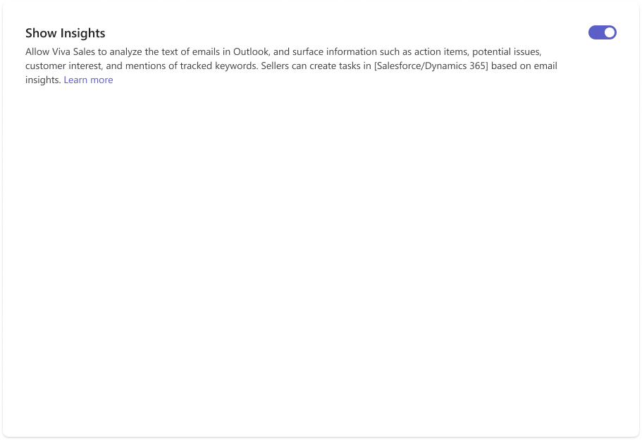

---
title: 
description: 
ms.date: 01/11/2023
ms.topic: article
ms.service: dynamics-365-sales
author: sbmjais
ms.author: shjais
manager: shujoshi
---

# Enable email intelligence in Outlook

As an administrator, you can allow Viva Sales to analyze the text of emails in Outlook, and surface information such as action items, potential issues, customer interest, and mentions of tracked keywords. When this feature is enabled, sellers can create tasks in their CRM systems, directly from Viva Sales, based on email insights.

1.  In Viva Sales admin settings, select **Email**.

2.  Turn on the **Show insights** toggle.

