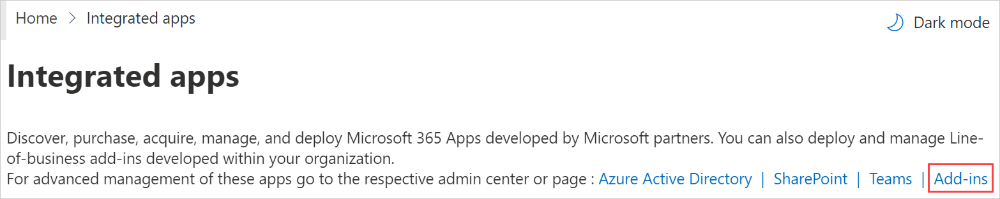

# Install Viva Sales as an individual add-in from AppSource

> [!IMPORTANT]
> Viva Sales is currently available only for public preview customers, and only in English. The features described here are subject to change.

1.  Sign in to [Microsoft AppSource](https://appsource.microsoft.com/en-US/home).

2.  Search for **Microsoft Viva Sales for Microsoft Outlook (Preview)**.

3.  Under the Viva Sales add-in in the search results, select **Get it now**.

4.  If you're asked to confirm your details to continue, do so, and then select **Get it now** again.  
    The AppSource window closes. You'll complete the remaining steps in the Microsoft 365 admin center.

5.  In the **Configuration** step, verify the information, and then select **Next**.

6.  In the **Users** step, select the users or groups who will have access to the add-in, and then select **Next**.

7.  In the **Deployment (Permissions)** step, read the app permissions and capabilities, and then select **Next**.

8.  In the **Deployment (Finish)** step, select **Finish deployment**.

9.  When the deployment is complete, select **Done**.

Allow up to 12 hours for Viva Sales to appear in users' Outlook ribbon.

## Manage the Viva Sales add-in

After you've installed Viva Sales as an individual add-in, you can change the users who can access it, change the deployment method, and disable the add-in if needed in the Microsoft 365 admin center.

1.  In the [Microsoft 365 admin center](https://admin.microsoft.com/), select **Settings** &gt; **Integrated apps**.

2.  On the **Integrated apps** page, select **Add-ins**.

    

3.  Select **Microsoft Viva Sales for Microsoft Outlook (Preview)**.

