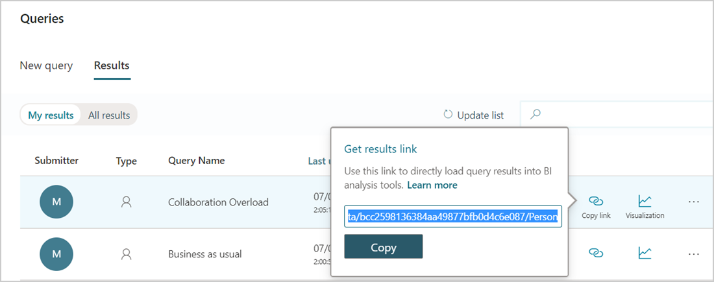
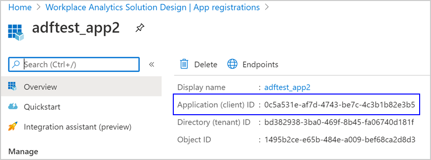
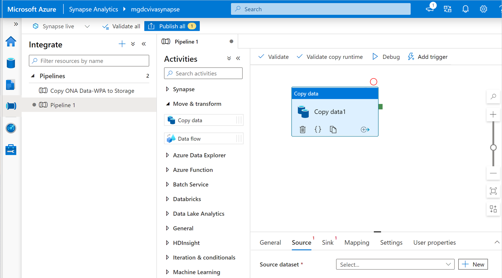
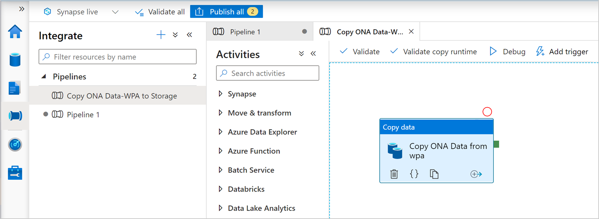

---

ms.date: 06/13/2018
title: Automate query data exports
description: Learn how to automate data query data exports from Microsoft Viva Insights in Workplace Analytics to Azure
author: madehmer
ms.author: v-lilyolason
ms.topic: article
ms.localizationpriority: medium 
search.appverid:
- MET150
ms.service: viva 
ms.subservice: viva-insights
ms.collection: 
- M365-analytics
- viva-insights
manager: helayne
audience: Admin
---

# Automate query data exports to Azure

With Azure Active Directory, you can automate the export of query data from Microsoft Viva Insights in Workplace Analytics. You can do this by using an OData query link in Workplace Analytics to connect and automatically refresh an Azure data store of your choice, such as through Azure Data Factory or Azure Synapse Analytics.

## Pick a setup path

To set up the automated OData connection between query data and an Azure data store, use one of the following paths to create and configure a new Azure analytics app, which needs company-specific information (secrets) about your private network and your choice data store.

* [Set up with Azure Data Factory UI](#to-set-up-with-azure-data-factory-ui) – This path steps you through creating and registering an app and creating a data factory for the data export through the Azure Data Factory UI.
* [Set up with Azure Synapse Analytics](#to-set-up-with-azure-synapse-analytics) - This path steps you through creating and registering an app and creating an OData pipeline for exporting query data through the Azure Synapse Analytics.
* [Set up with Azure PowerShell](https://github.com/microsoftgraph/M365Insights/blob/master/README.md) – This path automates the process end-to-end through PowerShell with predefined scripts that create and register the app, prompt for your organization’s specific parameters, and create and deploy the data factory.

## Prerequisites

* **Viva Insights or Workplace Analytics analyst** – Must be assigned a license and an Analyst role for Viva Insights or Workplace Analytics and have query results with the data you want to export.
* **Microsoft Azure subscription** – If you don't have an Azure subscription, create a [free account](https://azure.microsoft.com/free/) now. You’ll be using [Azure Active Directory](/azure/active-directory/), [OData connector](/azure/data-factory/connector-odata#supported-capabilities), and [Data Factory](/rest/api/datafactory/) for this setup.
* **Azure data store** – Your data store must be [supported by the OData connector](/azure/data-factory/connector-odata).
* **Azure admin** – You need Azure admin privileges to create and register the app in Azure. You also need to ask the Azure global admin to grant you permissions in Azure Data Factory to connect your new app to the Azure data store.

## To set up with Azure Data Factory UI

The following steps you through how to automate the export of Workplace Analytics query data to your choice Azure data store with the [Azure Data Factory UI](/azure/data-factory/introduction). Use the following steps in conjunction with the [Azure documentation](/azure/data-factory/introduction) to complete this setup.

1. Follow the steps in [Register an application using the Azure portal](/azure/active-directory/develop/quickstart-register-app#register-a-new-application-using-the-azure-portal) to create and register a new analytics app in Azure Active Directory.
2. In **Azure Active Directory App registrations**, select the app from **Step 1**,  and then grant it permissions for accessing Workplace Analytics by selecting **View API permissions**, and then select **Add a permission**.
3. Enter and search for the **Workplace Analytics** app name or **ID** and then select the applicable name from the list.

   

   To find the Application (client) ID:

   * In **Active Directory**, select **all applications**, and then enter **Workplace Analytics** for the enterprise app that you want to use.
   * Select it from the list.
   * In **Application ID**, copy the ID and paste it in **APIs my organization uses** search field.

     

4. In **Request API permissions**, select **Application permissions**, select **Analyst**, and then select **Add permissions**.
5. In **API permissions**, the global admin must select **Grant admin consent for [Workplace Analytics…]** before you can continue to the next step.

    

6. Follow the steps in [Create data factory](/azure/data-factory/quickstart-create-data-factory-portal) to create a new analytics data factory within Azure Active Directory.
7. In the **Azure Data Factory Overview**, select **Author & Monitor** to open Azure Data Factory.

    >[!Note]
    >Keep all your browser windows open because you must switch between them to complete the following steps.

8. In **Azure Data Factory**, select **Create a pipeline**.
9. Select the **ellipsis** (**...**) next **Datasets**, and then select **New dataset**. For more details, see [Datasets in Azure Data Factory](/azure/data-factory/concepts-datasets-linked-services).
10. In **Select a data store**, enter **odata**, and then select **OData**.
11. In **General**, enter a name and description for the query data you’re linking to.
12. Select **Connection**, select **New**, and then enter a name and description for the OData link, such as **WPA_Odata_Collab**.

13. In **Connect via integration runtime**, select **AutoResolveIntegrationRuntime**.
14. In [Workplace Analytics](https://workplaceanalytics.office.com/), select **Analyze** > **Query designer** > **Results**, and then copy the OData link for the query data you want to connect to Azure.

    >[!Important]
    >For automatically refreshed data, you must link to a query that uses the **Auto-refresh** option in Workplace Analytics. For static query results, you’ll need to enter a new OData link each time to update the query data in the connected Azure data store.

     

15. In **Service URL**, paste the query OData link that you copied in the previous step.
16. In **AAD resource**, enter `https://workplaceanalytics.office.com`.
17. In **Active Directory**, select **Overview** for the new app, and then copy the **Application (client) ID**.

     

18. In **Azure Data Factory** > **New linked service** > **Service principal ID**, copy the client ID. For  details, see [Linked service properties](/azure/data-factory/connector-odata#linked-service-properties).

     

19. In **Authentication type**, select either **AAD service principal with Key** or **AAD service principal with Cert**. Keep **New linked service (OData)** open in a separate browser window. For details about these options, see [Use Azure Key Vault secrets in pipeline activities](/azure/data-factory/how-to-use-azure-key-vault-secrets-pipeline-activities).
20. In **Azure Active Directory** > **your newly registered analytics app**, select **Certificates & secrets**, and then do one of the following.

    * **For Key authentication**, select **New client secret** and in **Add a client secret**, enter a description, select when it expires, and then select **Add**. In **Client secrets**, select the new secret, and then select the **Copy icon** to copy it.
    * **For Certificate authentication** (preferred for higher security), select a certificate and copy it.

21. In **Azure Data Factory**, do the following for the applicable authentication type:

    * For Service principal key, paste the new client secret copied in the previous step in **Service principal key**.
    * For **Azure key vault**, copy and paste the certificate and the other required information. See [Set and retrieve a secret from Azure Key Vault](/azure/key-vault/secrets/quick-create-portal) for details.

22. Select **Test connection** to test the OData linked service.
23. After you see **Connection successful**, select **Create**.
24. In **Connection** > **Linked service** for the new OData linked service, select the new dataset you just created in the previous steps.
25. In **Connection** > **Path**, select **Edit**, and then enter the **Entity set name**. To find it, copy the OData query link from [Workplace Analytics](https://workplaceanalytics.office.com/) > **Analyze** > **Query designer** > **Results**, and open the query link in a new browser window. Search for **metadata** to find the entity name, which is shown after **$metadata#**. For example, the entity set name shown in this graphic is **Persons**:

     

26. Select **Preview data** for the path to confirm you entered the correct entity.
27. In **Azure Data Factory** > **Properties**, confirm the name and description for this new dataset.
28. Select **Publish all** at the top, and then select **Publish**.
29. In **Pipelines**, create a new pipeline that can use the new OData dataset to copy the query data to the external resource. For details, see [Create a pipeline](/azure/data-factory/tutorial-copy-data-portal#create-a-pipeline).
30. For the new pipeline, select **Source**, and in **Source dataset**, select the name of new OData dataset, and in **Use query**, select **Table**.
31. Create a linked service for the data store you want to export to. For details, see [Linked services](/azure/data-factory/author-management-hub#linked-services).
32. In **Azure Data Factory** > **Author**, select the new pipeline, and then select **Add trigger** > **Trigger now** to manually run the last published pipeline, as shown in the following graphic. You can also schedule a trigger for this new pipeline by selecting **Add trigger** > **New/Edit** > **New**, and complete the required information for it. See [Pipeline execution and triggers in Azure Data Factory](/azure/data-factory/concepts-pipeline-execution-triggers) for details.

     

33. In **Sink** > **Sink dataset**, select the linked service name you created in a previous step.

You can then use this new data factory to access query data from Workplace Analytics and copy it to your choice data store (blob storage) by using the Azure Resource Manager template. You can reuse this new app over time for multiple projects without having to repeat these steps. You can also reuse the data factory you created for new pipelines.

## To set up with Azure Synapse Analytics

The following steps you through how to automate the export of Workplace Analytics query data to your choice Azure data store with the [Azure Synapse Analytics](/azure/synapse-analytics/get-started). Use the following steps in conjunction with the [Azure documentation](/azure/data-factory/introduction) to complete this setup.

1. Follow the steps in [Register an application using the Azure portal](/azure/active-directory/develop/quickstart-register-app#register-a-new-application-using-the-azure-portal) to create and register a new analytics app in Azure Active Directory.
2. In **Azure Active Directory App registrations**, select the app from **Step 1**,  and then grant it permissions for accessing Workplace Analytics by selecting **View API permissions**, and then select **Add a permission**.
3. Enter and search for the **Workplace Analytics** or **Viva Insights** app name or **ID** and then select the applicable name from the list.

   

   To find the Application (client) ID:

   * In **Active Directory**, select **all applications**, and then enter **Workplace Analytics** or **Viva Insights** for the enterprise app that you want to use.
   * Select it from the list.
   * In **Application ID**, copy the ID and paste it in **APIs my organization uses** search field.

     

4. In **Request API permissions**, select **Application permissions**, select **Analyst**, and then select **Add permissions**.
5. In **API permissions**, the global admin must select **Grant admin consent for [Workplace Analytics…]** before you can continue to the next step.

    

6. Follow the steps in [Create A Synapse Workspace](/azure/synapse-analytics/quickstart-create-workspace) create a new Synapse Workspace within your Azure portal.
7. In the **Azure Synapse** resource in portal, select **Open Synapse Studio** to open the Azure Synapse Workspace.

    >[!Note]
    >Keep all your browser windows open because you must switch between them to complete the following steps.

8. In **Azure Synapse Studio**, select **Integrate**, and then add a **Pipeline**.

    

9. In the new Pipeline activities menu, select **Move and Transform**, and then drag a **Copy data** into your pipeline workspace.
10. Select the **ellipsis** (...) next **Datasets**, and then select **New dataset**.
11. In the **Source** section, add a new source.

    

12. In **New Integration Dataset**, enter **odata**, and then select **OData**.
13. In **Set Properties**, enter a name and create a new linked service.
14. In **New linked service (Odata)**, enter a name and description for the query data you’re linking to.
15. In **Connect via integration runtime**, select **AutoResolveIntegrationRuntime**.
16. In Viva Insights in [Workplace Analytics](https://workplaceanalytics.office.com), select **Analyze** > **Query designer** > **Results**, and then copy the OData link for the query data you want to connect to Azure.

    >[!Important]
    >For automatically refreshed data, you must link to a query that uses the Auto-refresh option. For static query results, you’ll need to enter a new OData link each time to update the query data in the connected Azure data store.

     

17. In Azure Synapse New linked **Service URL**, paste the query OData link that you copied in the previous step.
18. In **AAD resource**, enter `https://workplaceanalytics.office.com`.
19. In **Active Directory**, select **Overview** for the new app, and then copy the **Application (client) ID**.

     

20. In **Azure Synapse Studio** > **New linked service (Odata)** > **Service principal ID**, copy the client ID. For details, see [Linked service properties](/azure/data-factory/connector-odata#linked-service-properties).
21. In **Authentication type**, select either **AAD service principal with Key** or **AAD service principal with Cert**. Keep **New linked service (OData)** open in a separate browser window. For details about these options, see [Use Azure Key Vault secrets in pipeline activities](/azure/data-factory/how-to-use-azure-key-vault-secrets-pipeline-activities).
22. In **Azure Active Directory** > **your newly registered analytics app**, select **Certificates & secrets**, and then do one of the following.

    * For **Key authentication**, select **New client secret**, and then in **Add a client secret**, enter a description, select when it expires, and then select **Add**. In **Client secrets**, select the new secret, and then select the **Copy** icon to copy it.
    * For **Certificate authentication** (preferred for higher security), select a certificate and copy it.

23. In **Azure Synapse studio**, do the following for the applicable authentication type:

    * For Service principal key, paste the new client secret copied in the previous step in **Service principal key**.
    * For **Azure key vault**, copy and paste the certificate and the other required information. See [Set and retrieve a secret from Azure Key Vault](/azure/key-vault/secrets/quick-create-portal) for details.

24. Select **Test connection** to test the OData linked service.
25. After you see **Connection successful**, select **Create**.
26. In **Set Properties** > **Linked service** for the new OData linked service, select the new linked service you just created in the previous steps.
27. In **Source** > **Path**, select **Edit**, and then enter the **Entity set name**. To find it, copy the OData query link from [Workplace Analytics](https://workplaceanalytics.office.com/) > **Analyze** > **Query designer** > **Results**, and open the query link in a new browser window. Then search for **metadata** to find the entity name, which is shown after **$metadata#**. For example, the entity set name shown in this graphic is **Persons**:

     

28. Select **Preview data** for the path to confirm you entered the correct entity.
29. In the **Sink** section, add a new **sink dataset** and in the **New Integration Dataset**, select **Azure Data Lake Storage Gen2**, and then select **Continue**.
30. For **Select Format**, select **Delimited Text**, and then select **Continue**.
31. In **Set Properties**, enter a name, select **First row as header**, and then select your default Synapse storage account (which is already linked), or create a new linked service.
32. Enter a file path for the destination of the copied file in the storage. If you leave  **File** empty, the copy pipeline automatically generates a name for the file in the destination directory.

    

33. Validate and if successful, select **Publish all** at the top.

    

34. After it publishes successfully, select **Add trigger**, and then **Trigger now** or select the trigger.
35. After it successfully runs, go to your Azure Data Lake Linked Service to locate the transferred data. Select **More** > **Refresh** to view the latest available data.

## Related topics

* [Automate query data export with PowerShell](https://github.com/microsoftgraph/M365Insights/blob/master/README.md)

