# Viva Insights data lake solution

You can use this solution to extract, transform, and load (ETL) Microsoft Viva Insights data into a database and then report on it through Power BI as an end-user platform. The key features of this workload:

- Automated pipeline to avoid manual interaction with the Viva Insights Query designer.
- Instructions and guidelines on managing and loading Viva Insights historical data.
- Utilizing an open source scripting language (Spark) to enable reusability of the script in other platforms and tools.
- Leveraging Azure Synapse for a seamless, easy-to-manage workspace to implement the solution.

## Use cases

Several scenarios can benefit from this workload through layering an advanced ETL pipeline on top of Viva Insights:

- Two native out-of-the-box options are available with Viva Insights’ queries:

  - Download the query results file manually.
  - Use the OData links with a secondary tool like Microsoft Power BI to connect through the OData links. To avoid manual downloads and using other unnecessary tools, a program (script) is required to load and ingest the data.

  Many use cases for advanced analytics require automatic processing of data in production environments within existing data warehouses. You can use this solution to automatically load and then combine Viva Insights data with other data sources for a more comprehensive view of the organization.

- Business intelligence (BI) solutions with Power BI or other tools might not scale properly through an OData link with Viva Insights. With this solution, you can use a combination of a SQL Database and Power BI (or any other tool connecting though OData) to scale up.
- The Viva Insights queries are limited by the set time periods in the app. Having an additional work stream to ingest and store the historical data over time might be necessary for some organizations and some scenarios.

## Architecture

- [Azure Synapse Analytics](/azure/architecture/example-scenario/data/small-medium-data-warehouse) is an analytics service that combines data integration, enterprise data warehousing, and big data analytics. This solution includes the following components:

  - An [Azure Synapse workspace](/azure/synapse-analytics/quickstart-create-workspace) - Promotes collaboration between data engineers, data scientists, data analysts, and BI professionals.
  - [Azure Synapse pipelines](/azure/synapse-analytics/get-started-pipelines) - Orchestrate and ingest data into SQL Database and Data Lake Storage.
  - [Azure Synapse SQL pools](/azure/synapse-analytics/get-started-analyze-sql-on-demand) - Run queries and analytics at massive scale once data is stored in relational tables with columnar storage.
  - [Azure Synapse serverless Apache Spark pools](/azure/synapse-analytics/get-started-analyze-spark) - For code-first explorations in Data Lake Storage with Spark languages, such as Spark SQL, PySpark, and Scala.

The following shows how these components are used within this solution's architecture.

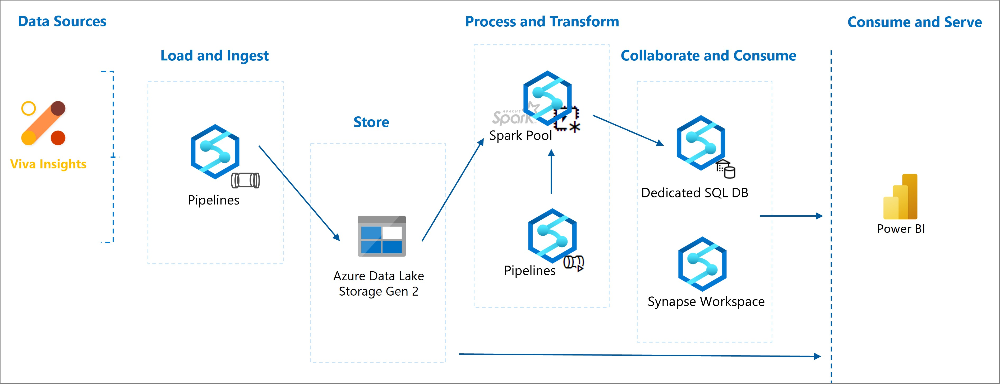

## Alternatives

- Use [Azure Data Factory](https://azure.microsoft.com/services/data-factory) for orchestration instead of Azure Synapse pipelines. The choice depends on several factors:

  - [Azure Synapse pipelines](/azure/synapse-analytics/get-started-pipelines) keep the solution design simpler and enable collaboration inside a single Azure Synapse workspace. However, Azure Synapse pipelines do not support rehosting the SSIS packages, which is supported in Azure Data Factory.
  - [Synapse Monitor Hub](/azure/synapse-analytics/get-started-monitor) monitors Azure Synapse pipelines, while [Azure Monitor](https://azure.microsoft.com/services/monitor) can monitor Data Factory.

  For more information and a feature comparison between Azure Synapse pipelines and Data Factory, see [Data integration in Azure Synapse Analytics versus Azure Data Factory](/azure/synapse-analytics/data-integration/concepts-data-factory-differences).

- Use SQL Database instead of [Synapse Analytics dedicated SQL pools](/azure/synapse-analytics/sql-data-warehouse/sql-data-warehouse-overview-what-is) for storing enterprise data.
- Use DataBricks instead of Synapse Spark Pool to transform the data. The link for DataBricks notebooks is also available in the [GitHub repository](https://github.com/microsoft/VivaSolutions/tree/main/Sample%20Solutions/Data%20Lake/Viva%20Insights).

## Availability and pricing

SQL Database (standalone or as a Synapse dedicated SQL pool) is a PaaS service that can meet your high availability (HA) and disaster recovery (DR) requirements. For guidance, see [High availability for Azure SQL Database and SQL Managed Instance](/azure/azure-sql/database/high-availability-sla).

You can use the [Azure Pricing Calculator](https://azure.microsoft.com/pricing/calculator/) to get an estimate for this workflow. You can use Azure Synapse to scale your compute and storage levels independently. Compute resources are charged by the hour, which you can scale or pause on demand. Because storage resources are billed by the terabyte, your costs will increase as you ingest more data.

- [SQL Database](https://azure.microsoft.com/pricing/details/azure-sql-database/single) pricing depends on the selected Compute and Service tiers, and the number of vCores and Database Transaction Units (DTUs).
- [Data Lake Storage](https://azure.microsoft.com/pricing/details/storage/data-lake/) pricing depends on the amount of data you store and how often you use the data.
- [Azure Synapse pipelines](https://azure.microsoft.com/pricing/details/synapse-analytics/) pricing depends on the number of data pipeline activities, integration runtime hours, data flow cluster size, and execution and operation charges. Pipeline costs increase with additional data sources and amounts of data processed.
- [Azure Synapse Spark pool](https://azure.microsoft.com/pricing/details/synapse-analytics/) pricing depends on node size, number of instances, and uptime.

## Prerequisites

- [Workplace Analytics Analyst](/viva/insights/setup/assign-user-roles) – Must be assigned a Viva Insights license and the Analyst role for Workplace Analytics with Viva Insights and know how to use the Query designer.
- [Microsoft Azure subscription](https://azure.microsoft.com/free/) – If you don't have an Azure subscription, create a free account now. You’ll be using Azure Active Directory, OData connector, and Synapse or Azure Data Factory for this setup.
- [Azure data store](/azure/data-share/supported-data-stores) – Your data store must be supported by the [OData connector](/azure/data-factory/connector-odata).
- [Azure admin](/azure/data-factory/concepts-roles-permissions) – You need Azure admin privileges to create and register the app in Azure. You also need to ask the Azure global admin to grant you permissions to connect your new app to the Azure data store.

## Setup overview

The following steps walk you through how to implement the Viva Insights Synapse pipeline in the architecture. The focus of this workflow will be on transferring and maintaining Viva Insights standard person and meeting queries in an Azure Synapse Dedicated SQL Database and maintaining the workflow over time.
Use the following steps in conjunction with the Azure documentation to complete this setup.

1. [Update your organizational data](#update-your-organizational-data)
2. [Create the queries](#create-the-queries)
3. [Prepare the Synapse Workspace](#prepare-the-synapse-workspace)
4. [Set up the Viva Insights Synapse Pipeline](#set-up-the-viva-insights-synapse-pipeline)

## Update your organizational data

The pipeline requires the following data attributes within the organizational (HR) data that’s uploaded and used in Viva Insights:

- **PersonId**, **ManagerId**, and **Organization** - For details, see [Attribute reference](/viva/insights/setup/prepare-organizational-data#attribute-reference).
- **LevelDesignation** - Defines the reporting hierarchy and is used in a lot of workplace analysis.
- **EmployeeId** - Secondary unique identifier that’s used as a key for joining Viva Insights data with other external data sources. Many advanced use cases can use this workflow to export the Viva Insights query output into a database to join with other data sources for a comprehensive analysis of organizational collaboration patterns. Because PersonId in Viva Insights is automatically de-identified in the system and in query results, you must add a secondary identifier (EmployeeId) as a key for the join scenarios.

>[!Note]
>If you prefer not to use LevelDesignation and EmployeeId, you can change the PySpark script and the database table creation script to remove these attributes. Also, you can use a different naming structure for EmployeeId. In the pipeline parameters, you can name the identifier that you want to use for EmployeeId.

**Recommendation**: To protect employee privacy, don’t use employees' actual employee IDs in your organizational data file. Instead, use a modified, mapped, or hashed version of employee IDs for the EmployeeID in the file, and then only make the reverse mapping available to a limited number of Workplace Analytics or Viva Insights Admins.

After your organizational data is updated based on these instructions, do the following to create a query in Workplace Analytics for Viva Insights.

## Create the queries

Within your Viva Insights workspace, follow the instructions in the [Query designer](/viva/insights/tutorials/query-designer) to create a standard person query and a standard meeting query with the following configurations.

- Select **Standard meeting query** and **Standard person query** when creating your custom queries.
- In **Select filters**, select your target group (all employees or active only).
- In **Organizational data**, select to include all the attributes. The PySpark script will only use the fields required in addition to the secondary **EmployeeId** for the join. By including all of the available attributes, you can then easily change the workflow to add other attributes for future configurations.

The Organizational attributes listed in the [AttributeList.txt](https://github.com/microsoft/VivaSolutions/blob/main/Sample%20Solutions/Data%20Lake/Viva%20Insights/AttributeList.txt) file are required in the Viva Insights meeting and person queries used in this solution.

### Managing historical data

A production workload requires an initial historical data upload that's followed by weekly or monthly updates. You can use this pipeline for this purpose in one of two ways:

**Option 1**: Create two copies of this pipeline within your Synapse workspace with two sets of queries. For the first set of queries (person and meeting queries), select the following options to load the historical data. Then use the OData links for these queries in your pipeline to copy the data into Blob storage and inserting into database. This pipeline only needs to be triggered one time:

- **Time period** - Select your preferred historical data period (such as one year).
- **Group by** - Select **Week** for the Person query.
- **Auto-refresh** - Don’t select it.

The second set of queries with the following configuration prepares the weekly or monthly updates. Use the OData links for these queries in your second pipeline to copy the data into the Blob Storage and insert into the database on a schedule. Based on your use case requirement, you can do weekly or monthly updates. This pipeline must be triggered on a schedule to load the data updates. With every run, the pipeline reads the data from the OData link, copies it into the Blob Storage, checks the database for the latest existing records, and only upserts the latest records based on the existing database records.

- **Time period** - Select the minimum available or your preferred time frame. **Note**: The “Last one month” is the smallest time period available in the product. This works great for the monthly scheduled pipeline (database update). For a weekly scheduled pipeline, the PySpark script will extract “Last week's” data for upserts.
- **Group by** - (for Person Query): Week (for a weekly scheduled pipeline) or “Month” (for the monthly one)
- **Auto-refresh** - Select it.

>[!Note]
>Query results are refreshed when new data is available that can be when your weekly data is being processed and published by Viva Insights or when there is a new organization file upload or update.
Usually, Viva Insights weekly updates are processed on weekends and for some, can take until Monday afternoon to finish. To allow for this possibility, the Synapse pipeline provided in these instructions can be scheduled for Tuesday.

**Option 2**: Use one pipeline and one set of queries. Set up the queries for the historical data load (as described in Option 1) to trigger the pipeline. However, after the triggered pipeline successfully runs, change the configuration to the second set (as described in Option 1), and schedule the pipeline to run based on your preferred settings (weekly or monthly).

## Prepare the Synapse Workspace

- Follow the steps in [Synapse documentation](/azure/synapse-analytics/quickstart-create-workspace) to create a Synapse workspace and connect it to a new or existing Storage account. When creating the workspace, keep the SQL Server admin credentials.
- Follow the steps in documentation to create a [Synapse Dedicated SQL Pool](/azure/synapse-analytics/get-started-analyze-sql-pool#create-a-dedicated-sql-pool) and a [Spark Pool](/azure/synapse-analytics/get-started-analyze-spark#create-a-serverless-apache-spark-pool).

## Set up the Viva Insights Synapse Pipeline

After following the steps to [Create the queries](#create-the-queries), do the following to set up the pipeline in Azure Synapse Analytics. Use the [Azure documentation](/azure/data-factory/introduction) in conjunction with these steps.

1. In the **Azure Synapse** resource in portal, select **Open Synapse Studio** to open the Azure Synapse Workspace.

   >[!Note]
   >Keep all your browser windows open because you must switch between them to complete the following steps.

2. In **Azure Synapse Studio**, select **Integrate**, and then add a **Pipeline**.

   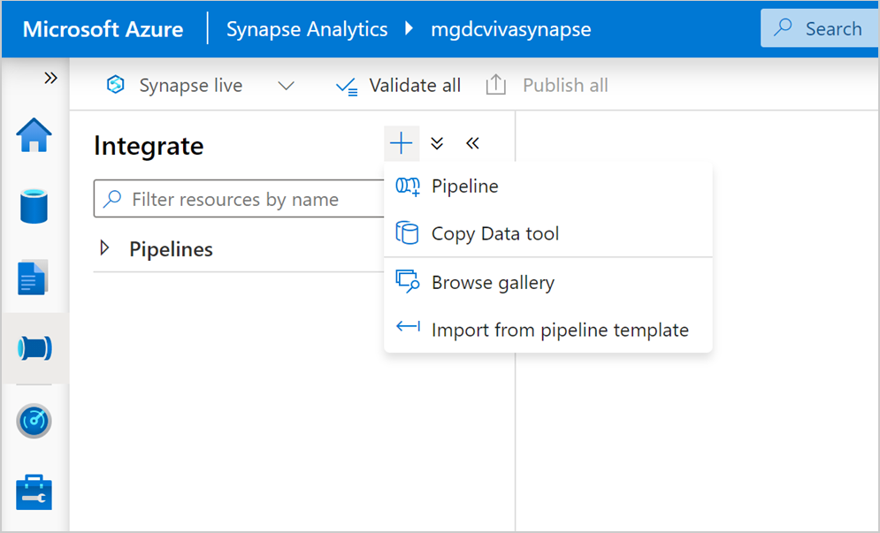

3. Name your pipeline and in **Parameters**, add the following (use +New) with their initial default values:

   - **StorageAccountName** - Name of the storage account linked to Synapse for this workflow.
   - **VivaInsightsDataFileSystem** - Name of the Storage Account Container within StorageAccountName for copying the Viva Insights query results into, such as “vivainsights,” as shown as an example in these steps. You should create a container with this name manually.
   - **PersonQueryDatasetFolder** - Directory used to write the Person query results within the VivaInsightsDataFileSystem container, such as “personQuery.”
   - **MeetingQueryDatasetFolder** - Directory used to write the Meeting query results within the VivaInsightsDataFileSystem container, such as “meetingQuery.”
   - **PersonQueryMetaData** - Metadata of the Person query is “Persons.”
   - **MeetingQueryMetaData** - Metadata of the Meeting query is “Meetings.”

    >[!Note]
    >For details on finding the metadata value for Viva Insights queries, copy the OData query link from the Query designer **Results** page in Workplace Analytics, and open the query link in a new browser window. Then search for metadata to find the entity name, which is shown after **$metadata#**. For example, the following shows the entity set name as **Persons**.

    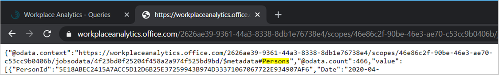

   - **SecondaryEmployeeId** - Name of the secondary employee identifier that's described in [Update your organizational data](#update-your-organizational-data).
   - **SQLServerEndpoint** - Open the Synapse **Manage** tab from the left menu. In the **Analytics Pool** > **SQL Pools**, select the SQL pool for this pipeline. In **Properties**, the **Workspace SQL Endpoint** is the correct value for this parameter.
   - **DBName** - Name of the SQL Pool selected to be used in this pipeline.
   - **DBUser** - Admin or a user with write permissions for the SQL Database.
   - **DBPass** - Password for the selected user.
   - **DBPort** - By default port 1433 is used, which you can change based on the SQL Database configuration.

     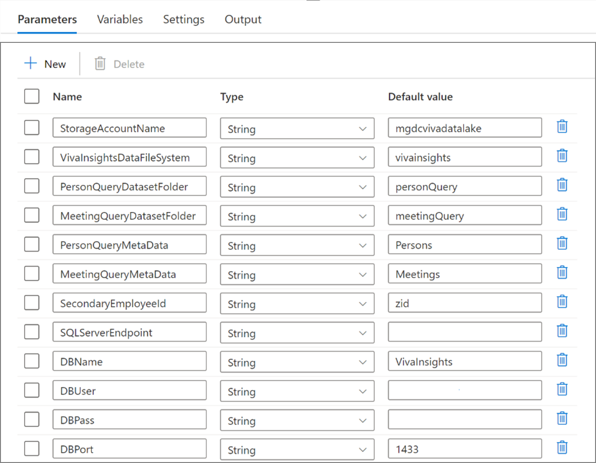

4. Follow **Steps 1 to 5** in [To set up with Azure Synapse Analytics](../automate-exports.md#to-set-up-with-azure-synapse-analytics) to register an application and grant it permissions, and then copy and save the **Application** (client) and **Directory** (tenant) **IDs**.
5. In the **Pipeline activities** menu, select **Move and Transform**, and then drag a **Copy data** into your pipeline workspace.
6. In **General**, enter a name, such as "Person Query Copy,” as shown in these steps.
7. In **Source**, add a new Source dataset.
8. In **New Integration Dataset**, enter **OData**, and then select **OData**.
9. In **Set Properties**, enter a name and create a new linked service.
10. In **New linked service (OData)**, enter a name and description for the query data you’re linking to.

    1. In **Connect via integration runtime**, select **AutoResolveIntegrationRuntime**.
    2. Open Workplace Analytics in a separate browser, and then on the Query designer **Results** page, copy the OData link for the person query data you want to connect to Azure.
    3. In **Service URL**, paste the query OData link that you copied in the previous step.
    4. In **Authentication type**, select either **AAD service principal with Key** or **AAD service principal with Cert**. For details about these options, see [Use Azure Key Vault secrets in pipeline activities](/azure/data-factory/how-to-use-azure-key-vault-secrets-pipeline-activities).
    5. In **AAD resource**, enter 'https://workplaceanalytics.office.com'.
    6. If not set by default, paste your saved **Directory ID** (tenant) in **AAD tenant**.
    7. Paste your saved **Application ID** (client) recorded in **AAD service principal ID**. For details, see [Linked service properties](/azure/data-factory/connector-odata#linked-service-properties).
    8. In **Azure Active Directory** > **your newly registered analytics app**, select **Certificates & secrets**, and then do one of the following.

       - For **Key authentication**, select **New client secret**, and then in **Add a client secret**, enter a description, select when it expires, and then select **Add**. In **Client secrets**, select the new secret, and then select the **Copy** icon to copy it.
       - For **Certificate authentication** (preferred for higher security), select a certificate and copy it.

    9. Back in the **New linked service** window, do the following for the applicable authentication type:

       - For **Service principal key**, paste the new client secret copied in the previous step in **Service principal key**.
       - For **Azure key vault**, copy and paste the certificate and the other required information. See [Set and retrieve a secret from Azure Key Vault](/azure/key-vault/secrets/quick-create-portal) for details.

    10. Select **Test connection** to test the OData linked service.
    11. After confirming that the connection is successful, select **Create**.

11. In **Set Properties** > **Linked service** for the new OData linked service, select the new linked service you just created in the previous steps. In **Path**, ignore the “Failed” status and select **OK**.

    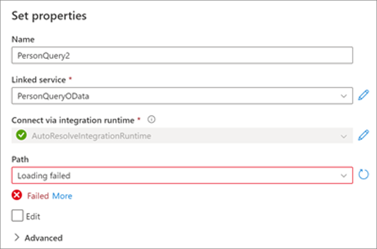

12. In **Source**, select **Open** for the source dataset that you've created.

    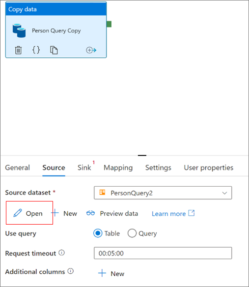

13. In **Parameters** for the opened OData resource, add **PersonQueryMetaData**.

    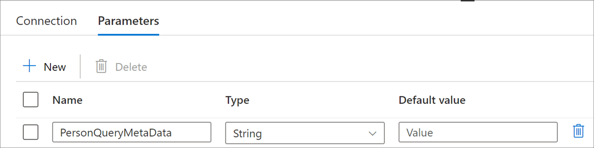

14. Go back to the **Connection** tab, select the empty field for the **Path** and use the **Add Dynamic Content** to set the path to the dynamic value of: '@dataset().PersonQueryMetaData'

    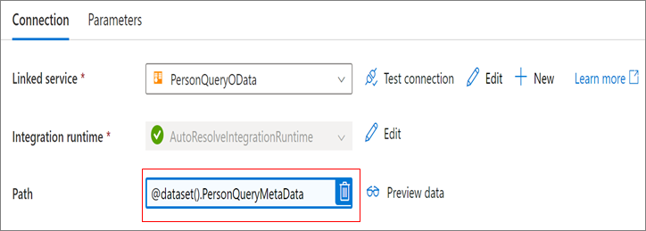

15. Select **Preview data** and confirm the path is correct. If prompted to enter the PersonQueryMetaData parameter value, use “Persons” or “Meetings," which are the defaults for the person and meeting queries.
16. Go back to the **Person Query Copy** activity > **Source** > **Dataset Properties**, select the empty value field for the parameter, and use the **Add Dynamic Content** to set the parameter value.

    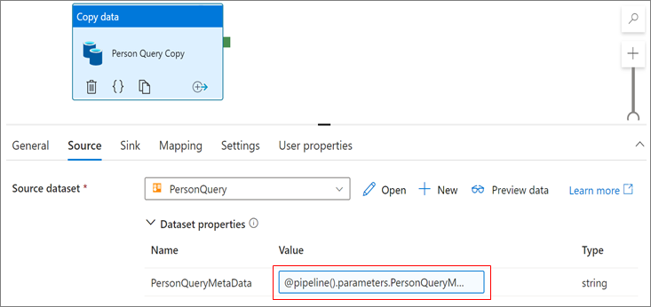

17. For the **Person Query Copy** activity, select the **Sink** tab, and then add a new **Sink** dataset.
18. Select **Azure Data Lake Storage Gen2**, continue with **DelimitedText** as the format, and then select **Continue**.

    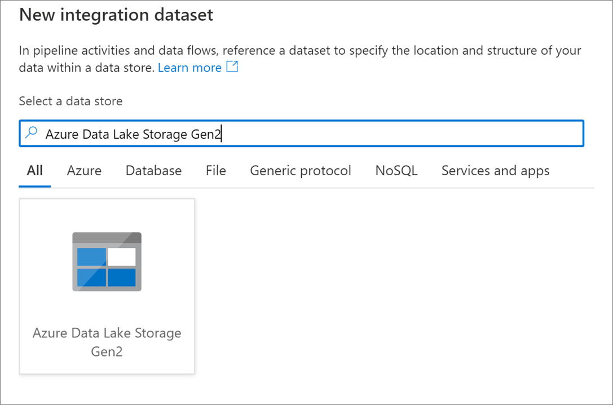

19. In **Set properties**, select your linked storage account, which will be used as the write destination of the Viva Insights query result in Linked Service. Leave the **File Path** as is.

    >[!Note]
    >When creating the Synapse Workspace, it links to a default storage account. To link to a different storage account (new or existing storage), follow the steps in the [Synapse documentation](/azure/synapse-analytics/quickstart-create-workspace#prepare-an-existing-storage-account-for-use-with-azure-synapse-analytics) to link a different storage account.

20. In **Sink**, open the created Sink dataset.

    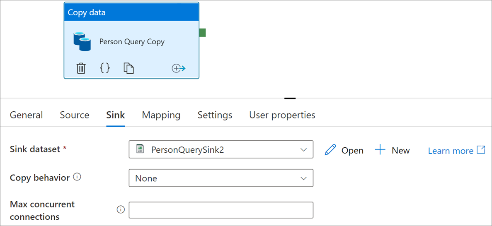

21. In **Parameters**, add the **PersonQueryDatasetFolder**, **PipelineID**, and **VivaInsightsDataFileSystem** parameters.

    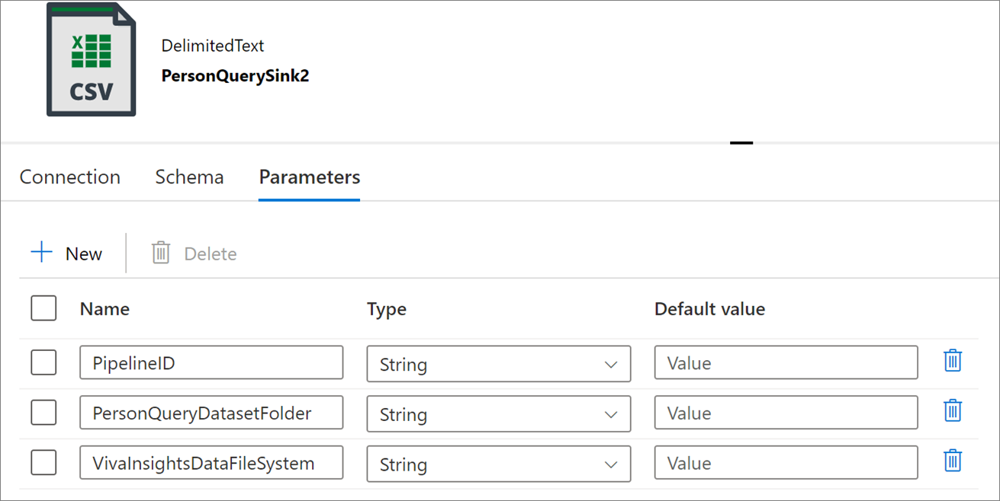

22. In **Connection**, select the **File Path** > **Directory** > **Add Dynamic Content** and create the following path:

    '@concat(dataset().VivaInsightsDataFileSystem,'/',dataset().PipelineID,'/raw/',dataset().PersonQueryDatasetFolder)'

    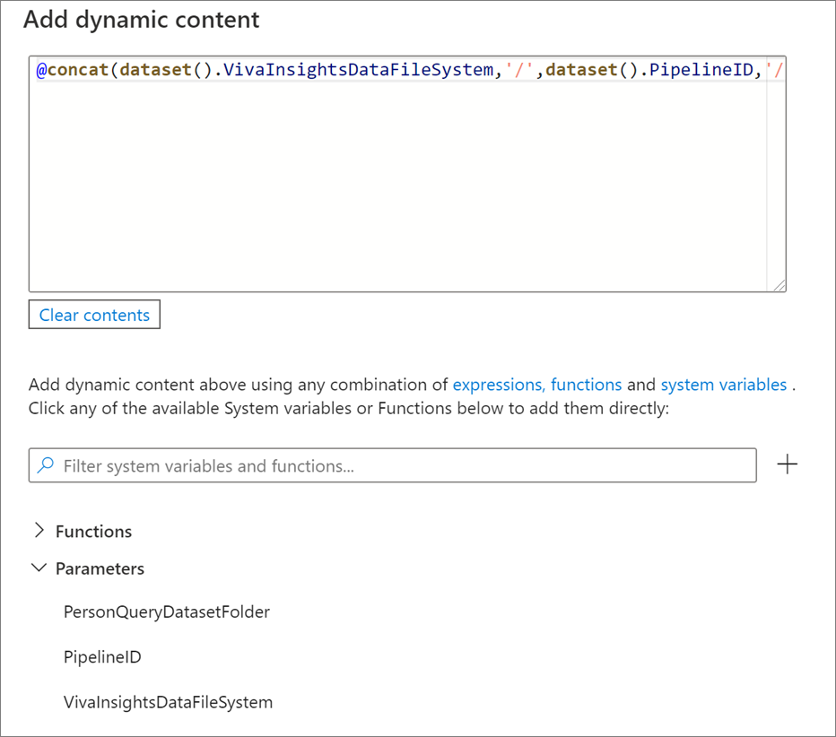
    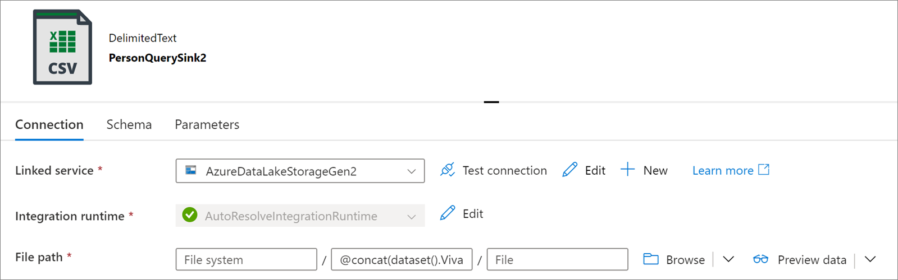

23. Keep the **PersonQuerySink** tab open and go back to the pipeline tab. In the **Person Query Copy** activity > **Sink** > **Dataset Properties**, use the **Add Dynamic Content** for each parameter to set the values accordingly.

    >[!Note]
    >The PipelineID is shown under the system variables for the Pipeline Run ID.

    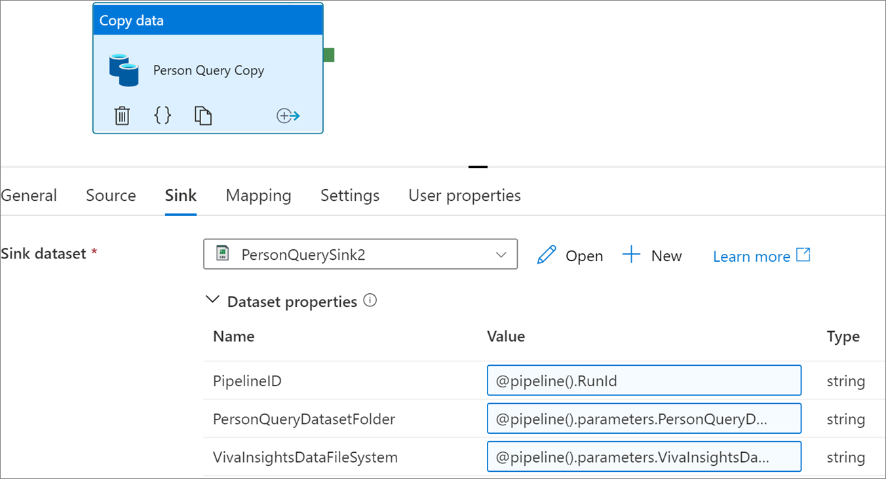

24. Publish the pipeline to confirm it's error-free.
25. Repeat the previous steps to modify the names and parameter names to create another copy data activity for meeting query named **Meeting Query Copy**, as shown in these steps. Change the parameter names for the meeting query to be **MeetingQueryDatasetFolder** and **MeetingQueryMetaData**, as applicable.
26. Publish the pipeline again to confirm the configuration is error-free.
27. Download the **vivainsights_person** and **vivainsights_meeting** Synapse Notebook (ipynb) files from [this GitHub repository](https://github.com/microsoft/VivaSolutions/tree/main/Sample%20Solutions/Data%20Lake/Viva%20Insights).
28. In the Synapse **Develop** menu, select the **Notebook ellipsis** (...) and import the two downloaded ipynb files.
29. Open your Pipeline and from the Pipeline **Activities** menu, under **Synapse**, add a **Notebook** named **Viva Insights Person Transformation**, and then connect it to the **Person Query Copy**.
30. In **Settings** for the Notebook, select the imported **vivainsights_person** notebook, add the following base parameters, and then use the **Add dynamic content** to initialize them with the pre-defined Pipeline parameters:

    - VivaInsightsDataFileSystem
    - StorageAccountName
    - PersonQueryDatasetFolder
    - PipelineId
    - SecondaryEmployeeId
    - SQLServerEndpoint
    - DBName
    - DBUser
    - DBPass
    - DBPort

    The following shows an example of what your pipeline should look like:

       

31. Repeat the previous two steps to add another notebook named **Viva Insights Meeting Transformation**, and then connect it to the **Meeting Query Copy** activity. For this notebook, add the **MeetingQueryDatasetFolder**.
32. Your pipeline should now look like the following example. Publish the pipeline to confirm it's error-free.

    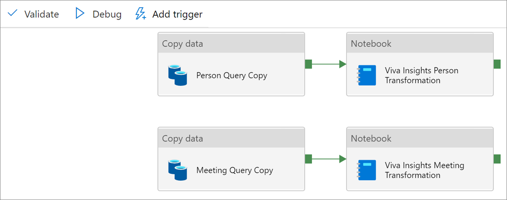

33. In [the GitHub repository](https://github.com/microsoft/VivaSolutions/tree/main/Sample%20Solutions/Data%20Lake/Viva%20Insights), download the two SQL scripts to create the **viva_insights_meeting** and **viva_insights_person** tables.
34. In **Develop**, select the SQL Script **ellipsis** (...) icon and import the two SQL scripts. Open each, select your SQL server in **Connect To** and your database in **Use Database**, and then run it.

    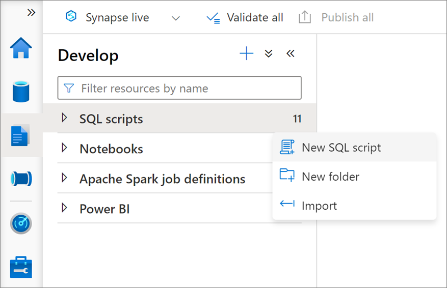

The pipeline is now complete and can be triggered

## Consume data for analytics

After the Viva Insights query data is included in the SQL Database, you can now add an analytics layer. Almost all platforms, applications, and scripting or programming languages have connectors for SQL Databases. The following is sample script for Python and R.

Follow these steps to connect your Power BI desktop to the SQL Database:

1. Sign in to your Power BI with the same credentials that has access to the Synapse and SQL database.
2. Select **Get Data** > **Database** > **SQL Server Database**, and then select **Connect**.
3. Enter the applicable server and database values, and then select your preferred data connectivity mode.

   >[!Note]
   >Open the **Synapse Manage** tab, and then in **Analytics Pool** > **SQL Pools**, select the SQL pool for this pipeline. In the **Properties** window, confirm **Workspace SQL Endpoint** is the correct value for SQL Database.

    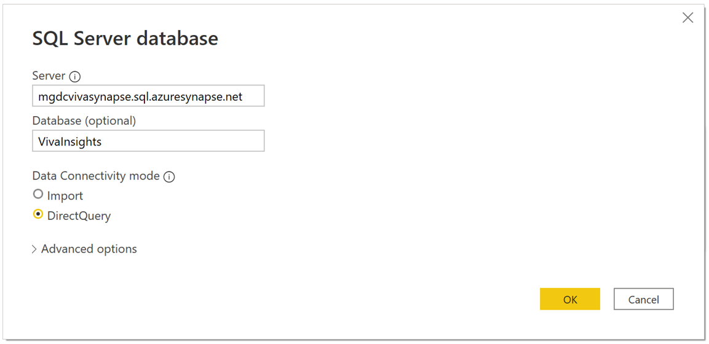

4. Select the tables, and then load them.

## Additional external data sources

Many advanced analytics use cases require the joining of multiple data sources for a comprehensive view of workplace interactions and collaboration patterns. The secondary **EmployeeId** in this pipeline is the key that's added to Viva Insight data to enable dataset joins.

You can use Synapse activities and capabilities to load the additional data source into the SQL database and join via a python script or BI tools like Power BI for analysis.

>[!Note]
>PersonId in Viva Insights data is, by default, a hashed and de-identified employee identifier which cannot be reverse mapped and so cannot be used as the join key.
