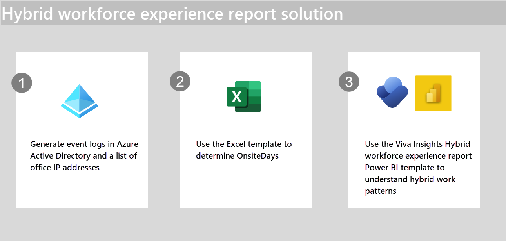

# Hybrid workforce experience report Onsite days solution

By following the steps in this solution, you'll:

> [!div class="checklist"]
>
> * Create an **OnsiteDays** attribute, which is required to use the Hybrid workforce experience Power BI template.

In this introductory article, you'll:

> [!div class="checklist"]
>
> * Learn what the Hybrid workforce experience report from Microsoft Viva Insights does and how it can help your organization as it transitions to hybrid working modes.
> * Get an overview of the solution and which steps you'll need to complete.

## Background

### A new hybrid workforce

Before the COVID-19 pandemic, the business world mostly worked onsite, and workplace policies and practices supported employees as they worked in the office. Once the pandemic hit, however, organizations had to quickly shift to remote and hybrid modes of working. More than two years since COVID began, many things are starting to return to the way they were before—both in our everyday lives and in business. Hybrid and remote working, though? That’s here to stay.

So, what should businesses do to prepare for a more permanent hybrid employee workforce? First, before starting any planning and strategizing, really understand how hybrid work affects their employees. That’s where the Hybrid employee experience report from Microsoft Viva Insights comes in.

### Overview of the report

Using data-driven insights, the Hybrid employee experience report helps leaders quickly sum up how hybrid work affects employees in different work modes (onsite, remote, or hybrid) in the following six ways:

* **Collaboration Habits** – How does hybrid work impact meeting engagement and collaboration patterns? What does meeting engagement look like for employees in different work modes?
* **Behavioral Trends** – How are behaviors evolving over time in different work modes?
* **New Hire Onboarding**: Are new hires getting the support they need from their managers?
* **Manager Connection** – How does employee work mode impact access to 1:1 time with their manager?
* **Work-Life Balance & Flex Work** – How does hybrid work impact employees’ ability to unplug? Are there specific work modes working longer hours, or embracing more flexible schedules?
* **Connectivity and Belonging** – Are people connecting in ways that boost their sense of belonging?

Then, using information from these six categories, the report provides guidance on **Why it matters**, as well as actionable insights and recommendations about how improve the overall hybrid employee experience.

### Report prerequisites

Before you can start using the Hybrid workforce experience report, you'll need to have the latest version of Power BI Desktop installed. You'll also need to upload three attributes as part of your HR data:

* **OnsiteDays** – The number of days per week an employee works from the company’s main worksite. This attribute can be based on badge data, wireless network data, or other sources—for example, tags in the HR system showing the number of days an employee plans to work onsite. This solution helps you create an **OnsiteDays** attribute.
* **SupervisorIndicator** – Indicates whether someone is a manager.
* **HireDate** – The day someone was hired. This attribute enables the New hire onboarding insights.

## Overview of the solution

To help you create the required **OnsiteDays** attribute, we’ve developed an automated template that draws from Azure Active Directory (AD) sign-in information. 

This solution involves two components:

* Azure AD
* Excel

After you've determined **OnsiteDays**, you'll use Viva Insights and Power BI to populate the report template.

### How it all works

1. **Prepare two source files:**
    * Event log from Azure Active Directory (AD)
    * List of office IP addresses
2. **Transform data:** Use the Excel template to determine **Onsite days**.

After you've completed these two steps, you're ready to use the Viva Insights Hybrid workforce experience report template. Through this report, you can understand your company’s hybrid work patterns and how hybrid work impacts employees differently.

### Licensing and connection requirements

This solution makes the following assumptions about your licenses and connection environment:

* You’ve already assigned Viva insights licenses and are using Azure AD, including using Azure AD to access Office 365. 
* The connection between a device (PC, mobile device) and Azure AD is configured to differentiate between being connected in the office and being connected on a VPN outside of the office. A few configurations allow that differentiation, like these:
    * [VPN split tunneling](/microsoft-365/enterprise/microsoft-365-vpn-implement-split-tunnel) for Azure AD
    * VPN users having a different NAT IP address than office users
* When an employee is onsite, they’re not using a VPN.
* You’ve documented the gateway IPs of all office locations and the time zone for each location. This documentation will be used to define the times and days that employees work onsite in different locations.

## Create the solution

In the next sections, we'll describe how to configure your Hybrid workforce experience report solution.

[Step 1. Generate source files](hybrid-workforce-experience-source-files.md)

[Step 2. Use the automated OnsiteDays template](hybrid-workforce-experience-template.md)

[Step 3. Use the Hybrid workforce experience Power BI template](../insights/Tutorials/hybrid-workforce-experience.md)

> [!div class="nextstepaction"]
> [Next up: Prepare source files](hybrid-workforce-experience-source-files.md)