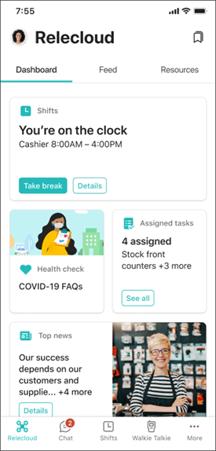
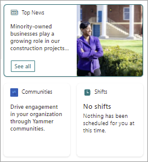

# Microsoft Viva for the hybrid workplace: Frontline workers
Frontline workers want to do things like see their schedules and be able to check in and check out of their shifts easily, get organizational communications and conversations, track assigned tasks and more all in one place.

| Viva Connections | Microsoft Teams | Viva Insights | Viva Learning | Yammer Communities |
| ---|---|---|---|---|
 | Provide easy access to tasks and information in one place, including things like Shifts or Assigned tasks. | Use Teams apps like Shifts, Planner, and others to populate the Dashboard. | Provide ability to set aside time for focus and balance during a busy day | Target specific training for frontline workers | Provide the ability to share and consume just-in-time information with their co-workers, team leads, and supervisors.

**Roles for this scenario**:
Managers and supervisors, Corporate communications specialists, SharePoint site owners and page authors, Yammer community admins

#### Provide easy access to tools in one place with Viva Connections

With Viva Connections, you can provide your frontline workers with a single entry point on multiple devices using the Viva Connections Dashboard. The Dashboard can provide quick access to a variety of tasks including tracking time, checking tasks, catching up on conversations, and seeing the latest news and videos from your organization.

 

Let’s say you have retail workers who want to be able to check their shifts or clock in and out easily when they are not at work. All they have to do is open their Viva Connections dashboard on their mobile device and select the Shifts card.

Page authors can make the Shifts card available to employees by going to the Dashboard in SharePoint, adding the Teams app card, and then searching for and selecting Shifts from the property pane. Additionally, third-party cards that are available to you can be used, and custom cards just for your organization can be created.

[Get more information about setting up and using Viva Connections](/Viva/connections/guide-to-setting-up-viva-connections).

#### Help balance employee's days with Viva Insights
Front line workers often “go go go” all day. You can help them build a sense of balance and well-being with Viva Insights, and managers can use Insights to provide better guidance on time management.

Learn more about Viva Insights and how it helps protect and organize time in [Supporting work/life balance](/Viva/solutions/viva-work-life-balance).

#### Target training with Viva Learning
Learning new skills is an ongoing process. In a hybrid environment, it is essential that employees can learn from wherever they are, and Viva Learning can be accessed on the desktop or on a mobile device within Teams.

You can assign and/or recommend learning content to individuals, share content with your team, and track the reported completion status of learning that you've recommended.

See [Incorporate learning into your organization](/viva/solutions/incorporate-learning) for a full guide.

Let’s say that your employees need to learn new policies in relationship to their work. Or, your employees might want to explore career development or up their skills in technology. All they have to do is open Teams on their mobile device, open the Learning app, see which courses you have assigned, and which courses are recommended based on their interests. They can also browse all of the available courses.

Content from Microsoft Learn and Microsoft 365 Training is automatically available in Viva Learning. You'll also have free access to a set of 125 courses from LinkedIn Learning. In addition, Viva Learning can integrate with select third-party content providers and learning management systems. For more information about how admins and knowledge admins can set up content sources, see [Manage content sources for Viva Learning](/viva/learning/content-sources-365-admin-center).

By adding SharePoint as a learning source for Viva Learning, you can create and add your own organization’s training materials to Viva Learning. 

The knowledge admin (or global administrator) provides a site URL to where the Learning Service can create a centralized location in the form of a structured SharePoint list. This list is called the Learning App Content Repository. Your organization can use this list to house links to cross-company SharePoint folders that contain learning content. See the [step-by-guide](/viva/learning/configure-sharepoint-content-source) on how to do this.

Once you have Learning set up, you can make it easily discoverable from your Viva Connections Dashboard by adding a Learning app card to it. To do this, go to your Dashboard in SharePoint, add the Teams app card to your dashboard, and search for and select Viva Learning from the property pane on the right. Get more information about [getting started with Viva Connections](/Viva/connections/guide-to-setting-up-viva-connections).

#### Engage with Yammer Communities
Communities in Yammer serve the needs of knowledge-sharing, employee experience, company-wide communications, and leadership engagement by providing a central place for your conversations, files, events, and updates. This can be especially useful for front line workers to share and consume just-in-time information with their co-workers, team leads, and supervisors. See how to [Manage a community in Yammer](https://support.microsoft.com/office/manage-yammer-community-members-75253554-d0f3-4148-b835-e6a9a8a0c294).

Additionally, you can use the Yammer Communities app for Microsoft Teams and the Yammer web part on your home page (or other pages) in SharePoint Online.
When you use the [Yammer Communities app for Microsoft Teams](https://support.microsoft.com/office/use-the-yammer-communities-app-for-microsoft-teams-930c86f1-e1e2-4e45-a66a-ce8faca71a21), you can also [add it to Viva Connections as a card to your dashboard](/viva/connections/create-dashboard), making it easy for your employees to find like in this image:

**Next**: See how to help employees gain valuable insights into how they use their time and how to protect it in [Supporting work life balance](/Viva/solutions/viva-work-life-balance).