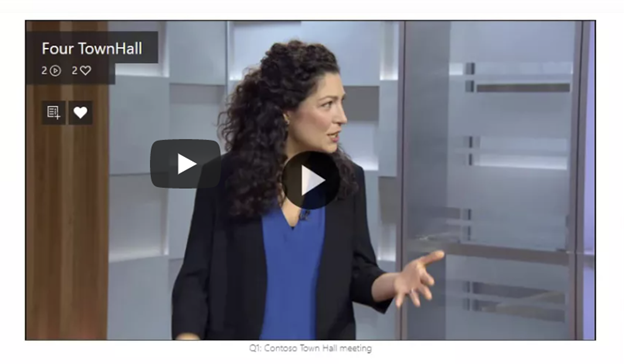

# Microsoft Viva for the hybrid workplace: Leadership communications

**Leadership communications – a live event**

Let’s say your organization is launching a new product. Announcement of the product, including how it works and what the organization’s goals are for it, need to be communicated across your organization. Holding an all-hands or town hall is a traditional way to do this. In a hybrid work environment, you need to ensure that everyone has access to the announcement no matter where they are. It is also essential to have a recording and transcript of the event for those who can’t participate in the live event because they are in a different time zone or they are frontline workers whose schedules don’t allow participation.

You can use Yammer Live, Stream, and Viva Connections to bring everyone together, have the event available after it happens, and have follow-up conversations.

| Yammer Live | Microsoft Stream | Viva Connections  
---|---|---|
 Bring your organization together around an event. Yammer group admins can host a live video event including Yammer conversations before, during, and after the event. | Record the live event and embed the Stream video in your news feed, or provide a link to it from the Viva Connections dashboard. | Promote and provide resources to the event, including Yammer conversations, news posts, and Stream recordings. | 

**Roles for this scenario**: Executive leadership, Corporate communications specialists, SharePoint site owners and page authors, Yammer group admins 

**Prepare and conduct a live event** for people in your Yammer network, with built-in discussions for use before, during, and after the event. Up to 10,000 people can attend at once from anywhere on their device or computer (higher limits for event attendees are temporarily available through the Microsoft 365 Live Events Assistance program). 

You can make the video available after the event, so that people who can’t make it at the scheduled time can still participate. Learn more in [Organize a live event in new Yammer](https://support.microsoft.com/office/organize-a-live-event-in-new-yammer-7338782a-4f0b-4fd0-a6c3-33625906ead1).

Only Yammer group admins can create and schedule a live event in Yammer. Additionally, to host a live event in Yammer, your organization must have **Enforce Office 365 identity** selected, and you must be using Microsoft 365 connected Yammer groups. For more information, see [Enforce Office 365 identity for Yammer users](/yammer/configure-your-yammer-network/enforce-office-365-identity) and [Yammer and Microsoft 365 groups](/yammer/manage-yammer-groups/yammer-and-office-365-groups).

**Share the recorded event**

 When employees with varying schedules can’t make the live event, you can share out the Stream recording of the event which is processed and available after the event. 

[Stream](/stream/portal-get-started) (on SharePoint) provides [Multi-Geo support](/microsoft-365/enterprise/administering-a-multi-geo-environment?view=o365-worldwide) for video storage and advanced sharing options.

**Make the recorded video available in Viva Connections**

 Once your recording is available, you can add it to the [Viva Connections Feed](/viva/connections/video-news-links) as a news post, put it on your SharePoint home site using the [Yammer web part](https://support.microsoft.com/office/use-a-yammer-web-part-in-sharepoint-online-a53cfa0c-3d09-42c8-a286-1038a81c59da) or the [News feed web part](/yammer/integrate-yammer-with-other-apps/yammer-and-newsfeed). Then it’s available in the news feed in Viva Connections, including the [mobile app](/viva/connections/add-viva-connections-app) if you’ve added it to Teams so your end users can find and use it.

Learn more

[Requirements for live events in Yammer](/yammer/manage-yammer-groups/yammer-live-events#yammer-network-and-group-requirements)

[Live events in Yammer](/yammer/manage-yammer-groups/yammer-live-events) 

[Learn about Stream](/stream/streamnew/start)

[Hold a town hall in Yammer and keep the conversation going](sharepoint/hold-town-hall-using-yammer)

[Set up and launch Viva Connections](/viva/connections/guide-to-setting-up-viva-connections)

