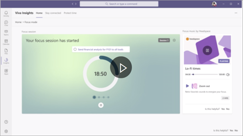
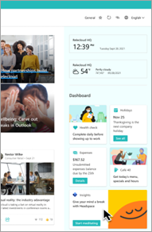

# Microsoft Viva in the hybrid workplace:  Supporting work/life balance

In the hybrid world employees spend a considerable amount of time at their keyboards and screens, or going all day if they are front-line workers.  You want your employees to balance their work and lives so they can avoid burnout and be more productive.
| Viva Insights | Viva Connections | 
|---|---|
 | Help people and businesses thrive with data-driven, privacy-protected insights, and recommendations to improve productivity and wellbeing. | Add a Viva Insights card to your Dashboard to make it easy for users to find in one central location.|

**Roles for this scenario**: Managers and supervisors, SharePoint site owners and page authors, Viva Insights admins

### Viva Insights

Viva insights includes personal insights that only employees can see. These can include useful recommendations such as protecting time in the day for regular breaks, focused work, and learning that help improve wellbeing and boost productivity. Employees can access these insights in Teams, in a Briefing email in Outlook, or in a personal dashboard.

Manager insights give much-needed visibility into work patterns of your team that might lead to burnout and stress. These include regular after-hours work, meeting overload, or too little focus time.

Leader insights help business leaders see how their work culture is affecting their organizational resiliency and boosting employee engagement. Leaders can use the recommendations on the Outcomes page to see opportunities where a change could improve their business outcomes. Similar to Leader insights, Advanced insights can also help business leaders address critical questions about organizational resiliency and work culture with insight into how work impacts their people and their business. 

### Viva Connections

You can make Viva Insights easily discoverable from your Viva Connections Dashboard by adding the Insights app card to it.

 
To do this, go to your Dashboard in SharePoint, add the Teams app card to your dashboard, and search for and select Viva Insights from the property pane on the right. Learn more about using the [Viva Connections Dashboard](/viva/connections/create-dashboard).

**Next**: Learn how to use [Microsoft Viva for leadership communications](/viva/solutions/viva-leadership-communications).
