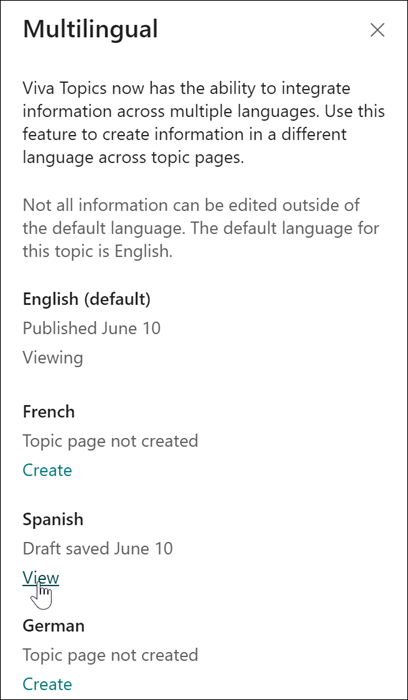
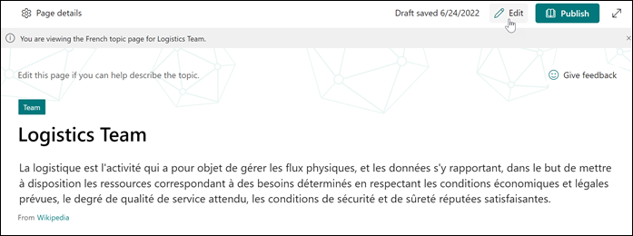
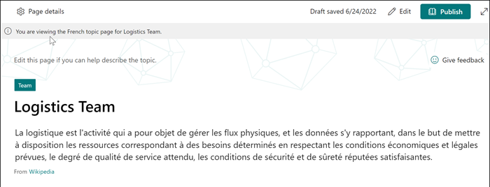
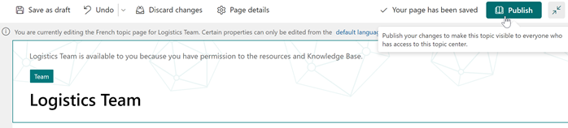
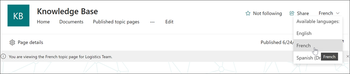

# Curate  Multilingual topics in Microsoft Viva Topics

The Multilingual feature in Viva Topics allows you to curate and edit a topic page in English, French, German, and Spanish.

> [!Note] 
> A topic page must be created and curated in the tenant's default language before it can be curated to a different language using the Multilingual feature in Viva Topics. 

## Curate Multilingual content into a topic page

To curate a multilingual topic page, open a topic page, and select **Multilingual** on the upper-left of the topic page. The topic page can also be opened from the topic center home page or from a topic highlight in your tenant.

   

1. On the Multilingual panel, find the desired language and select **Create**.

     

2. The Multilingual panel will confirm when the new Multilingual page is created. Select **View** to open and edit the Multilingual page.

     

3. To edit the newly created Multilingual topic page, select **Edit** on the command bar on the topic page.

     

     Make sure you're in the correct topic page by looking at the notification banner that will appear on the upper-left of the page. Complete the curating fields in the selected language.

     

4. Confirm or edit the topic name on the Multilingual topic page. If the topic name is the same in the new language, keep the current topic name.

     

5. In the **Context hint** section, add a hint relevant to the current topic in the selected language.

     

6. In the **Alternative names** section, add other names for the topic in the selected language.

     

7. In the **Short description** section, describe the topic in the selected language.

     

> [!Note] 
> When editing the Multilingual page, there are fields you can only edit in the default language topic page. Fields available to edit in the default language topic page include: Confirmed people, Pinned files and pages, Related sites, and Related topics.
   To edit these fields, save or publish your changes on the Multilingual topic page and visit the topic's default language page and continue editing if needed.

## View a published Multilingual topic page
To view a published Multilingual topic page, select a language option on the upper-right language menu of the topic page.

