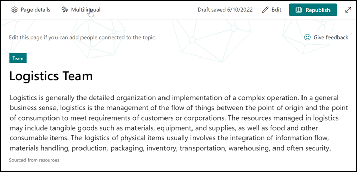

# Curate an existing topic using multilingual in Viva Topics 

In Viva Topics you can use the multilingual feature to curate and edit in English, French, German, and Spanish.

> [!Note] 
> Topics already available in the default langage is needed before they can be translated using the multilingual feature in Viva Topics. 

A topic in the tenant default language must be created before curating a topic using the multilingual feature in Viva Topics.

   

## Curate a multilingual topic page

To edit a topic, opne the topic page from a topic highlight, and then selecting the multilingual button on the topic page. The topic page can also be opened from the topic enter home page where you can find all the topics you are connected to.

   

1. Under the multilingual pael, find the desired language and select create.

   

2. 