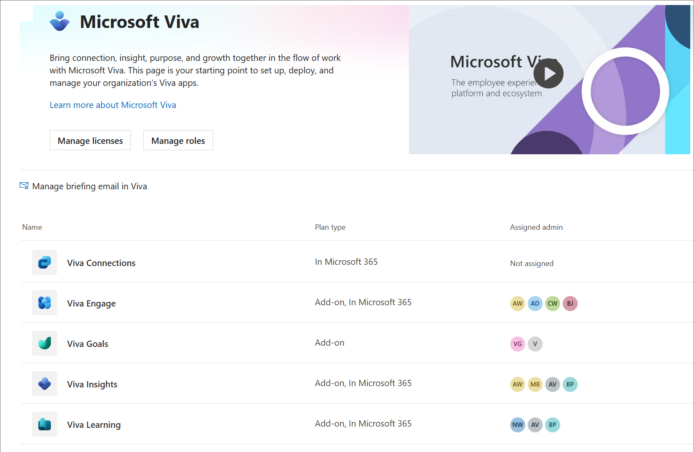

# Set up Microsoft Viva Topics

You can use the Microsoft 365 admin center to set up and configure [Topics](topic-experiences-overview.md).

It is important to plan the best way to set up and configure topics in your environment. Be sure to read [Plan for Microsoft Viva Topics](plan-topic-experiences.md) before you begin the procedures in this article.

You must be [subscribed to Viva Topics](https://www.microsoft.com/microsoft-viva/topics) and be a global administrator, or both SharePoint administrator and groups administrator to access the Microsoft 365 admin center and set up Topics.

> [!IMPORTANT]
> If you have configured SharePoint to [require managed devices](/sharepoint/control-access-from-unmanaged-devices), you must set up Topics from a managed device.

## Video demonstration

This video shows the process for setting up Topics in Microsoft 365.

 

> [!VIDEO https://www.microsoft.com/videoplayer/embed/RE4Li0E]  

 

## Assign licenses

You must assign licenses for the users who will be using Topics. Only users with a license can see information on topics including highlights, topic cards, topic pages and the topic center.

To assign licenses:

1. In the Microsoft 365 admin center, under **Users**, click **Active users**.

2. Select the users that you want to license, and click **Licenses and apps**.

3. Under **Licenses**, select **Viva Topics**.

4. Under **Apps**, make sure **Graph Connectors Search with Index (Viva Topics)** and **Viva Topics** are both selected.

   > [!div class="mx-imgBorder"]
   > 

5. Click **Save changes**.

It may take up to an hour for users to get access to Topics after the licenses are assigned.

Note that users must also have an Exchange Online license to use Topics.

## Set up Topics

> [!NOTE]
> The first time topic discovery is enabled, it may take up to two weeks for all suggested topics to appear in the Manage Topics view. Topic discovery continues as new content or updates to content are made. It is normal to have fluctuations in the number of suggested topics in your organization as Viva Topics evaluates new information.

To set up Topics

1. In the [Microsoft 365 admin center](https://admin.microsoft.com), select **Setup**, and then choose **Microsoft Viva**.

2. Select **Viva Topics**.

3. This will take you to the Viva Topics admin page. Choose **Manage Viva Topics** to set up how topics will work for your organization.

### Topic discovery

On the Topic discovery page, you'll choose how Viva Topics sources and identifies topics.

1. In the **Select SharePoint topic sources** section, select which SharePoint sites will be crawled as sources for your topics during discovery. Choose from:
    - **All sites**: All SharePoint sites in your organization. This includes current and future sites.
    - **All, except selected sites**: Type the names of the sites you want to exclude.  You can also upload a list of sites that you want to opt out from discovery. Sites created in future will be included as sources for topic discovery.
    - **Only selected sites**: Type the names of the sites you want to include. You can also upload a list of sites. Sites created in the future will not be included as sources for topic discovery.
    - **No sites**: Do not include any SharePoint sites.

2. Select **Save**.

3. In the **Select data connection sources** section, choose any additional sources you want Viva Topics to source topics from. [Learn more about eligible connection sources](/microsoft-365/knowledge/manage-topics).

4. In the **Exclude topics by name** section, you can add names of topics you want to exclude from topic discovery. Use this setting to prevent sensitive information from being included as topics. The options are:
    - **Don't exclude any topics**
    - **Exclude topics by name**
    1. To exclude topics by name, download and fill out the CSV file with the topics you want excluded.
    1. In the CSV template, enter the following information about the topics you want to exclude:
      - **Name**: Type the name of the topic you want to exclude. There are two ways to do this:
          - Exact match: You can include the exact name or acronym (for example, *Contoso* or *ATL*).
          - Partial match: You can exclude all topics that have a specific word in it.  For example, *arc* will exclude all topics with the word *arc* in it, such as *Arc circle*, *Plasma arc welding*, or *Training arc*. Note that it will not exclude topics in which the text is included as part of a word, such as *Architecture*.
      - **Stands for (optional)**: If you want to exclude an acronym, type the words the acronym stands for.
      - **MatchType-Exact/Partial**: Type whether the name you entered was an *exact* or *partial* match type.
    1. Upload your completed file and choose **Save**.

### Topic visibility

On the **Topic visibility** page, you'll choose who can see topics.

1. Choose **Edit** to make changes to who can see topics.

2. Select one of the following options:
    - **Everyone in my organization**
    - **Only selected people or security groups**
    - **No one**

3. Select **Save**.

> [!NOTE]
> While this setting allows you to select any user in your organization, only users who have Topic Experiences licenses assigned to them will be able to view topics.

### Topic permissions

In the **Topic permissions** page, you choose who can create, edit, and manage topics.

1. First, go to the **Who can create and edit topics** section. You can select:
    - **Everyone in my organization**
    - **Only selected people or security groups**
    - **No one**

2. Select **Save**.

3. Then, go to the **Who can manage topics** section. You can select:
    - **Everyone in my organization**
    - **Only selected people or security groups**

4. Select **Save**.

5. If you chose **Only selected people or security groups**, type the name of the person or group and then select it when it appears. Repeat until you've added everyone who should be able to manage topics.

6. Select **Save**.

7. Then go to the **Who can see Viva Topics Early Adopter Program experiences** section. You can select:
    - **Everyone in my organization**
    - **Only selected people or security groups**
    - **No one**

8. Select **Save**.

### Topic center

On the **Topic center** page, you can create your topic center site where users can view topic pages and manage topics.

1. Under **Topic center name**, choose **Edit**.

2. Pick a name for your topic center. Then select **Save**.

3. Next go to the **Site address** section. Here you can determine the URL of your topic center. Select **Save**.

> [!IMPORTANT]
> You can change the site name later, but you can't change the URL after you complete the wizard.

### Review and finish

Once you've chosen all your settings you can close out the **Manage Viva Topics** pane. You can change your settings any time by repeating the same process from your Microsoft 365 admin center.

## Access to EWS Exchange

If your organization has controlled access to EWS Exchange, this will impact the Viva Topics product. Add "VivaTopicsApi" as the user agent string in EWSAllowList.

Control access to EWS for your organization:

- [Learn about control access to EWS in exchange](/exchange/client-developer/exchange-web-services/how-to-control-access-to-ews-in-exchange)
- [Reference to Set-OrganizationConfig](/powershell/module/exchange/set-organizationconfig)

## Manage topic experiences

Once you have set up Topics, you can change the settings that you chose during setup in the [Microsoft 365 admin center](https://admin.microsoft.com/AdminPortal#/featureexplorer/csi/KnowledgeManagement). Manage other areas in topics:

- [Manage topic discovery in Microsoft Viva Topics](topic-experiences-discovery.md)
- [Manage topic visibility in Microsoft Viva Topics](topic-experiences-knowledge-rules.md)
- [Manage topic permissions in Microsoft Viva Topics](topic-experiences-user-permissions.md)
- [Change the name of the topic center in Microsoft Viva Topics](topic-experiences-administration.md)

You can also [add Viva Topics as an app in Teams](add-topics-app.md).

## Resources for your users

- [Understanding Viva Topics](https://support.microsoft.com/office/5bef3020-2679-4045-81cb-bcbc37218332)
- [Edit an existing topic in Microsoft Viva Topics](https://support.microsoft.com/office/6a4c7459-2293-4291-af76-973af65a44ae)

## See also

[Topic Experiences Overview](topic-experiences-overview.md)

[Learn about topics in Microsoft Viva Topics](/viva/topics/get-started-with-viva-topics)
