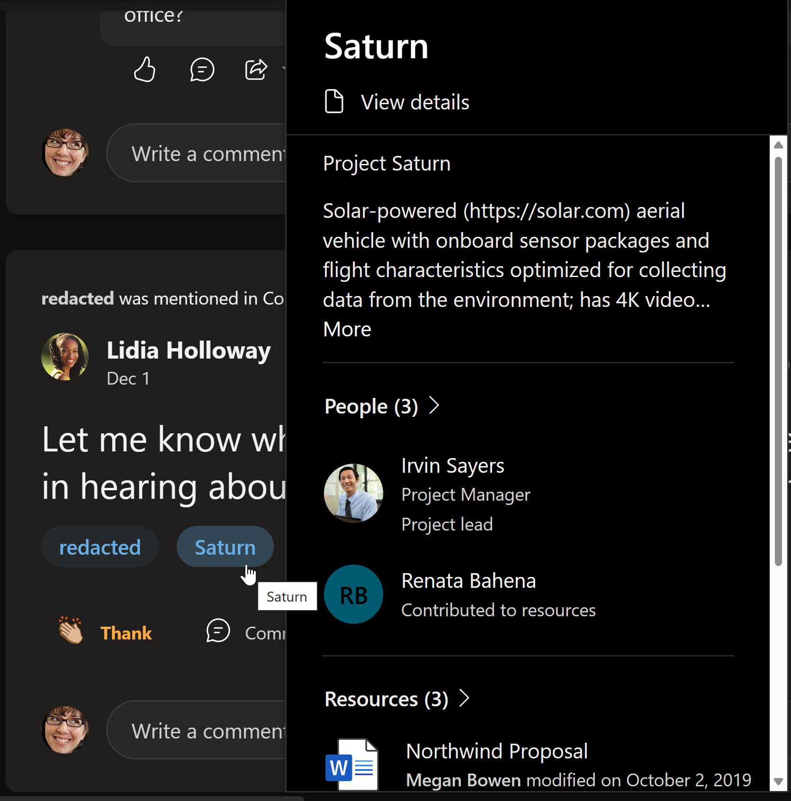
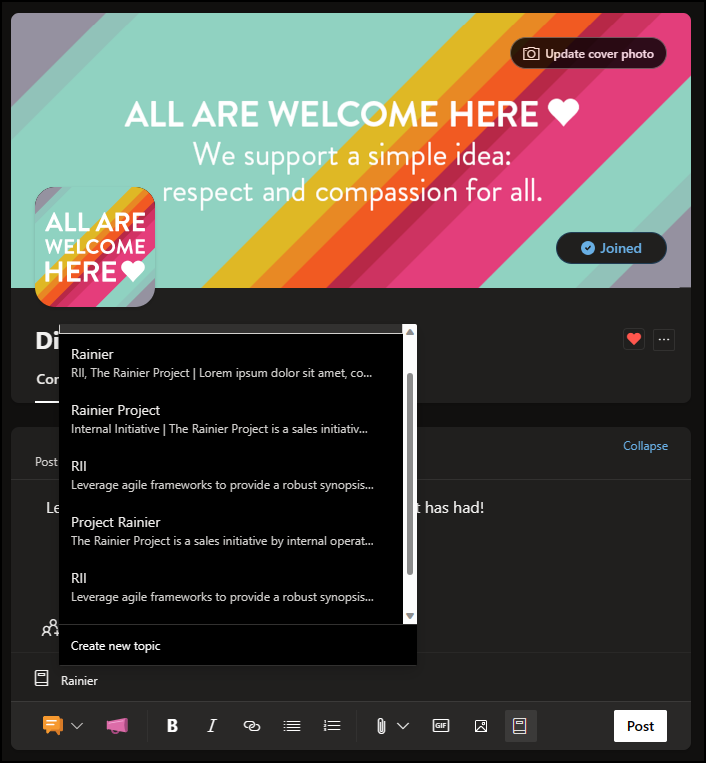

# Viva Topics in Yammer

The article covers the Viva Topics migration in the Yammer app. You can now access information in Yammer through Viva Topics features like the live topic card, highlighted topics, and the topic picker. 

## Topics migration in Yammer
Microsoft is aligning to leverage the advantages and capabilities of Viva Topics across all Microsoft 365 apps and services. To ensure that Yammer customers can utilize the benefits of Viva Topics, we're integrating Viva Topics into Yammer experiences. To deliver this integration, we're migrating Yammer topics to Viva Topics. 

As part of the migration, all Yammer topics will be migrated to Viva Topics for the tenant. However, only Yammer Topics that were used in the last 18 months or are associated with 10 or more conversations, prior to your tenant migration will be available for selection in the topic picker experience.  

Migrated topics will also be accessible through other Microsoft 365 apps and services. Knowledge managers will have to confirm migrated topics.

## Topics permissions and licenses
There's no requirement for the users to have a paid Viva Topics license for the migration. However, to access the topic center and other Viva Topics features, users must have designated Viva Topics permissions. Topic access can be controlled in the Microsoft Admin Center, as a part of the broader Viva Topics product. 

For Viva-licensed tenants, Yammer admins will work from [Manage topics](manage-topics.md) to manage Yammer topics alongside all other Viva Topics. For unlicensed tenants, Yammer admins will use the same controls as before to manage topics in Yammer. 

## Experience Viva Topics in Yammer
With Viva Topics in Yammer, you'll be able to share knowledge and explore more topics in your organization. For example, highlighted topics can appear in conversations and you can provide more content in your Yammer posts using the topic picker.

Attaching Yammer threads with Viva Topics will have the advantage of ensuring that Yammer content shows up across the Microsoft 365 suite wherever the Viva Topics knowledge experiences surface. 

