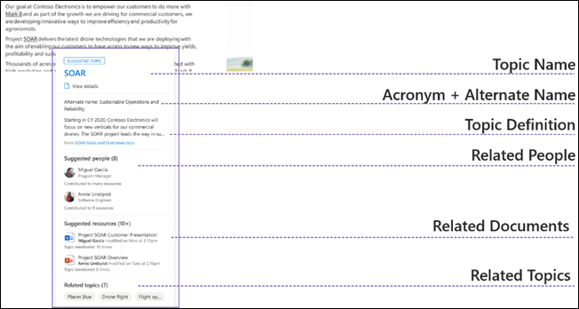
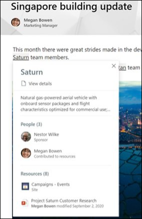
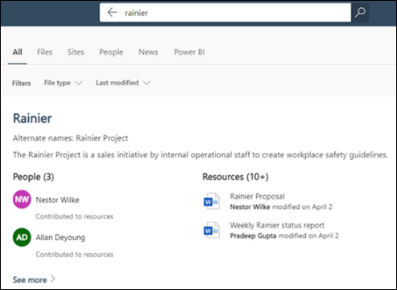
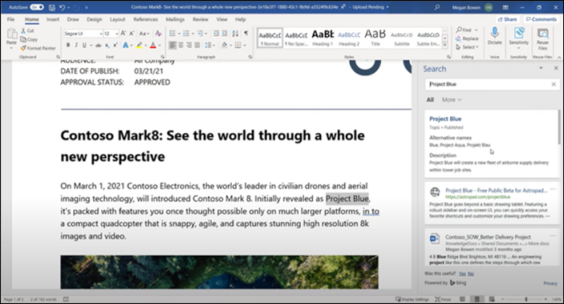
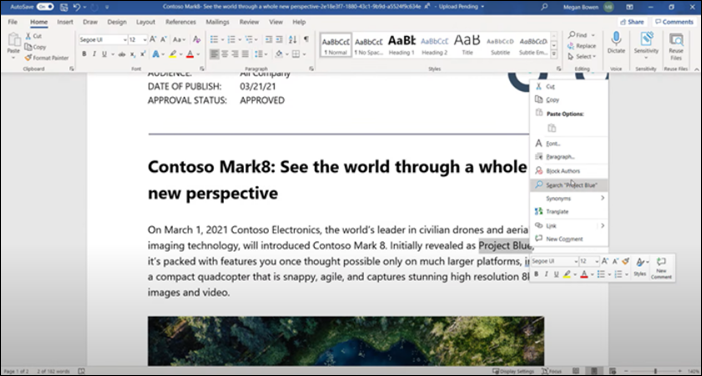
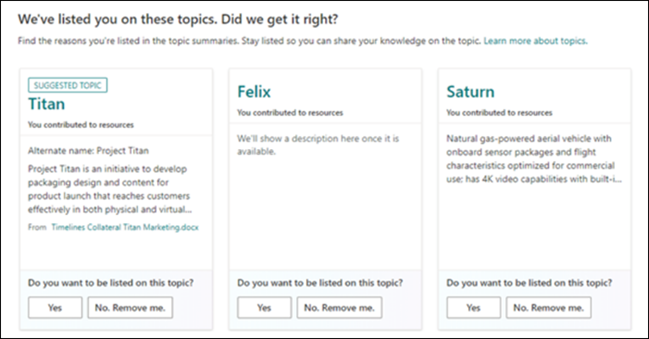

# Topic viewers: Find information and put knowledge to work with Microsoft Viva Topics

Viva Topics helps the user access the right information when they need it so they can be more productive and work smarter. In this document we review:  

- [What Viva Topics is and how topics are displayed to users](topic-experiences-information-endusers.md#what-viva-topics-is-and-how-topics-are-displayed-to-users)

- [Different ways to use Viva Topics](topic-experiences-information-endusers.md#different-ways-to-use-viva-topics)

- [How to contribute knowledge to Viva Topics](topic-experiences-information-endusers.md#contribute-knowledge-and-expertise-to-viva-topics)

## What Viva Topics is and how topics are displayed to users

Viva Topics is an AI—powered solution that empowers people with knowledge and expertise in the apps they use every day. More accessible knowledge and expertise can help people: 

- Spend less time searching for or recreating information that already exists 

   Research shows people spend about an hour a day—or up to seven weeks a year—searching for or recreating information.

- Work smarter by having access to the right information when it’s needed 

- Make better and faster decisions by easily accessing the organization’s knowledge and expertise  

- Onboard new team members to the organization or to a project 

Viva Topics uses AI to help arrange an organization’s knowledge base into shared topics. A topic is a phrase or term that has a specific meaning to the organization. Topics have properties and resources that can provide knowledge about the topic and help people find more information and experts related to the topic.  

 

Viva Topics uses human contributions to make the quality of topics better. Through various curation mechanisms in Viva Topics, people in an organization add their tacit knowledge and feedback on the usefulness of topics.    

There can be many different types of topics that may be important to an organization including projects, products or services, materials or supplies, customers, suppliers, processes, areas of study, disciplines, functions, and assets.  

### How topics are displayed to users

Topics are displayed to users through:

- [Topics highlighted](topic-experiences-overview.md#sharepoint-highlights) on SharePoint pages

- Topic answers in [search results](topic-experiences-overview.md#search-results)

- Search in [office applications](topic-experiences-overview.md#office-application-search)

- [Topic center](topic-experiences-overview.md#topic-center) home page

### SharePoint highlights

When a topic is mentioned in content on SharePoint news and pages, the user will see it highlighted. They can hover over the highlighted topic and a topic card appears. In the topic card, opening the topic details from the title of the summary will give view to the full topic page. The mentioned topic could be identified automatically or could have been referenced directly by the page author. 

 

### Search results

To see a  [topic answer](search.md#topic-answer) in search results when searching from the SharePoint start page, search on Office.com, or search from a SharePoint site after changing the search scope to include the full organization. The topic answer will appear at the top of the results list and show a short set of information related to that topic. 

 

### Office application search

When using Search in Office apps such as Word, PowerPoint, Outlook, or Excel—either through the **search** box or by selecting Search in the context menu—topic answers are displayed in the search results. 

 

### Topic center

Users can see topics in their organization to which they have a connection to in the  [topic center home page](topic-center-overview.md#home-page). 

 

## Different ways to use Viva Topics

Finding knowledge or expertise in an organization is often quite difficult. Viva Topics changes this by making knowledge and expertise more accessible. There's different ways in which Viva Topics can help people be more productive.

### Learn more about an important topic
We've all experienced reading through documents and site pages where we encounter terms we are unfamiliar with, or subjects we need more information about. Typically, we stop what we are doing to spend precious time searching for more information. We often don’t know who to ask or where to find more information. Viva Topics uses AI to highlight topics in the apps people already use every day. When a user is curious to learn more about a topic, they can select the highlighted topic to view a **Topic Summary** card that provides a short description. And if they want to learn more, they can select a **Topic Details** link in the summary to open the detailed topic page. 

### Reuse language or information

Recreating work or a deliverable, when someone else in the organization has already created something reusable, can be frustrating. Redundant work often occurs in an organization because people are not aware of similar work that has been done by someone else, or due to difficulties finding information or expertise. There are many examples where redundant work in an organization can occur, including proposals, sales presentations, project deliverables, training content, plans, and specifications. Viva Topics makes it easy for people to find existing knowledge and content in the organization and reuse it for their work. 

### Share knowledge

People spend a lot of time sharing their knowledge, whether thru email, chat, or other inefficient channels. Sharing the knowledge organized and maintained in Viva Topics is easy. A page author can directly reference a topic on a modern SharePoint site page by using the hashtag symbol. Page authors can invoke the topic picker on a modern SharePoint page by adding a hashtag and then selecting the topic they’d like to include on the page.  

 

Check out the [Viva Topics scenario catalogue](DOWNLOADABLE) for some additoinal ideas on how organizations can use Viva Topics

## Contribute knowledge and expertise to Viva Topics

There are two main ways people can contribute their knowledge and expertise to Viva Topics:

1. **Edit and create topics**: Editing or creating a topic is like editing or publishing a SharePoint page. Learn how to [edit an existing topic](edit-a-topic.md) and [create new topics](create-a-topic.md). It’s also possible to [save a topic as a draft](save-topic-as-draft.md) if it’s not ready to publish.

   > [!Note] 
   > Users need topic contributor permissions to be able to edit and create new topics. If people are not able to edit or create topics, reach out to the Knowledge Admin to have the appropriate [permissions assigned](topic-experiences-user-permissions.md).  

2. **Crowdsource feedback**: When users interact with a suggested topic, they might be asked a simple question in the Viva Topics UI. For example: *Was this topic relevant to the page? Is this person relevant for the topic? Was this definition accurate?* By using the feedback to such questions, Viva Topics improves the accuracy of topics. 

    

