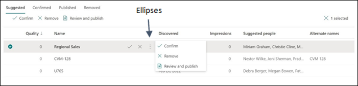
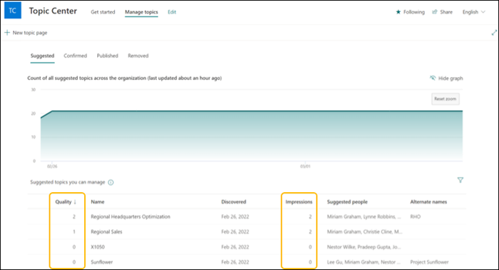
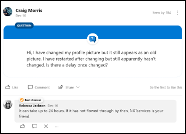
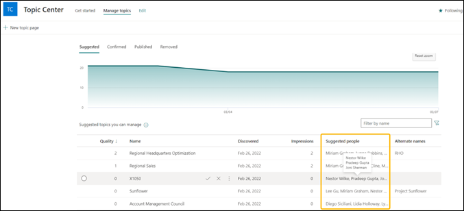

# Knowledge managers: Build and manage a knowledge base in Microsoft Viva Topics

Knowledge managers play a key role in building a knowledge base that Viva Topics then makes available to employees, in the flow of their work. In this document we review:  

- [The importance of the knowledge manager](topic-experiences-knowledge-managers.md#importance-of-the-knowledge-manager)

- [The role of a knowledge manager](topic-experiences-knowledge-managers.md#knowledge-manager-role)

- [Get started as a knowledge manager](topic-experiences-knowledge-managers.md#get-started-as-a-knowledge-manager)

- [Edit and create topics in Viva Topics](topic-experiences-knowledge-managers.md#edit-and-create-topics)

## Importance of the knowledge manager

Knowledge managers have a unique opportunity to scale their impact and demonstrate leadership by showing colleagues and leaders how knowledge can be used for better outcomes, and by helping build a quality knowledge base for their team and department.  

A high-quality knowledge base can help a knowledge manager and their team:  

- Spend less time searching for or recreating information that already exists 

- Work smarter by having access to the right information when it’s needed 

- Make better and faster decisions by easily accessing the organization’s knowledge and expertise  

- Onboard new team members to the organization or to a project 

To help accelerate the creation of an organization’s knowledge base, [Viva Topics applies Artificial Intelligence (AI) to identify knowledge and experts](topic-experiences-discovery-curation.md) from across the organization and categorize them into shared topics. A topic is a phrase or term that has a specific meaning to the organization. Topics have resources related to them that can provide people with knowledge about the topic and help them find more information and experts related to the topic. There can be many different types of topics that could be important to an organization, including projects, products or services, materials or supplies, customers, suppliers, processes, disciplines, functions, and assets.  

The AI not only organizes knowledge into topics, it also automatically creates a suggested topic page for each. To take the knowledge base to the next level, people need to be able to easily add their tacit knowledge, provide unique insights, or generally improve the quality of the topic. Knowledge managers play a critical role enabling human curation of the knowledge base.  

## Knowledge manager role

The knowledge manager’s role is to help curate and improve the quality of an organization’s knowledge base. Knowledge Managers help create and maintain the quality of the organization’s knowledge base by: 

- Managing topics in Viva Topics, including creating, confirming, editing, deleting, or removing topics 

- Identifying high priority topics and engaging subject matter experts to help curate 

- Helping create a culture of knowledge sharing by modeling the behavior and empowering others  

## Get started as a knowledge manager

To help a knowledge manager started, use the workflow below to effectively assign, prioritize, edit, and create topics.

 

### Assign stage

Each topic will need to be assigned a stage in the topic lifecycle to ensure that the topic and knowledge stays accurate and relevant over time.  

 

Knowledge managers can use the **Manage Topics** page in the [Topic Center](topic-center-overview.md) to review topics that were suggested by the AI. As an initial step, knowledge managers need to classify suggested topics as either Confirmed or Removed.  

To classify the suggested topic into the correct stage, select the ellipses of the topic and choose the appropriate stage. 

**Confirm** the topic if it's relevant for the organization. **Remove** the topic if it isn't needed, no longer has any connections, or isn't valid.  

To edit the topic, select **review and publish** to be taken to the topic page, then select the edit button on the top right corner of the topic page. Learn more about how to [edit a topic](edit-a-topic.md).  

Topics can also be confirmed or removed based on crowdsourced feedback. When users interact with a suggested topic, they might be asked a simple question in the UI. For example: Was this topic relevant to the page? Topics are automatically confirmed or removed if multiples users vote positively or negatively respectively, using the feedback mechanism on the topic card. There must be a net of two votes received, either positive or negative, for the topic to be confirmed or removed automatically.  For example, if one user voted positive and one user voted negative for a particular topic, two more positive votes would be needed for the topic to be confirmed. 

### Prioritize topics for curation

To build an initial, high quality knowledge base quickly, it’s important to determine which topics should be prioritized for curation. Priority topics should be high value and have high visibility in the organization. 

There are several different ways to prioritize which topics to focus efforts on:  

- **Scenarios**: Think about how Viva Topics will be used in the team, department, or business unit, then prioritize topics that are relevant to the scenarios. For example, if a department would get value from organizing knowledge about the products the organization makes, prioritize product related topics for initial curation. There are various scenarios that Viva Topics can be used inside an organization. Check out the [Viva Topics scenario catalog](https://aka.ms/TopicsScenarios) for some ideas and to help determine which related topics to prioritize.  

- **Stakeholders**: Who are the key stakeholders to win over on a team or department? Consider the topics that are relevant to these stakeholders based on their business priorities. For example, the VP of Human Resources might have an initiative underway to improve the new hire onboarding process. By prioritizing topics that are important for new hires to be able to onboard successfully, the knowledge manager is helping the VP with their project while exposing them to the power of Viva Topics.  

- **Impressions & quality score**: Each topic discovered by Viva Topics has its number of impressions counted and is assigned a quality score. These two properties, when considered together, can be a useful way to prioritize topics for curation. Topics with high impressions and a low-quality score would be natural targets for prioritization. These topics are likely interacted with frequently and need human curation to improve their quality.  

Use the **Manage Topics** page in the [Topic center](topic-center-overview.md) to view and prioritize topics. Knowledge managers have access to the **Manage Topics** page where they can review topics.  
 
> [!Note] 
> If the **Manage Topics** page isn’t available to the assigned knowledge manager, the knowledge administrator can get them set up in Viva Topics as a knowledge manager.  

On the **Manage Topics** page, there's a quality score column and impressions column. The **quality score** reflects the amount of information that the average user will see for the information on the topic, keeping in mind that each user might see more or less information because of the permissions they might or might not have on the information in a topic. The **impressions** column displays the number of times a topic has been shown to end users. Sort each column to find the topics with the lowest quality score and highest number of impressions.  

- **Bookmarks and existing knowledge base**: [Bookmarks](https://docs.microsoft.com/microsoftsearch/manage-bookmarks) are used in Microsoft Search to help people quickly find important sites and tools. They can also help indicate what the organization deems as important and provide consideration for what topics should be prioritized for curation. Organizations can have other, existing knowledge bases that are prime candidates for migrating to Viva Topics. For example, if the organization has invested in knowledge bases or wiki sites, these can provide a list of topics to use for initial curation efforts. If they're large, select the most viewed or edited topics as a starting point. The wiki knowledge will then be more accessible through the applications people use to do their work and suggested elements of the topic will be automatically updated by the AI in Viva Topics.  

Prioritization of topics for curation should also factor in demand levels for different types of knowledge in the organization. Make sure the topics being curated are in demand and will be used once published. Find topics for curation that are in high demand and that are currently being addressed in inefficient and non-scalable ways. For example, product experts are often asked random questions from salespeople and often answer the same question repeatedly through hard to scale mediums such as email or chat. In this example, product experts will be highly responsive to Viva Topics to scale their impact, minimize randomization and gain more recognition as an expert in the organization.  

### Set quality level for topics

Once topics are prioritized, it’s time to begin the curation process. To prepare curators and maintain quality and consistency across topics, first define standards for what a good topic looks like.  

There are two types of knowledge to include in the knowledge base:  

1. **Explicit**: Information that can be documented, stored, and shared with others. Viva Topics helps codify explicit knowledge by using AI to discover people and content connected to a topic and then displays them on a topic page. These AI generated topic properties include alternate names and/or acronyms, a short description of the topic, and people who might be knowledgeable about the topic, as well as files, pages, and sites that are related to the topic.  

   

   Knowledge managers should define the minimum requirements for a published topic and communicate these standards to topic contributors. Minimum requirements for topics in the organization could include guidance that all topics contain alternate names, a factual description, and pinned people and resources. Learn more how curators can edit topics to meet minimum requirements for published topics that are established.    

2. **Tacit**: Tacit knowledge refers to the knowledge, skills, and abilities an individual gains through experience that resides in their mind. Tacit knowledge can be difficult to put into words or otherwise communicate. Tacit knowledge often surfaces in conversations or answers to adhoc questions. [Yammer](https://support.microsoft.com/en-us/office/what-is-yammer-1b0f3b3e-89ee-4b66-aac5-30def12f287c), an enterprise social network in Office 365, provides a platform for capturing and sharing the tacit knowledge of experts through its [question and best answer feature](https://support.microsoft.com/office/use-questions-and-answers-in-a-yammer-community-a4f1b722-d1bf-42be-a592-7288c7c0b895), conversations, and [polling](https://support.microsoft.com/office/create-polls-praise-announcements-and-questions-in-yammer-4b30c7e0-f915-4c69-9582-ccbbd09a516b) capability to seek opinions on relevant topics.  

   

   Use the [Yammer conversations web part](https://support.microsoft.com/office/use-a-yammer-web-part-in-sharepoint-online-a53cfa0c-3d09-42c8-a286-1038a81c59da#conversations) to bring tacit knowledge into relevant topic pages.

   

Specific scenarios of Viva Topics can require unique properties appended to a topics page. For example, product-based topic pages can include brand assets, SKU#, roadmap information, product news, frequently asked questions (FAQ) and product specifications. [Web parts](https://support.microsoft.com/en-us/office/using-web-parts-on-sharepoint-pages-336e8e92-3e2d-4298-ae01-d404bbe751e0) can be used on a topic page to bring in different types of content. 

## Get help from colleagues

To scale Viva Topics curation in an organization, reach out to colleagues who have expertise or capability in a knowledge area to help curate relevant topics. This can include teammates that have specific expertise on a topic or set of topics, experts that have been nominated to help or colleagues that have been suggested in Viva Topics as someone who is related to a topic based on the content they've authored or edited frequently.  

Once the right people to curate relevant topics are identified, explain how contributing their knowledge will:  

- Broaden their impact by helping colleagues benefit from their contributions 

- Build their brand and get them recognized for the knowledge they have about a topic 

Help colleagues curate topics effectively by:

- Sharing the specific topic(s) they should edit and [how to find other relevant topics](topic-center-overview.md) to curate  

- Preparing colleagues with the standards the organization define for what a good topic looks like

- Helping them learn how to [edit](edit-a-topic.md) and [create](create-a-topic.md) new topics, and how to [save a topic as a draft](save-topic-as-draft.md)  

- Encouraging them to ask their colleagues that they think have relevant expertise to also contribute

Users need topic contributor permissions to be able to edit and create new topics. If colleagues aren't able to edit or create topics, reach out to the administrator to have the appropriate [permissions assigned](topic-experiences-user-permissions.md).   

Once colleagues have curated topics, **recognize** their efforts. There are ways to provide recognition to topic contributors depending on what Office 365 applications are used within the organization:  

- [Praise](https://docs.microsoft.com/viva/insights/personal/teams/viva-insights-praise) colleagues in [Viva Insights](https://docs.microsoft.com/viva/insights/personal/teams/viva-teams-app) 

- [Praise](https://support.microsoft.com/office/create-polls-praise-announcements-and-questions-in-yammer-4b30c7e0-f915-4c69-9582-ccbbd09a516b) someone in a Yammer network 

- [Send an announcement](https://support.microsoft.com/office/send-an-announcement-to-a-channel-8f244ea6-235a-4dcc-9143-9c5b801b4992) in Microsoft Teams of the topic contribution made by colleagues 

- Post recognition of top contributors on the Intranet 

To kick-start topic curation, consider running Viva Topics hackathon(s) within a team or department. A Viva Topics hackathon is a workshop designed to jumpstart Viva Topics adoption and curation in an organization by creating a fun and collaborative environment for employees to contribute to the shared knowledge base. The hackaton doesn’t require coding, all are welcome. To get started, download the free [hackathon toolkit](https://aka.ms/Viva/Topics/Hackathon) that includes invitations, presenter deck and instructions to run the workshop.  

## Edit and create topics

There will be topics that the knowledge manager has the capability and expertise to curate, including topics suggested by the AI, or new topics that the AI didn't discover. Editing or creating a topic is like editing or publishing a SharePoint page. Learn how to [edit an existing topic](edit-a-topic.md) and [create new topics](create-a-topic.md). It’s also possible to [save a topic as a draft](save-topic-as-draft.md) if it’s not ready to publish. 

> [!Note] 
> While information in a topic that is gathered by AI is [security trimmed](topic-experiences-security-trimming.md), the topic description and people information manually added when editing an existing topic is visible to all users who have permissions to view topics. 

