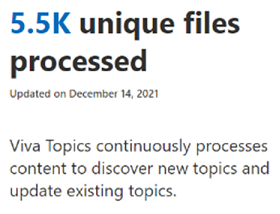

# Analytics for Microsoft Viva Topics

Insights are available for Viva Topics in the Microsoft 365 admin center. You need to be a SharePoint admin and a Groups admin to see these reports.

To access Viva Topics insights
1. In the Microsoft 365 admin center, expand **Settings** and select **Search & intelligence**.
1. On the **Insights** tab, select **Viva Topics**.

## Topics overview

The **Topics overview** section provides a look at topic visibility in your organization.

The information in this section is based on the time period that you select. The changes from the last time period appear next to each metric. If the time period selected is larger than when data was first available, the delta is collected from a starting point of 0.

 

|Measure|Value|
|:------|:----|
|Topics visible|The number of topics that are visible to topic viewers in Microsoft 365 locations such as search and SharePoint |
|Discovered by Viva Topics|The number of topics that have been [discovered by Viva Topics](/viva/topics/topic-experiences-discovery-curation) or have AI-discovered properties.|
|Created by users|The number of topics that have been [manually created](/viva/topics/create-a-topic) and do not have any AI-discovered properties.|
|Hidden by settings|If you have [configured Viva Topics to not show suggested topics to topic viewers](/viva/topics/topic-experiences-discovery#prevent-topic-viewers-from-seeing-suggested-topics), the number of hidden topics will be reflected here|
|Removed|The number of topics that have been [removed by user feedback and knowledge managers](/viva/topics/manage-topics)|

## File processing for topic discovery

The **File processing for topic discovery** section shows the number of files that have been processed as Viva Topics crawls the [content sources that you selected](/viva/topics/topic-experiences-discovery).

|Measure|Value|
|:------|:----|
|Unique files processed|The number of files that have been processed for topic discovery. This is a cumulative total since Viva Topics was set up. This number does not decrease if topics are deleted or excluded.|

 

## See also

[Plan topic experiences](plan-topic-experiences.md)

[Set up topic experiences](set-up-topic-experiences.md)
