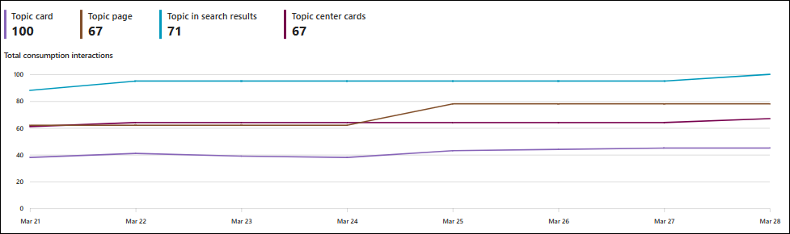
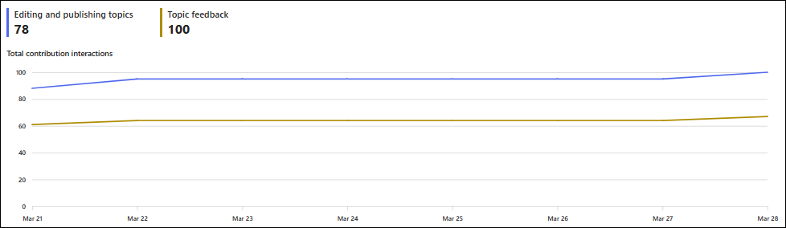

# Usage and engagement metrics in Viva Topics

Usage and engagement metrics demonstrate how users are engaging with Viva Topics in your organization.

To access usage and engagement metrics:

1. In the Topic center, select the **Analytics** tab.
2. In the **Analytics** tab, select **Usage & engagement**.

>[!NOTE]
>User counts under 100 are exact, while numbers over 100 are approximations within three percent of the exact number.

## Topic engagement

The **Topic engagement** section provides a look into how unique users are engaging with topics. Engagement from users include consuming, sharing, and contributing to topics.

The information in this section is based on the time period that you select. The changes from the last time period appear next to each metric.

## Topic interaction

The **Topic interaction** section provides a look into how users are interacting with topics. Interactions include consumption of topics, sharing interactions, and contributing interactions from users.

## Topic consumption

The **Topic consumption** section provides a look into how users are consuming topics through topic views and clicks.

### What contributes to consumption

>[!NOTE]
>Topic consumption is measured by top-level activity, such as selecting a card, but doesn't measure activity within topic cards.

Some activities that contribute to consumption include:

- Selecting topic card, including from other Viva apps
- Viewing a topic card
- Viewing a topic pill
- Dwelling on a topic card
- Viewing a topic page

## Topic contribution

The **Topic contribution** section provides a look into how users contribute to content on topics. Topic contributions include editing and publishing topics, and providing topic feedback.

