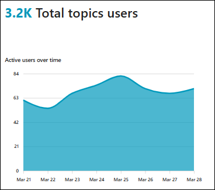
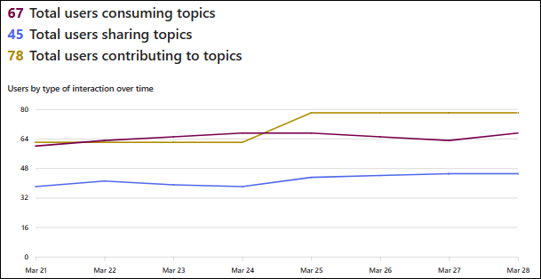
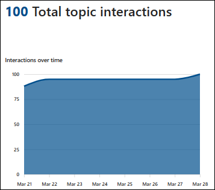
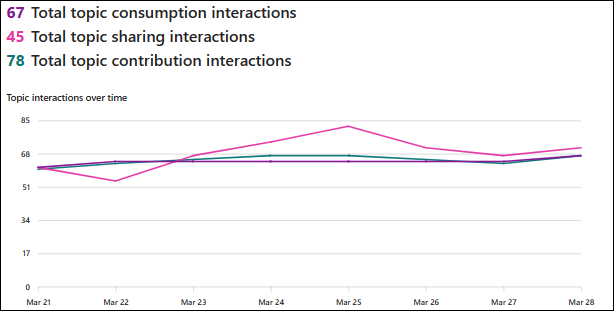

# Usage and engagement metrics in Viva Topics

Usage and engagement metrics demonstrate how users are engaging with Viva Topics in your organization. 

To access usage and engagement metrics:
1. In the Topic center, select the **Analytics** tab.
2. In the **Analytics** tab, select **Usage & engagement**.

## Topic engagement
The **Topic engagement** section provides a look into how unique users are engaging with topics. Engagement from users include consuming, sharing, and contributing to topics. 

The information in this section is based on the time period that you select. The changes from the last time period appear next to each metric. 

## Topic interaction

The **Topic interaction** section provides a look into how users are interacting with topics. Interactions include consumption of topics, sharing interactions, and contributing interactions from users.

## Topic consumption

The **Topic consumption** section provides a look into how users are consuming topics. Topic consumption include accessibility to topic cards, topic pages, topics in search results, and topic cards in the Topic center.

## Topic contribution 

The **Topic contribution** section provides a look into how users contribute to topics. Topic contributions include editing and publsohing topics, and providing topic feedback.