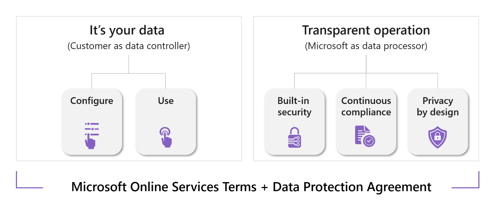

# Microsoft Viva Compliance

Microsoft Viva and the Viva apps work with and integrate into Microsoft 365. They inherit many compliance features from Microsoft 365. The Viva apps can also use specific settings and policies of the services that Viva is built on. For example, while all users can access Viva Learning in Microsoft Teams by default, you can use app permissions policies in Teams to allow or block access for specific users.

Microsoft offers a [comprehensive set of compliance offerings](/compliance) to help your organization comply with national, regional, and industry-specific requirements governing the collection and use and data. 
Microsoft Viva is also covered under the [Microsoft Product Terms](https://www.microsoft.com/licensing/terms/welcome/welcomepage) and [Data Protection Agreement (DPA)](https://www.microsoft.com/licensing/docs/view/Microsoft-Products-and-Services-Data-Protection-Addendum-DPA?year=2021#:~:text=Microsoft%20Products%20and%20Services%20Data%20Protection%20Addendum%20%28DPA%29,to%20the%20Product%20Terms%20site%20%28and%20formerly%20OST%29).

For more information, see the [Microsoft Trust Center](https://www.microsoft.com/trustcenter).

In this article you can learn about:

- [Shared responsibility model](#shared-responsibility-model)

- [Inheritance of compliance features and settings](#inheritance-of-compliance-features-and-settings)

- [System and Organization Controls (SOC) 2](#system-and-organization-controls-soc-2)

- [General Data Protection Regulation (GDPR)](#general-data-protection-regulation-gdpr)

- [Data residency](#data-residency)

- [Using Microsoft Purview](#microsoft-purview)

## Shared responsibility model
Microsoft works to ensure that we are compliant with industry and international standards, and customers are responsible for ensuring their data within the [Microsoft Cloud](https://www.microsoft.com/en-us/trust-center/compliance/compliance-overview#compliance) is protected in a manner that is compliant with the standards and regulations imposed on the customer.

## Inheritance of compliance features and settings
Microsoft Viva apps are built on your existing infrastructure and, depending on the app, inherit compliance features and settings from Microsoft Teams, Exchange Online, SharePoint Online, Azure, and Yammer.

For detailed information on each service, see:

**Microsoft 365** [Plan for security and compliance](/microsoft-365/compliance/plan-for-security-and-compliance)

**Microsoft Teams** [Overview of security and compliance in Microsoft Teams](/microsoftteams/security-compliance-overview)

**Microsoft SharePoint** [Plan compliance requirements for SharePoint and OneDrive](/SharePoint/compliant-environment)

**Microsoft Graph** [Use the Microsoft Graph compliance and privacy APIs](/graph/api/resources/complianceapioverview?view=graph-rest-1.0)
 
**Yammer** [Overview of security and compliance in Yammer](/yammer/manage-security-and-compliance/security-and-compliance)

**Azure AD** [Azure AD security baseline for Azure Active Directory](/security/benchmark/azure/baselines/aad-security-baseline)

**Azure** [Azure, Dynamics 365, Microsoft 365, and Power Platform compliance offerings](/azure/compliance/offerings/)

## System and Organization Controls (SOC) 2

A [SOC 2 report](/compliance/regulatory/offering-soc-2) is an independent assessment of a service organization's systems and processes that are relevant to the trust services criteria. The report is conducted by a third-party auditor and evaluates the effectiveness of the controls in place to meet these criteria. Following is the SOC 2 audit report status for each Viva app:

|**Viva app**|**SOC 2 report**|
|----------|-----------|
| Viva Connections | Covered within scope of [SharePoint Online SOC 2 report](https://servicetrust.microsoft.com/DocumentPage/89e8b7c9-d08d-4bd3-9644-7a29d8266c58), although not individually called out in the report. 
| Viva Topics | Covered within scope of [SharePoint Online SOC 2 report](https://servicetrust.microsoft.com/DocumentPage/89e8b7c9-d08d-4bd3-9644-7a29d8266c58), although not individually called out in the report.
| Viva Learning | Covered by [Microsoft 365 Microservices T1 - SSAE 18 SOC 2 Type 1 Report (2022)](https://servicetrust.microsoft.com/DocumentPage/24a81cd0-395b-4419-b76d-fc4c6e625a6d)
| Viva Engage | Covered by [Office 365 – Yammer – SOC 2 Type 2 (2022)](https://servicetrust.microsoft.com/DocumentPage/d38c3a33-5521-4b6d-9891-924ab1cdf6e6)
| Viva Goals | Covered by [Microsoft 365 Microservices T1 - SSAE 18 SOC 2 Type 1 Report (2022)](https://servicetrust.microsoft.com/DocumentPage/24a81cd0-395b-4419-b76d-fc4c6e625a6d)
| Insights Personal | Covered by [Microsoft 365 Microservices T1 - SSAE 18 SOC 2 Type 1 Report (2022)](https://servicetrust.microsoft.com/DocumentPage/24a81cd0-395b-4419-b76d-fc4c6e625a6d)
| Insights Organizational | Covered by [Microsoft 365 Microservices T1 - SSAE 18 SOC 2 Type 1 Report (2022)](https://servicetrust.microsoft.com/DocumentPage/24a81cd0-395b-4419-b76d-fc4c6e625a6d)
| Viva Sales | Covered under Dynamics 365. For more information see: [Azure and other Microsoft cloud services in compliance audit scope](/azure/compliance/offerings/cloud-services-in-audit-scope)

## General Data Protection Regulation (GDPR)
All Viva apps built on your Microsoft 365 infrastructure support compliance with EU General Data Protection Regulation (GDPR) requirements.
For detailed information, see [Microsoft Viva Privacy](/Viva/viva-privacy)

## Data residency
Data residency refers to the geographic location where data is stored at rest. Many customers, particularly in the public sector and regulated industries, have distinct requirements around protecting personal or sensitive information.  In addition, in certain countries, customers are expected to comply with laws and regulations that explicitly govern data storage location.

For information about data residency for Viva apps, see [Microsoft Viva Privacy](/Viva/viva-privacy).

## Microsoft Purview 
[Microsoft Purview](/purview/purview) is a family of data governance, risk, and compliance solutions that can help your organization govern, protect, and manage your entire data estate.

Currently, certain features in Viva Engage (through Yammer) and Viva Connections and Viva Topics (through SharePoint) are supported by Microsoft Purview.

Viva Engage is supported by Microsoft Purview features through Yammer, including [eDiscovery](/yammer/manage-security-and-compliance/overview-of-ediscovery) and [Data Retention](/microsoft-365/compliance/retention-policies-yammer). Sensitivity Labels and Data Loss Prevention are not supported. Native Mode is required to take advantage of eDiscovery and the Microsoft Purview compliance portal. This functionality is unavailable for networks in non-Native mode. For more information, see [Overview of Native Mode](/yammer/configure-your-yammer-network/overview-native-mode).

Viva Connections and Viva Topics inherit eDiscovery and [Data Retention](/microsoft-365/compliance/retention-policies-sharepoint?view=o365-worldwide) support from [SharePoint Online](/SharePoint/compliant-environment) for files involved in each service.

## More resources

[Microsoft Viva Privacy](/Viva/viva-privacy)

[Microsoft Viva Security](/Viva/microsoft-viva-security)

[Viva admin roles and tasks](/viva/microsoft-viva-admin-roles)