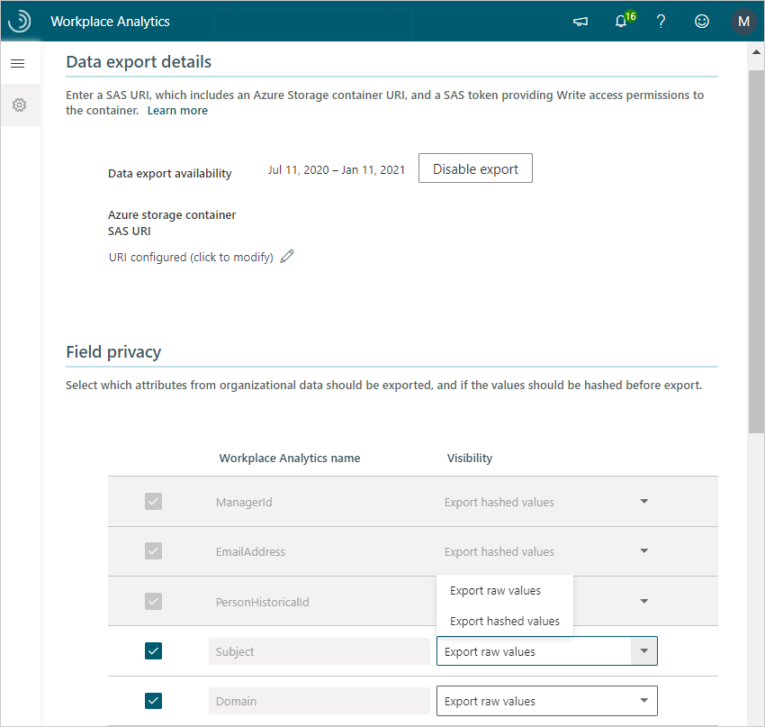

---

ROBOTS: NOINDEX,NOFOLLOW
title: Workplace Analytics Data export
description: Learn about Workplace Analytics Data export and how to set up and use it
author: madehmer
ms.author: v-pausch
ms.topic: article
search.appverid:
- MET150
ms.prod: wpa
ms.collection: M365-analytics
manager: scott.ruble
audience: Admin
---

# Workplace Analytics Data export

_Data export is only available as part of a Microsoft service engagement._

Your company might have unique data-analysis needs that require custom exploration of Workplace Analytics insights and data that goes beyond Workplace Analytics metrics and queries. This custom data exploration might include combining Workplace Analytics data with data outside of Workplace Analytics.

After you get a CS agreement, Microsoft can enable data export for your Office 365 tenant. After data export is enabled, your Workplace Analytics admin can view and use the Data Export page in Workplace Analytics to save the SAS URI, which points to an Azure storage container with write-only permission.

Saving the SAS URI enables a workflow that exports the Workplace Analytics data to the storage container. The data will be exported each time it is refreshed in Workplace Analytics, for the agreed duration of the CS agreement.

## Data included in the export

You can export pre-processed Workplace Analytics data to a designated Azure storage container as .csv files. The export uses the latest available organizational data that was uploaded and processed in Workplace Analytics.

If you add new organizational data attributes to your Workplace Analytics upload, you must also add them as additional fields that you want to include in the export in the **Field privacy** section on the **Data export** page. The new fields are added to the next data export after the data upload is next refreshed and processed in Workplace Analytics. For details, see [Upload organizational data (subsequent uploads)](../setup/upload-organizational-data.md).

The following .csv files are included in data exports. Select a file to view what's included in that file, such as the data column names, data types, and definitions:

* [Meetings](./Meetings.md)
* [MeetingParticipants](./Meetingparticipants.md)
* [PersonHistorical](./PersonHistorical.md)
* [MailParticipants](./MailParticipants.md)
* [Mails](./Mails.md)
* [Calls](./calls.md)
* [CallParticipants](./callparticipants.md)
* [InstantMessages](./instantmessages.md)
* [InstantMessageParticipants](./instantmessageparticipants.md)

## To export data from Workplace Analytics

1. If you have already installed Azure Templates, use the SAS URI created after deployment which grants write only access to the raw data folder that was setup during deployment and use that URI in the following step 3.

   If you have not installed Azure Templates, or if you're setting up data access for other reasons, set up your Azure storage container as described in [Azure environment requirements](#azure-environment-requirements) and [Azure storage container setup](#azure-storage-container-setup). Confirm the URI is write only and has an applicable expiration date.
2. In Workplace Analytics, go to **Settings** > **Data export**.
3. In **Azure storage container SAS URI**, enter the URI for the Azure storage container.
4. In the **Field privacy** section, you can select which fields to include and which fields to mask in the export. Note the options for the required fields at the top of the list are locked and unchangeable, as shown in the following graphic.

   > [!Note]
   > When you add new attributes to your organizational data and you want to include them in a data export, you must repeat this step to add the new attributes as additional fields to include in the export.

5. Select **Save** (top right) to save your selections and enable a workflow that exports the Workplace Analytics data to the storage container. The applicable data is then exported to Azure during each subsequent data refresh in Workplace Analytics.

   

## Azure environment requirements

Before you can export Workplace Analytics data, you need to confirm or do the following to set up your Azure environment:

* Confirm your company has a current Azure subscription and an Azure storage account with an Azure storage container for storing the exported Workplace Analytics data. The following section describes some setup options.

* Create a write-only SAS URI for this storage container. The following section provides an option to set this up as part of creating the storage container. To learn more about SAS, see [Delegating Access with a Shared Access Signature](https://docs.microsoft.com/rest/api/storageservices/delegating-access-with-a-shared-access-signature).

## Azure storage container setup

* You can manually create an Azure storage container and associated resources by using the [Azure Portal](https://portal.azure.com) and the [Azure Storage Explorer](https://azure.microsoft.com/features/storage-explorer/).

* Or you can automate the creation of the Azure storage environment and generate the SAS URI for the container by using [Azure CLI](https://docs.microsoft.com/cli/azure/get-started-with-azure-cli) or [Azure PowerShell](https://docs.microsoft.com/azure/storage/common/storage-powershell-guide-full).

>[!Important]
>If you are using this storage for Workplace Analytics Azure Templates, use the SAS URI that you generated in [Generate SAS URI for data export](../azure-templates/deploy-configure.md#generate-sas-uri-for-data-export).

#### Example script

The following example script uses [Azure CLI 2.0](https://docs.microsoft.com/cli/azure/get-started-with-azure-cli) to create the container and the SAS URI.

> [!Note]
> * The storage-account name, resource-group name, data-center location, and container name are passed as command-line arguments.
> * The resources are created if they do not already exist. You can run this script directly from the Azure Portal in an [Azure Cloud Shell](https://azure.microsoft.com/features/cloud-shell/).
> * Update the _EXPIRY_ variable in this script to match the expiration date of your CS engagement.

```
#!/bin/bash
# Script to create a storage account with SAS URI

# command line arguments
SANAME=$1
RGNAME=$2
LOCATION=$3
CONTAINERNAME=$4

# set the start date to today, and expiry date 90 days in the future - change this as needed
SASSTART=`date +%Y-%m-%d`'T00:00:00Z'
EXPIRY=`date -d "+90 days" +%Y-%m-%d`'T00:00:00Z'

# set the name of the SAS key, based on the storage account
SASNAME=$CONTAINERNAME'sas'

# create the resource group (keeps going if already exists)
az group create --name $RGNAME --location $LOCATION

# Create a storage account (keeps going if already exists)
az storage account create --name $SANAME --resource-group $RGNAME

# Get a storage account key
KEY=`az storage account keys list -g $RGNAME -n $SANAME | jq .[0].value`

# Create a container using the key
az storage container create -n $CONTAINERNAME --account-name $SANAME --account-key $KEY

# Create a write-only SAS token on the container and get the key
SASKEY=`az storage container generate-sas --account-name $SANAME --account-key $KEY --name $CONTAINERNAME \
--permissions w --start $SASSTART --expiry $EXPIRY`

# remove quotes
SASKEY=${SASKEY:1:-1}

# return the write-only SAS URI which is used in the Workplace Analytics Settings page
echo 'https://'$SANAME'.blob.core.windows.net/'$CONTAINERNAME'?'$SASKEY

# Create a read-list-only SAS token on the container and get the key
SASKEY=`az storage container generate-sas --account-name $SANAME --account-key $KEY --name $CONTAINERNAME \
--permissions rl --start $SASSTART --expiry $EXPIRY`

# remove quotes
SASKEY=${SASKEY:1:-1}

# return a read-only SAS URI which can be used by an analyst to export data
echo 'https://'$SANAME'.blob.core.windows.net/'$CONTAINERNAME'?'$SASKEY
```
