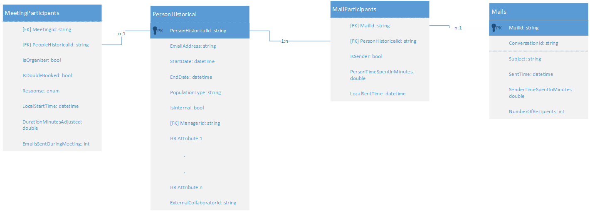

---
# Metadata Sample
# required metadata

ROBOTS: NOINDEX,FOLLOW
title: Data Access (WPA Data Access)
description: Overview of Workplace Analytics Data Access
author: gbowerman
ms.author: guybo
ms.date: 05/17/2018
ms.topic: language-reference
ms.prod: wpa
---

# Workplace Analytics Data Access
Customers with unique data-analysis requirements might require custom exploration of Workplace Analytics insights data that goes beyond the metrics that are available through flexible queries. This custom data exploration can include combining Workplace Analytics data with other data sets, such as building-space allocation or CRM data. Custom data access scenarios include:

- Which groups are starting long email threads? The answer would involve associating email data with corporate function.
- Do people with the same function who are collocated spend more time together than people with the same function who are not collocated?
- Optimizing workspace allocation.
- Effectiveness of the sales team.

Access to the underlying Workplace Analytics pre-processed data model can be obtained as part of a Customer Solutions (CS) engagement.

Once a CS agreement is in place, Microsoft enables data access in the customer's Office 365 tenant. Then, a Data Access panel on the Workplace Analytics Settings page becomes visible to customers who have the role of Workplace Analytics administrator. On this panel, an administrator can save a [SAS URI](https://go.microsoft.com/fwlink/?linkid=871677), which points to an Azure storage container with write-only permission.

Saving the SAS URI triggers a workflow that exports the Workplace Analytics data to the storage container. The data will be re-exported each time it is refreshed, for the agreed duration of the CS engagement.

## Data access schema for WPA
The following schema describes the data structure of pre-processed Workplace Analytics data when it is exported to a customer-owned Azure storage account in the form of .csv files with headers. 



Each of the tables are exported as a separate .csv file in the designated Azure storage container.

### Tables

[Meetings](./Meetings.md)

[MeetingParticipants](./MeetingParticipants.md)

[PersonHistorical](./PersonHistorical.md)

[MailParticipants](./MailParticipants.md)

[Mails](./Mails.md)


## Creating Azure infrastructure for data access

To prepare for a Workplace Analytics data export, you need a current Azure subscription and an Azure storage account that contains an Azure storage container. You also need to create a write-only SAS key for the container. 

You can manually create an Azure storage container and associated resources by using the [Azure Portal](https://portal.azure.com) and the [Azure Storage Explorer](https://azure.microsoft.com/features/storage-explorer/). Alternatively, you can automate the process by using [Azure CLI](https://docs.microsoft.com/cli/azure/get-started-with-azure-cli?view=azure-cli-latest) or [Azure PowerShell](https://docs.microsoft.com/azure/storage/common/storage-powershell-guide-full).

Following is an example bash script which uses [Azure CLI 2.0](https://docs.microsoft.com/cli/azure/get-started-with-azure-cli?view=azure-cli-latest) to automate the creation of the Azure storage infrastructure that is required to receive the data, and to generate an SAS key on the container. The storage-account name, resource-group name, data-center location, and container name are passed as command-line arguments. The resources are created if they do not already exist. This script can be run directly from the Azure Portal in an [Azure Cloud Shell](https://azure.microsoft.com/features/cloud-shell/). The _EXPIRY_ variable in the script should be adjusted to match the expiry date of the CS engagement.

```
#!/bin/bash
# Script to create a storage account with SAS URI

# command line arguments 
SANAME=$1
RGNAME=$2
LOCATION=$3
CONTAINERNAME=$4

# set the start date to today, and expiry date 90 days in the future - change this as needed
SASSTART=`date +%Y-%m-%d`'T00:00:00Z'
EXPIRY=`date -d "+90 days" +%Y-%m-%d`'T00:00:00Z'

# set the name of the SAS key, based on the storage account
SASNAME=$CONTAINERNAME'sas'

# create the resource group (keeps going if already exists)
az group create --name $RGNAME --location $LOCATION

# Create a storage account (keeps going if already exists)
az storage account create --name $SANAME --resource-group $RGNAME

# Get a storage account key
KEY=`az storage account keys list -g $RGNAME -n $SANAME | jq .[0].value`

# Create a container using the key
az storage container create -n $CONTAINERNAME --account-name $SANAME --account-key $KEY

# Create a write-only SAS token on the container and get the key
SASKEY=`az storage container generate-sas --account-name $SANAME --account-key $KEY --name $CONTAINERNAME \
--permissions w --start $SASSTART --expiry $EXPIRY`

# remove quotes
SASKEY=${SASKEY:1:-1}

# return the write-only SAS URI which is used in the Workplace Analytics Settings page
echo 'https://'$SANAME'.blob.core.windows.net/'$CONTAINERNAME'?'$SASKEY

# Create a read-list-only SAS token on the container and get the key
SASKEY=`az storage container generate-sas --account-name $SANAME --account-key $KEY --name $CONTAINERNAME \
--permissions rl --start $SASSTART --expiry $EXPIRY`

# remove quotes
SASKEY=${SASKEY:1:-1}

# return a read-only SAS URI which can be used by an analyst to access data
echo 'https://'$SANAME'.blob.core.windows.net/'$CONTAINERNAME'?'$SASKEY
```

## Creating a virtual machine to analyze data
To analyze the pre-processed data once it has been exported, it is recommended to create a virtual machine in the same Azure subscription as the storage account.

Below is an example bash script which uses [Azure CLI 2.0](https://docs.microsoft.com/cli/azure/get-started-with-azure-cli?view=azure-cli-latest) to automate creation of Microsoft Windows 2016 [Data Science VM](https://docs.microsoft.com/azure/machine-learning/data-science-virtual-machine/overview). This script takes the following command line arguments: virtual machine name, resource group name, data center location, VM size (small, medium or large), user and password. The Azure resource group is created if does not already exist. This script can be run directly from the Azure Portal in an [Azure Cloud Shell](https://azure.microsoft.com/features/cloud-shell/).

```
#!/bin/bash
# script to create a Microsoft Windows 2016 data science VM in Azure
VMNAME=$1
RGNAME=$2
LOCATION=$3  # e.g. westus2
CONFIG=$4    # small|medium|large
USER=$5      # e.g. wpauser
PASS=$6      # must be 12 or more characters

PUB='microsoft-ads'
OFFER='windows-data-science-vm'
SKU='windows2016'
VERSION='latest'

# determine config size
case $CONFIG in
    small)
        SIZE='Standard_D1_v2'
        DATASIZEGB='32'
        ;;
    medium)
        SIZE='Standard_D2_v3'
        DATASIZEGB='256'
        ;;
    large)
        SIZE='Standard_D8_v3'
        DATASIZEGB='1024'
        ;;
esac

# create the resource group (keeps going if already exists)
az group create --name $RGNAME --location $LOCATION

# create the VM
az vm create \
    --name $VMNAME --resource-group $RGNAME --image $PUB\:$OFFER\:$SKU\:$VERSION \
    --plan-name $SKU --plan-product $OFFER --plan-publisher $PUB \
    --admin-username $USER --admin-password $PASS \
    --size $SIZE \
    --data-disk-sizes-gb $DATASIZEGB
```