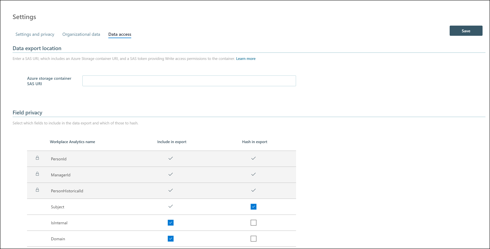

---
# Metadata Sample
# required metadata

ROBOTS: NOINDEX,NOFOLLOW
title: Data Access (WPA Data Access)
description: Overview of Workplace Analytics Data Access
author: madehmer
ms.author: madehmer
ms.date: 11/28/2018
ms.topic: language-reference
ms.prod: wpa
---

# Workplace Analytics Data Access

Customers with unique data-analysis requirements might require custom exploration of Workplace Analytics insights data that goes beyond the metrics that are available with Explore and Queries in Workplace Analytics. This custom data exploration might include combining Workplace Analytics data with other data sets, such as building-space allocation or collaboration data. Custom data access scenarios include:

* Which groups are starting long email threads? The answer would involve associating email data with corporate function.
* Do people with the same function who are co-located spend more time together as compared to people with the same function who are not co-located?
* Effectiveness of your sales team or customer service team.

You can get access to the underlying Workplace Analytics pre-processed data model as part of a Customer Solutions (CS) engagement.

After you get a CS agreement, Microsoft can enable data access for your Office 365 tenant. After it's enabled, your Workplace Analytics admin can view and use the Data Access tab on the Workplace Analytics Settings page. The Data Access page enables your admin to save a [SAS URI](https://go.microsoft.com/fwlink/?linkid=871677), which points to an Azure storage container with write-only permission.

Saving the SAS URI enables a workflow that exports the Workplace Analytics data to the storage container. The data will be exported each time it is refreshed, for the agreed duration of the CS agreement.

## Data access schema for Workplace Analytics

The data structure of pre-processed Workplace Analytics data, when it is exported to a customer-owned Azure storage account, in the form of .csv files with column headers is shown in the following graphic.


Each of the following tables are exported as a separate .csv file in the designated Azure storage container.

### Tables

[Meetings](./Meetings.md)

[MeetingParticipants](./MeetingParticipants.md)

[PersonHistorical](./PersonHistorical.md)

[MailParticipants](./MailParticipants.md)

[Mails](./Mails.md)

## Creating Azure infrastructure for data access

To prepare for a Workplace Analytics data export, you need a current Azure subscription and an Azure storage account that contains an Azure storage container. You also need to create a write-only SAS key for the container.

You can manually create an Azure storage container and associated resources by using the [Azure Portal](https://portal.azure.com) and the [Azure Storage Explorer](https://azure.microsoft.com/features/storage-explorer/).

Alternatively, you can automate the process by using [Azure CLI](https://docs.microsoft.com/cli/azure/get-started-with-azure-cli?view=azure-cli-latest) or [Azure PowerShell](https://docs.microsoft.com/azure/storage/common/storage-powershell-guide-full).

Following is an example bash script that uses [Azure CLI 2.0](https://docs.microsoft.com/cli/azure/get-started-with-azure-cli?view=azure-cli-latest) to automate the creation of the Azure storage infrastructure that is required to receive the data, and to generate an SAS key on the container.

The storage-account name, resource-group name, data-center location, and container name are passed as command-line arguments. The resources are created if they do not already exist. This script can be run directly from the Azure Portal in an [Azure Cloud Shell](https://azure.microsoft.com/features/cloud-shell/). The _EXPIRY_ variable in the script should be adjusted to match the expiry date of the CS engagement.

```
#!/bin/bash
# Script to create a storage account with SAS URI

# command line arguments 
SANAME=$1
RGNAME=$2
LOCATION=$3
CONTAINERNAME=$4

# set the start date to today, and expiry date 90 days in the future - change this as needed
SASSTART=`date +%Y-%m-%d`'T00:00:00Z'
EXPIRY=`date -d "+90 days" +%Y-%m-%d`'T00:00:00Z'

# set the name of the SAS key, based on the storage account
SASNAME=$CONTAINERNAME'sas'

# create the resource group (keeps going if already exists)
az group create --name $RGNAME --location $LOCATION

# Create a storage account (keeps going if already exists)
az storage account create --name $SANAME --resource-group $RGNAME

# Get a storage account key
KEY=`az storage account keys list -g $RGNAME -n $SANAME | jq .[0].value`

# Create a container using the key
az storage container create -n $CONTAINERNAME --account-name $SANAME --account-key $KEY

# Create a write-only SAS token on the container and get the key
SASKEY=`az storage container generate-sas --account-name $SANAME --account-key $KEY --name $CONTAINERNAME \
--permissions w --start $SASSTART --expiry $EXPIRY`

# remove quotes
SASKEY=${SASKEY:1:-1}

# return the write-only SAS URI which is used in the Workplace Analytics Settings page
echo 'https://'$SANAME'.blob.core.windows.net/'$CONTAINERNAME'?'$SASKEY

# Create a read-list-only SAS token on the container and get the key
SASKEY=`az storage container generate-sas --account-name $SANAME --account-key $KEY --name $CONTAINERNAME \
--permissions rl --start $SASSTART --expiry $EXPIRY`

# remove quotes
SASKEY=${SASKEY:1:-1}

# return a read-only SAS URI which can be used by an analyst to access data
echo 'https://'$SANAME'.blob.core.windows.net/'$CONTAINERNAME'?'$SASKEY
```

## Saving the data export location and field privacy settings

After you have a write-only SAS URI that points to an Azure storage container, enter the URI in the Data Access tab of the Workplace Analytics Settings page to set the data-export location. This page also has a field-privacy section, where you can specify which HR attributes should be included in the export, and which attributes should be masked. You can also use the field-privacy settings to exclude or mask other potentially sensitive attributes, such as email subject lines.



When you select **Save**, the data is exported to the Azure storage container the next time the Workplace Analytics data is refreshed.
