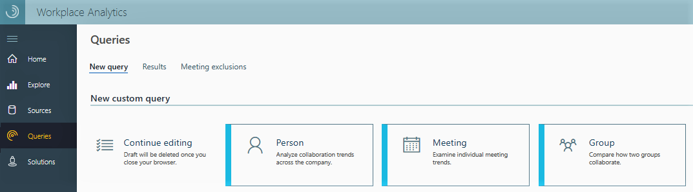

---
# Metadata Sample
# required metadata

title: To create an auto-update query
description: How to create an auto-update query in Workplace Analytics. 
author: paul9955
ms.author: v-pausch
ms.date: 02/21/2019
ms.topic: article
localization_priority: normal 
ms.prod: wpa
---

**To create an auto-update query**

1. Open the Queries page of Workplace Analytics:

   

2. Select a query type, such as Person query.

3. Name the query and add an optional description.

4. Select a time range: one, three, or six months, or one year:

    

   > [!Note] 
   > Auto-update is available only for the predefined time ranges in the Time period drop-down list. If you select **Custom range**, the Auto-update option becomes unavailable.

5. Select **Auto-update**. 

6. Click **Run**. 
