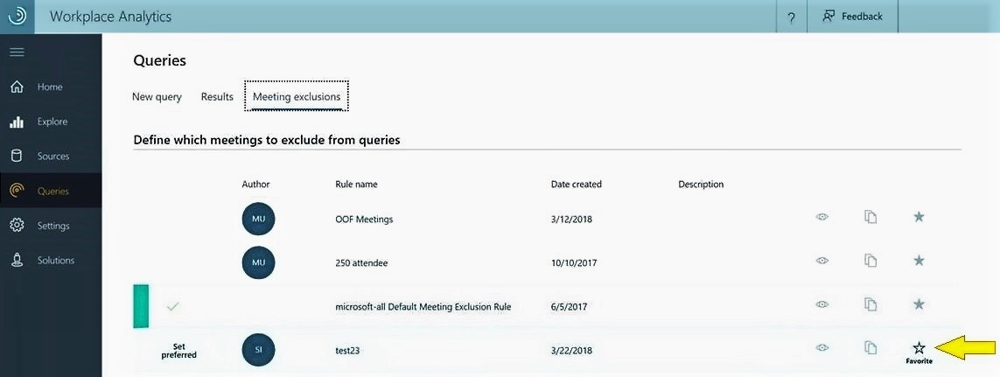
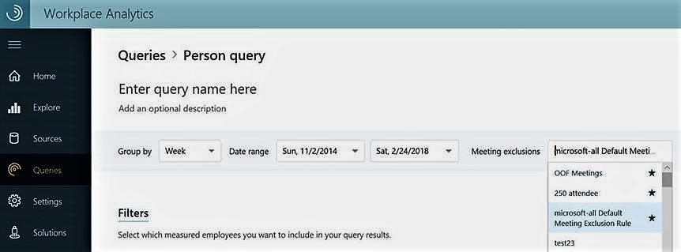

---
# Metadata Sample
# required metadata

title: To designate a meeting-exclusion rule as a favorite
description: How-to steps --  Designate a meeting-exclusion rule as a favorite in Workplace Analytics. 
author: paul9955
ms.author: v-pascha
ms.date: 03/27/2018
ms.topic: get-started-article
localization_priority: normal 
ms.prod: Mya
---

**To designate a meeting-exclusion rule as a favorite** 

Marking a rule as a favorite has one effect: It moves the rule to the top of the Meeting exclusions drop-down list on the query-creation page.

1. On the **Queries** page, find the row of the meeting-exclusion rule that you want to designate as a favorite. 
2. At the right end of the row, click the star. 

   
  
After you click the star, it appears filled-in to indicate that this exclusion rule is now a favorite. 

In the following illustration, the Person query page shows the "OOF Meetings" rule at the top of the Meeting exclusions list. It appears there because an analyst had previously marked it as a favorite.  

 

The order in which rules appear is stored for each analyst. One analyst's designated favorites are independent of other analysts' designated favorites. 

> [!Note] 
> You can designate more than one rule as a favorite. Each subsequent rule you mark as a favorite moves to the top of the list and pushes previously marked favorites down the list. 
